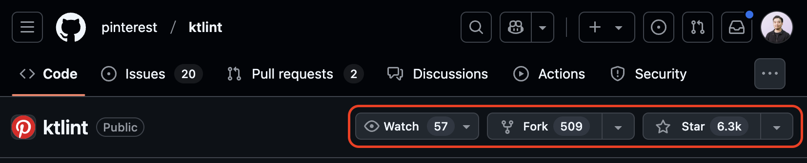
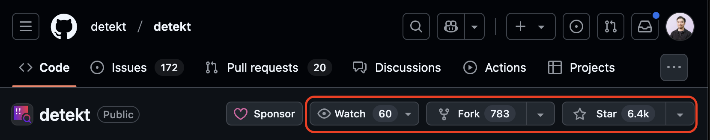
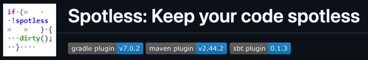

*Photo by <a href="https://unsplash.com/@tingeyinjurylawfirm?utm_content=creditCopyText&utm_medium=referral&utm_source=unsplash">Tingey Injury Law Firm</a> on <a href="https://unsplash.com/photos/brown-wooden-tool-on-white-surface-veNb0DDegzE?utm_content=creditCopyText&utm_medium=referral&utm_source=unsplash">Unsplash</a>*

# 목차
1. [개요](#개요)
2. [Lint 란 무엇이며 왜 필요한가](#lint-란-무엇이며-왜-필요한가)
    1. [Lint 적용 전에 고려 해야될 점](#lint-적용-전에-고려-해야될-점)
3. [필자가 겪고 있는 문제](#필자가-겪고-있는-문제)
    1. [문제 해결 방법 및 목표](#문제-해결-방법-및-목표)
4. [KtLint](#ktlint)
    1. [KtLint Gradle integration 설치 방법](#ktlint-gradle-integration-설치-방법)
    2. [KtLint 테스트 결과](#ktlint-테스트-결과)
5. [Detekt](#detekt)
    1. [Detekt 설치 방법](#detekt-설치-방법)
    2. [Detekt 테스트 결과](#detekt-테스트-결과)
    3. [KtLint vs Detekt 의 선호도 차이 알아보기](#ktlint-vs-detekt-의-선호도-차이-알아보기)
6. [Spotless](#spotless)
7. [정리하며](#정리하며)

> 예상 읽기 시간: 20분

# 개요

본 글에서는 Kotlin 으로 작성된 안드로이드 프로젝트에서 코드 서식을 관리하는 Lint 에 대해 알아봅니다.

또한 필자의 실무에 기반하여 작성된 글이며, 프로젝트에 적용할 최적의 Lint 라이브러리를 찾는 과정을 서술 했습니다. **KtLint**, **Detekt**, **Spotless**를 다룹니다.

프로젝트에 Lint 적용을 고민하는 분들께 참고가 되길 바랍니다.

# Lint 란 무엇이며 왜 필요한가

**Lint** 혹은 **Linter** 란, 소스코드를 분석하여 프로그램의 오류, 잘못된 서식, 의심스러운 구조체에 표시(flag)를 달아놓기 위한 도구를 가리킵니다.

우리는 이 Lint 도구를 이용해서 팀 내에 특정한 코딩 서식을 따르게 설정할 수 있을뿐 아니라 코드의 복잡성을 경고하거나, 버그가 잠재된 코드를 조기에 경고하여 일정한 코드 퀄리티를 유지할 수 있습니다.  

협업을 하다보면 작업자 마다 코드를 작성하는 스타일이 다름을 알게 됩니다. [코틀린 공식 코딩 컨벤션](https://kotlinlang.org/docs/coding-conventions.html#verify-that-your-code-follows-the-style-guide) 을 참고하는 정도가 각자 다르고, 특히 한 작업자의 독자적인 스타일로 코드가 작성되는 경우를 볼 수도 있습니다. 

코드 서식이 불규칙하거나 복잡할수록 미래의 자신, 혹은 다음 작업자가 해당 코드의 컨텍스트를 파악하고 수정하기 어렵게 만드는 요소가 될 수 있습니다. 때문에 본인이 참여하는 프로젝트가 정기적으로 관리되고 있다면 Lint 사용을 고려해보세요. 자신과 팀원 모두에게 보다 쾌적한 미래의 작업 환경을 만드는데 도움이 될 수 있습니다.

또한 신규 팀원에게 코드 스타일에 대한 지침을 Lint 에 위임하여 인수인계 시간을 절약하고 Lint 설정에 의해 자연스러운 프로젝트 적응을 도와줍니다.

## Lint 적용 전에 고려 해야될 점

이번엔 다소 부정적인 관점에서 바라볼까요? 팀원들과 정기적으로 관리하는 프로젝트에 Lint 적용을 고려중이라면 다음 사항을 충분히 인지 해두는게 좋습니다. 

Lint 를 적용한다는 것은 **코딩 컨벤션을 강제화 하는것**, 즉 팀원들에게 **불편함을 전파** 하는것입니다. 초기 적응 기간에 특히 그럴 것이고 작업 완료를 지연 시킴으로써 Lint 의 장점을 느끼기 보다는 불만의 목소리를 초래할 수 있습니다.

1. 초기 적응 기간에 우리가 겪을 불편함을 팀원들에게 충분히 인지 시키고
2. 그럼에도 우리가 Lint 를 적용하고, 적응함으로써 갖게될 이점이 뭔지 앞서 설명한 내용을 인용하여 팀원들과 충분히 논의하고 설득해야 합니다.
3. 코딩 가이드가 없음으로써 팀이 어떤 불편함을 겪었는지 실제 사례를 떠올려 보세요. 당장 Lint 가 필요한지 판단하는 지표가 될 수 있습니다.

# 필자가 겪고 있는 문제

최근 10년간 관리된 모놀리틱 프로젝트를 모듈화 설계로 개편한 영향 때문인지, 상당히 오래전(2021)에 적용했던 **KtLint** ` 0.4.0` 의 서식 검사가 제대로 안 되고 있습니다.

모듈화 개편 이전엔 Git hook 로 `pre-commit` 타이밍에 Lint 코드 서식 검사를 실행 했었는데요. (서식에 잘못된 부분이 있으면 커밋이 거부되는 방식) 설계 개편으로 늘어난 모듈 개수, 달라진 패키지 구조와 네이밍 방식 때문에 Lint 실행 시간만 늘어나서 이 대기 시간이 매우 답답한 상황입니다.

개편된 프로젝트에서 사용하는 Kotlin 의 버전은 `2.1.0` 이며, 이 Kotlin 버전에 대응하는 **KtLint** 는 `1.5.0` 입니다. 현재 사용중인 `0.4.0` 버전과 비교해보면 Lint 가 상당히 오래 되었음을 알 수 있습니다.

## 문제 해결 방법 및 목표

우선 개편된 프로젝트 구조에 맞게 **KtLint** 를 최신화, 테스트를 해보고 서식 검사 범위를 Compose 코드까지 확장하려 합니다.

이 프로젝트는 팀원들과 함께 관리되고 있으며 XML View 방식에서 Jetpack Compose 로 50% 이상 마이그레이션 되었습니다. 앞으로도 UI 작업은 Compose 가 메인이 될 것이라 해당 코드에 대한 서식 일관화, 퀄리티 관리가 잘 될 수 있는 방향으로 Lint 를 설정하려 합니다. 오랜 기간 관리된 프로젝트라 그런지 팀원들과 논의했을 때, Compose 까지 일관된 코드 퀄리티를 유지하고 싶은 공감대가 있음을 확인했습니다.

만약 Compose 비중이 낮은 팀이라면 Compose 서식 검사를 Ignore 하는게 가장 심플한 해결책이 될 겁니다.

# KtLint

[github.com/pinterest/ktlint](https://github.com/pinterest/ktlint)


아래는 KtLint 의 소갯말입니다.

> An anti-bikeshedding Kotlin linter with built-in formatter.
>"Bikeshedding"(자잘한 것에 대한 과도한 논쟁)을 방지하는 Kotlin 언어용 린터(코드 검사 도구).

>Key features (주요 기능)
> - No configuration required (설정이 필요하지 않습니다)
> - Built-in Rule sets (룰셋이 내장되어 있습니다)
> - Built-in formatter (포맷터가 내장되어 있습니다)

위 설명처럼 프로젝트에 KtLint 를 설치만 하면 별도의 설정이 필요없이 자체 Rule sets 으로 서식 검사를 할 수 있으며, 자체 Formatter 로 코드를 자동 수정할 수 있습니다. 전반적으로 KtLint 의 편의성에 대해 잘 설명하고 있습니다.

Mac OS 기준 `brew install ktlint` 커맨드로 KtLint CLI 설치, `ktlint --format` 을 입력하면 자체 내장 Rule set 서식을 참조하여 프로젝트의 코드를 자동 수정해줍니다.

하지만 필자는 `pre-commit` 타이밍에 KtLint 를 설치하고 사용할거라, [공식 문서 Gradle integration](https://pinterest.github.io/ktlint/latest/install/integrations/) 내용을 참고해서 설치했습니다. 서식 검사 커맨드를 `./gradlew ktlintCheck`, 포맷터 실행 커맨드를 `./gradlew ktlintFormat` 로 지정해서 테스트 했습니다.

## KtLint Gradle integration 설치 방법

Gradle integration 설치 스크립트가 궁금하신 분은 아래 토글을 펼쳐서 확인해주세요.

<details>
<summary>(토글) KtLint Gradle integration 설치 방법</summary>

1. 프로젝트 root 경로에 `ktlint.gradle.kts` 파일 생성
2. 아래 스크립트 작성
```kotlin
// KtLint version: 1.5.0 

val ktlint by configurations.creating

dependencies {
    ktlint("com.pinterest.ktlint:ktlint-cli:1.5.0") {
        attributes {
            attribute(Bundling.BUNDLING_ATTRIBUTE, objects.named(Bundling.EXTERNAL))
        }
    }
}

/**
 * Run at the project root:
 * ./gradlew ktlintCheck
 */
tasks.register<JavaExec>("ktlintCheck") {
    group = LifecycleBasePlugin.VERIFICATION_GROUP
    description = "Check Kotlin code style"
    classpath = ktlint
    mainClass.set("com.pinterest.ktlint.Main")
    args(
        "**/src/**/*.kt",
        "**.kts",
        "!**/build/**",
        "!:some-module-name/**", // <- ! exclude specific module from formatting
    )
}

/**
 * Run at the project root:
 * ./gradlew ktlintFormat
 */
tasks.register<JavaExec>("ktlintFormat") {
    group = LifecycleBasePlugin.VERIFICATION_GROUP
    description = "Check Kotlin code style and format"
    classpath = ktlint
    mainClass.set("com.pinterest.ktlint.Main")
    jvmArgs("--add-opens=java.base/java.lang=ALL-UNNAMED")
    args(
        "-F",
        "**/src/**/*.kt",
        "**.kts",
        "!**/build/**",
        "!:some-module-name/**", // <- ! exclude specific module from formatting
    )
}

tasks.register<Copy>("installKtlintGitHookToPreCommit") {
    val preCommitContent = """
        #!/bin/bash
        ./gradlew ktlintFormat
        if [ $? -ne 0 ]; then exit 1; fi
    """.trimIndent()
    
    val preCommitFile = File(rootProject.rootDir, ".git/hooks/pre-commit")
    preCommitFile.writeText(preCommitContent)
    preCommitFile.setExecutable(true)
}
3. Gradle sync 후 root 에서 아래 커맨드 실행

서식만 검사하기: `./gradlew ktlintCheck`

서식대로 코드 자동 수정하기: `./gradlew ktlintFormat`

4. 테스트가 완료 되었으면 `./gradlew installKtlintGitHookToPreCommit` 실행하여 `pre-commit` 단계에 KtLint 서식 검사를 설치합니다.

설치가 잘 되었는지 확인하려면

```bash
cat .git/hooks/pre-commit
```
프리커밋 단계를 삭제하고 싶다면
```bash
`rm -rf .git/hooks/pre-commit`.
```


끝.

</details>

## KtLint 테스트 결과

위에 작성한 Gradle integration 방법대로 KtLint `1.5.0` 로 최신화 및 Lint 실행 까지는 잘 되었으나, KtLint 에서 제시하는 서식이 우리 팀에서 작성하던 서식과 많이 달랐습니다.

```kotlin
interface SampleRemoteDataSource {
    fun callApi(parameter: Int)
}

class SampleDataSourceImpl @Inject constructor(
    private val apiService: SampleApiService,
) : SampleRemoteDataSource {
    override fun callApi(parameter: Int) {
        // ...
    }
}
```

위의 코드는 우리 팀이 일반적으로 작성하는 비즈니스 로직의 서식입니다. 보통 `클래스네임` + `@Inject`어노테이션 + `constructor(` 를 나란히 작성하고, 개행해서 파라미터 목록을 선언 했는데요.

서식을 어떻게 교정해주는지 확인하기 위해 `./gradlew ktlintFormat` 커맨드를 실행하고 결과를 확인해보면

```kotlin
class SampleDataSourceImpl
    @Inject // 여기서 개행을...?!
    constructor( 
        private val apiService: SampleApiService,
    ) : SampleRemoteDataSource {
        override fun callApi(
            parameter: Int
        ) {
            // ...
        }
    } // indent depth 또한 한 칸 씩 깊어짐
```

이와 같이 다소 낮선 모습으로 서식이 바뀌는 모습을 확인할 수 있습니다.

- 클래스 네임 선언 후 개행.
- indent 공백 후 @Inject 선언 뒤 다시 개행

이러한 서식 결과는 저와 팀원이 받아들이기 이상적이지 않았습니다. 

이 결과를 통해 Lint 설정 목표를 좀 더 명확히 생각할 수 있었습니다.

> Lint 의 서식 룰을 일방적으로만 따를게 아니라, 우리 팀 내에서 사용하던 스타일 또한 존중되어 Lint 룰에 반영할 수 있어야 함. 즉 절충안을 조절할 수 있어야 한다.

KtLint 에서 서식 설정을 추가 하려면 프로젝트 root 에 있는 `.editorconfig` 파일에서 직접 서식 룰을 설정하면 됩니다. 

```text
[*.{kt,kts}]
ktlint_standard_annotation = disabled
```

다음 문제로는 Composable 함수에 Function naming 경고가 발생하는것을 확인할 수 있었습니다.

순수 kotlin 서식 검사를 실행할 경우 Compose 코드를 잘못된 서식으로 판단할 수 있습니다. Kotlin 의 함수명은 소문자로 시작하지만 Composable 함수는 대문자로 시작하기 때문에 서식 검사 기준이 충돌하게 됩니다.

간단한 해결 방법은 Composable 함수 네이밍 규칙을 ignore 하는 것입니다. Compose 코드 퀄리티 관리가 우선 순위가 아닌 프로젝트라면 괜찮은 선택지가 될 수 있습니다.

[Compose 규칙 관련 이슈 참고](https://github.com/google/jetpack-camera-app/issues/55)
```text
[*.{kt,kts}]
ktlint_standard_annotation = disabled
# 아랫 줄에 설정 추가
ktlint_function_naming_ignore_when_annotated_with = Composable
```

Compose 서식 검사를 활성화 하려면 서드파티 Rule set 의존성을 추가로 설정해야 하는데요. 이것은 KtLint 오피셜 룰셋이 아닌, 다른 유저가 작성한 Rule set 입니다.

필자와 팀원들은 서드파티 의존성이 늘어나는 것을 관리 비용의 증가로 보기 때문에, 의존성을 추가 하더라도 되도록 KtLint 오피셜 패키지를 사용하거나 Lint 자체적인 설정으로 해결하길 원했습니다.

Compose Lint 관련 자료를 찾아보던 중, Detekt Lint 라이브러리 공식 문서에서 `Configuration for Compose` 섹션을 발견했습니다. Lint 내부적인 설정으로 Compose 설정이 어느정도 가능해 보여서 Detekt 라이브러리를 직접 설치, 테스트 해봤습니다.

# Detekt

[github.com/detekt/detekt](https://github.com/detekt/detekt)


아래는 Detekt 의 소갯말입니다.

> detekt helps you write cleaner Kotlin code so you can focus on what matters the most building amazing software.
> 
> detekt는 깔끔한 Kotlin 코드 작성을 도와주어 더 나은 소프트웨어 개발에 집중할 수 있게 해줍니다.

> Features (주요 기능)
> 
> Code smell analysis for your Kotlin projects.
> - 코드의 냄새(잘못된 서식, 복잡도, 안티패턴)를 분석 해줍니다.
> 
> Highly configurable rule sets.
> - 매우 다양한 룰셋 설정을 제공합니다.
> 
> Generate baselines to suppress existing issues for legacy projects while making sure no new issues are introduced.
> - 레거시 프로젝트의 기존 이슈는 무시하되, 새로운 이슈 발생을 방지하는 기준선 생성 가능

위 소갯말에서 알 수 듯, Detekt 는 "다양한 룰셋 설정이 가능함"을 강조하고 있습니다. 

`config/detekt/detekt.yml`
```yaml
complexity:  # 코드 복잡도 경고
formatting:  # 코드 서식 경고
naming:      # 네이밍 규칙
performance: # 성능 경고
style:       # 코딩 스타일 교정
coroutines:  # 코루틴 규칙
comments:    # 주석 규칙
potential-bugs: # 잠재적 버그 위험 검사
compose:     # 컴포즈 룰 설정 (필자가 커스텀 룰셋으로 만든 설정)
```
> `compose:` 를 제외한 초기 설정은 [이 Detekt 링크](https://github.com/detekt/detekt/blob/v1.23.7/detekt-core/src/main/resources/default-detekt-config.yml) 의 코드를 직접 가져와서 사용하시면 됩니다. 

Detekt 설정 파일 내용의 일부입니다. Built-in 룰셋 덕에 초기 설정이 필요 없음을 강조하는 KtLint 와 반대 됨을 알 수 있는 대목입니다. KtLint 가 `완제품 브랜드 PC` 라면 Detekt는 `조립 PC` 정도로 비유가 되겠군요. 첫 시작만 차이날 뿐, 결국 제대로 쓰려면 설정에 공수가 들어가는 점은 비슷합니다.

필자는 KtLint의 다소 일방적이고 이상적이지 않은 Built-in 포맷팅을 경험하며 Lint 와 개발자간의 절충안을 설정할 수 있어야 함을 느꼈습니다. Detekt 에서 제공하는 설정 파일로 원하던 설정을 쉽게 할 수 있는점이 좋았습니다.

위 `detekt.yml` 파일 내용의 각 섹션마다 수십가지의 설정이 제공 되는데요. 기본 룰 외에 더 필요한 설정이 있으면 커스텀 룰셋을 직접 작성할수도 있습니다. 커스텀 룰셋 작성 과정은 별도의 글을 발행하여 자세하게 다뤄보려 합니다. 

커스텀 룰셋까지 작성해보니 사실상 규칙 생성의 한계가 없다고 느껴졌습니다. 예를 들어 `data class` 네이밍에 `Response` 가 포함 되었을 경우 직렬화 어노테이션 포함 여부를 검사하는, 우리 팀만의 니즈를 규칙으로 만들수 있었습니다. (직렬화 어노테이션을 작성하지 않아도 프로퍼티명이 직렬화 키 매핑을 대신하기 때문에 어노테이션을 생략하는 작업자도 있었음 = 매핑 실수 위험, 스타일 통일 니즈)

## Detekt 설치 방법

Detekt 의 설치 과정이 궁금하신 분은 [공식 문서](https://detekt.dev/docs/intro) 혹은 아래 토글을 펼쳐서 확인해 주세요.

<details>
<summary>(토글) Detekt 설치 방법</summary>

> Detekt version 1.23.7, 필자의 프로젝트 환경 기준입니다.

1. 루트 경로 기준으로 `config/detekt/detekt.yml` 파일 생성. 경로와 `detekt.yml` 파일명은 자유 형식

[이 페이지의 Detekt 설정 코드](https://github.com/detekt/detekt/blob/v1.23.7/detekt-core/src/main/resources/default-detekt-config.yml)를 복사, 나의 `detekt.yml` 에 붙여넣기. 설정들을 러프하게 검토 해보고 필요 없는 설정은 `active: false` 하시면 됩니다. 반대로 활성화 하고싶은 규칙은 `active: true`를 입력하시면 됩니다.

2. 루트 경로 `build.gradle.kts` 에 아래 스크립트 추가
```kotlin
plugins {
    id("io.gitlab.arturbosch.detekt") version("1.23.7")
}

repositories {
    mavenCentral()
}

// (Optional) 
// 이 detekt-formatting 의존성은 
// KtLint 와 같은 코드 자동 포맷팅을 지원합니다.
dependencies {
    detektPlugins("io.gitlab.arturbosch.detekt:detekt-formatting:1.23.7")
}

detekt {
    toolVersion = "1.23.7"
    config.setFrom(file("config/detekt/detekt.yml"))
    buildUponDefaultConfig = true
}

/**
 * install detekt to pre-commit:
 * (optional): rm -rf .git/hooks/pre-commit
 * (require): ./gradlew installDetektToPreCommit
 *
 * Staged 된 파일만 lint 를 실행합니다.
 * Referenc: https://detekt.dev/docs/gettingstarted/git-pre-commit-hook/#only-run-on-staged-files
 */
tasks.register<Copy>("installDetektToPreCommit") {
   val preCommitContent = """
       #!/bin/bash
       echo "Running detekt check..."
       fileArray=($@)
       detektInput=$(IFS=,;printf "%s" "${fileArray[*]}")
       echo "Input files: $detektInput"
       OUTPUT=$(detekt --input "$detektInput" 2>&1)
       EXIT_CODE=$?
       if [ $EXIT_CODE -ne 0 ]; then 
           echo $OUTPUT 
           echo "***********************************************" 
           echo " detekt failed " 
           echo " Please fix the above issues before committing " 
           echo "***********************************************" 
           exit $EXIT_CODE
       fi
   """.trimIndent()
   
   val preCommitFile = File(rootProject.rootDir, ".git/hooks/pre-commit")
   preCommitFile.writeText(preCommitContent)
   preCommitFile.setExecutable(true)
}
```

3. Gradle sync 후 root 에서 아래 커맨드 실행

서식만 검사하기: `./gradlew detekt`

detekt 는 서식 이슈를 일정 개수 쌓으면 서식 검사를 강제로 중단할 수 있습니다. 아래 커맨드로 강제 종료 없이 계속 검사하게 만들수 있습니다.
- `./gradlew detekt --continue`

KtLint 처럼 서식대로 코드 자동 수정하기 (`detekt-formatting` 의존성 추가 필요):
- `./gradlew detekt --auto-correct`
- or `./gradlew detekt --auto-correct --continue`

테스트가 완료 되었으면 `pre-commit` 단계에 Detekt 서식 검사를 설치합니다.

```bash
./gradlew installDetektToPreCommit 
```

`pre-commit` 설치가 잘 되었는지 확인하려면
```bash
cat .git/hooks/pre-commit
```

프리커밋 단계를 삭제하고 싶다면
```bash
rm -rf .git/hooks/pre-commit
```

끝.

</details>

## Detekt 테스트 결과

`pre-commit` 단계에서 Detekt 가 서식 검사를 잘 실행합니다. import 순서, tailing comma 등 필자가 직접 설정한 Kotlin 룰에 기반하여 기초적인 경고를 잘 해주고 있습니다.

그리고 직접 작성한 Compose 룰 또한 기대한 결과대로 잘 동작하고 있습니다. 예를들어 아래와 같은 코드를 커밋하면 [Compose 파라미터 정렬 규칙을 정의한 공식문서](https://android.googlesource.com/platform/frameworks/support/+/androidx-main/compose/docs/compose-component-api-guidelines.md#parameters-order) 에 기반하여 서식 경고를 해주고 있습니다.

```kotlin
@Composable
fun SampleComposable(
    modifier: Modifier = Modifier,
    name: String,
    age: Int,
    profilePictureComponent: @Composable () -> Unit,
    onClick: () -> Unit = {},
) { }
```

경고문
> Composable function parameters should follow this order: required parameters, modifier parameter, optional parameters, composable slots [ComposableParametersOrdering]

> Composable 함수 파라미터는 다음 순서를 따라야 합니다: 필수 파라미터, modifier 파라미터, 선택적 파라미터, composable 슬롯

경고문 자체는 커스텀 룰에서 필자가 직접 작성한 내용이며, 제가 의도한 대로 파라미터 정렬에 관한 경고를 잘 해주었습니다. 경고를 참고하여 코드를 수정하면 아래와 같은 모습이 됩니다.

```kotlin
@Composable
fun SampleComposable(
    // 필수 파라미터를 가장 위로
    name: String, 
    age: Int,
 
    // 다음으로 modifier 파라미터
    modifier: Modifier = Modifier, 
    
    // 다음으로 optional 파라미터
    onClick: () -> Unit = {}, 
    
    // 마지막에 슬롯을 배치해야 한다
    profilePictureComponent: @Composable () -> Unit, 
) { }
```

이렇게 Kotlin 뿐 아니라 Compose 에서도 일관된 서식을 유지할 수 있게 되었습니다. 커스텀 룰과 Compose 룰을 작성한 내용은 추후 별도의 글로 발행할 예정입니다.

```kotlin
@Composable
fun Button(
    onClick: () -> Unit,
    modifier: Modifier = Modifier,
    enabled: Boolean = true,
    interactionSource: MutableInteractionSource? = null,
    elevation: ButtonElevation? = ButtonDefaults.elevation(),
    shape: Shape = MaterialTheme.shapes.small,
    border: BorderStroke? = null,
    colors: ButtonColors = ButtonDefaults.buttonColors(),
    contentPadding: PaddingValues = ButtonDefaults.ContentPadding,
    content: @Composable RowScope.() -> Unit
) {
```

마지막으로 공식 Jetpack Compose 의 기본 컴포넌트 코드는 어떻게 작성 되었는지 궁금해서 확인해본 결과입니다. `Button` 외 모든 기본 컴포넌트들은 이미 파라미터 정렬 규칙을 잘 따르는 모습을 확인할 수 있었습니다.

## KtLint vs Detekt 의 선호도 차이 알아보기



*궁금해서 알아봤습니다*

두 Linter 의 유저 선호도는 비슷합니다. 이슈 개수는 차이가 많이 나는데 KtLint 와 다르게 Detekt 는 설정 파일을 유저에게 직접 제공함으로써 러닝커브가 훨씬 높았습니다. 

이는 Detekt 가 무조건 정답이 아닐수 있음을 시사합니다. 프로젝트 규모가 작거나 바쁜 조직에겐 설정이 필요없는 KtLint 가 오히려 좋은 선택이 될 수 있고, 우리 팀 또한 `0.4.0` 버전 기준으로 문제 없이 잘 사용하고 있었습니다.

Detekt 끝.

# Spotless

[github.com/diffplug/spotless](https://github.com/diffplug/spotless)



리서칭 중 알게된 Spotless 는 필요 외에 너무 많은 정보가 제공되어 짧게 언급, 정리만 하는 글입니다. 

아래는 Spotless 의 소갯말입니다.

> Spotless can format <antlr | c | c# | c++ | css | flow | graphql | groovy | html | java | javascript | json | jsx | kotlin | less | license headers | markdown | objective-c | protobuf | python | scala | scss | shell | sql | typeScript | vue | yaml | anything> using <gradle | maven | sbt | anything>.

> Spotless는 다양한 프로그래밍 언어와 파일 형식을 Gradle, Maven, SBT 같은 빌드 도구를 사용해 포맷팅할 수 있는 도구입니다.

Spotless 는 kotlin 외에 다양한 언어들의 서식을 관리해주는 Linter 입니다. 필자의 프로젝트에서 다루려고 했던 Kotlin 외에도 다양한 언어들을 지원하고 있네요.

- Java 작업과 병행중인 프로젝트 
- Views UI (XML) 비중이 높은 프로젝트
- JNI 로 C++ 언어를 다루는 프로젝트

위 조건중 하나 이상 일치하는 프로젝트라면 충분히 고려 해볼만한 Linter 입니다. 

Lint rule 설정은 그래들 스크립트에 아래와 같은 형식으로 정의할 수 있습니다.

```kotlin
spotless {
    java { 
        // import 순서 정의
        importOrder(
                "java",
                "javax",
                "lombok",
                "org.springframework",
                "",
                "\\#",
                "org.junit",
                "\\#org.junit",
                "com.guide",
                "\\#com.guide"
        )
        // 구글 자바 포맷 적용
        googleJavaFormat()
        // indent 공백 수 설정
        indentWithTabs(4)        
        indentWithSpaces(4)
        // 사용하지 않는 import 제거
        removeUnusedImports()
        // 어노테이션 포맷팅 정리
        formatAnnotations()
        // 공백 제거
        trimTrailingWhitespace() 
        // 끝부분 New Line 처리
        endWithNewline()
    }
}
```

코드 서식 검사
```bash
./gradlew spotlessCheck
```

서식에 맞춰 코드 자동 수정 (포맷팅)
```bash
./gradlew spotlessApply
```

포맷을 항상 일관되게 유지하려면, build 타이밍에 `spotlessApply` 를 실행하게 그래들 스크립트를 정의 할수도 있습니다.
```bash
tasks.named('build') {
    dependsOn 'spotlessApply'
}
```

끝.

# 정리하며

이 글에서 Lint 에 대해 알아보고, 적용하기 전 "고려 해야될 점" 에 대해 설명했습니다.

또한 필자의 안드로이드 프로젝트에 적용할 Linter 들을 살펴봤고 적용하는 과정을 다뤘습니다. 필자의 경우 Compose 코드 관리와 팀 맞춤형 룰셋이 필요했기에 Detekt를 선택했습니다.  

KtLint, Detekt, Spotless 각 Linter 의 특징을 요약하면 다음과 같습니다.

**KtLint**
- Built-in 룰셋으로 빠른 적용이 가능
- 완제품 PC 로 비유됨. Detekt 와 정 반대의 특징
- 커스텀 설정 접근이 불편한 편

**Detekt**
- KtLint 보다 엄격하고 다양한 서식 설정 제공
- 커스텀 Rule set 접근성이 용이함 (필자는 Compose Rule set 을 작성함)
- 조립 PC 로 비유됨. KtLint 와 정 반대의 특징
- 대규모 프로젝트에 더 적합할 수 있음

**Spotless**
- 가장 많은 랭귀지의 서식을 지원함. Java, Kotlin, xml 등등...
- 컴포즈는 지원하지 않는듯

**세 Linter 의 공통 기능**
- lint 정의에 맞춰서 코드 서식을 자동으로 수정해줌


|      | 장점            | 단점                  | 적합한 경우               |
|----------|---------------|-----------------------|----------------------|
| KtLint   | 빠른 적용, 설정 불필요 | 커스텀 제한적         | 소규모 프로젝트             |
| Detekt   | 다양한 설정        | 러닝커브 높음         | 대규모 프로젝트             |
| Spotless | 다언어 지원        | Compose 미지원        | Java/XML/JNI 혼용 프로젝트 |


# 후속 글 예고
Detekt 로 Compose 를 비롯한 커스텀 룰셋 작성 과정은 별도 글로 다룰 예정입니다.

끝.

# Reference
> - https://ko.wikipedia.org/wiki/%EB%A6%B0%ED%8A%B8_(%EC%86%8C%ED%94%84%ED%8A%B8%EC%9B%A8%EC%96%B4)
> - https://kotlinlang.org/docs/coding-conventions.html#verify-that-your-code-follows-the-style-guide
> - https://pinterest.github.io/ktlint/latest/
> - https://detekt.dev/
> - https://github.com/diffplug/spotless
> - https://developer.android.com/develop/ui/compose/api-guidelines
> - https://mrmans0n.github.io/compose-rules/rules/
> - https://android.googlesource.com/platform/frameworks/support/+/androidx-main/compose/docs/compose-api-guidelines.md
> - https://android.googlesource.com/platform/frameworks/support/+/androidx-main/compose/docs/compose-component-api-guidelines.md

```toc

```