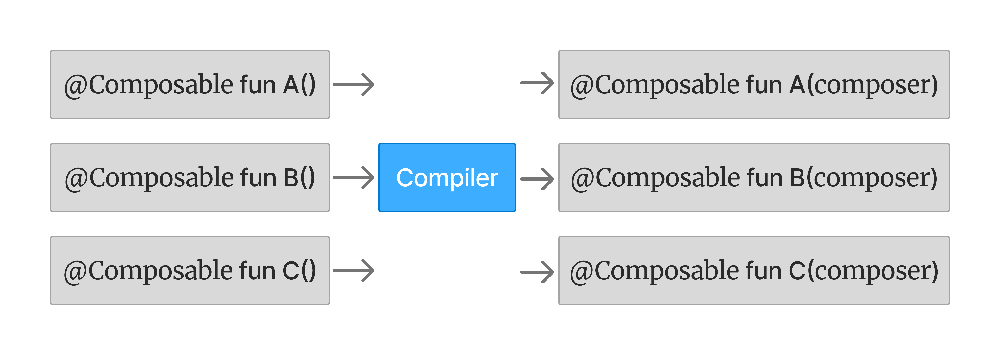

Jetpack Compose Internals 를 읽고 정리하는 글이다. 
어쩌다보니 올해 안에 완독 하겠다는 목표를 세워서 [(관련글)](https://winter-love.dev/insights/compose-internals) 열심히 읽는중이다.
이 글의 수준을 다음과 같이 설정했다. 
대학생이나 현업 개발자 등 컴포즈를 평소보다 좀 더 깊이 있게 파고들고 싶은 자가 받아들일 수 있을 정도로 쉬운 난이도.

---

참고. compose architecture


이 챕터를 읽기전에...
Compose Compiler가 어떻게 동작하는지 내 기준 꽤 깊이 있게 살펴본다. 크게 세 부분으로 나뉜다.

**Compose 어노테이션들**  @Composable부터 @Stable, @Immutable까지 각 어노테이션이 무엇을 의미하고 왜 필요한지.

**정적 분석과 검사** 컴파일 단계에서 코드를 검증하고 오류를 잡아내는 과정.

**코드 생성과 변환** IR 낮추기(Lowering)를 통해 우리가 작성한 코드가 어떻게 변환되는지. Composer 주입, 비교 전파, 그룹 생성 등 실제 최적화 기법들.

마음의 준비를 하자.
내용이 많고 기술적인 용어들이 마구 언급되며, 챕터 자체의 분량이 꽤 길다.

---

> **IR:** Intermediate Representation, Kotlin 컴파일러가 소스파일을 해석하는 하나의 과정.

> **Compose Compiler:** Kotlin 컴파일러 플러그인. Composable 함수를 변환하는 역할.

> **Composer:** 런타임중 트리의 형태를 빌드하거나 업데이트하는 객체.

# Compose 컴파일러 (The Compose compiler)

Kotlin 에서 코드 생성이라고 하면 보통 kapt, KSP 를 떠올린다. 
하지만 Compose Compiler 는 KSP 같은 어노테이션 프로세서가 아니라 "Kotlin 컴파일러" 의 플러그인이다.

**둘의 차이:** <br/>
KSP: 컴파일 전에 실행. 새 코드만 추가 가능. <br/>
컴파일러 플러그인: 컴파일 중에 실행. 기존 코드 수정 가능. <br/>

[이전 1장 글에서 봤던 Composer 파라미터 주입](https://winter-love.dev/composeinternals/1-composable-functions/#%ED%98%B8%EC%B6%9C-%EC%BB%A8%ED%85%8D%EC%8A%A4%ED%8A%B8-calling-context)
이 바로 "기존 코드 수정"의 예시다. KSP 로는 불가능.

Compose Compiler 는 IR (Intermediate Representation) 단계에서 코드를 변환한다.
IR 은 소스 코드가 최종 결과물로 변환되기 전 중간 단계다. 
이 단계에서 Compose Compiler 는 우리가 작성한 Composable 함수를 Runtime 이 원하는 형태로 마음대로 바꿔버린다.

예를 들어 우리가 작성한 `fun Header()` 는 컴파일 후에는 `fun Header($composer: Composer)` 로 변환된다. 
이게 IR 변환이다.

핵심: IR 단계에서 코드를 변환하니까 우리 눈에 안 보이는 일들이 일어날 수 있다.

@Composable 어노테이션은 단순 마커가 아니다. 함수의 타입 자체를 바꾼다.

일반 함수 타입: `(String) -> Unit` <br/>
Composable 함수 타입: `@Composable (String) -> Unit` <br/>

타입이 다르니까 컴파일러가 규칙을 강제할 수 있다. 
일반 함수에서 Composable 함수를 호출하면 컴파일 에러가 나는 이유다.
그럼 타입을 바꾸면 뭐가 좋은가? Composable 함수에게 "메모리"가 생긴다.

"메모리"가 생긴다는 의미: @Composable 이 붙으면 그 함수는 다음과 같이 동작하게 된다.

remember 사용 가능 (값을 기억할 수 있음), Composer 와 슬롯 테이블 사용 가능, 
고유한 ID 를 할당받음 (1장의 위치 기억법), 트리 내 위치를 가짐, 
라이프사이클을 가짐 (recomposition 되어도 상태 유지 가능).

이 모든 게 "메모리"다. 
Composable 함수가 실행될 때마다 매번 새로 시작하는 게 아니라, 이전 실행을 "기억"하고 있다는 뜻이다.
결과적으로 Composable 함수는 노드를 방출해서 트리를 구성할 수 있게 된다.

요약: @Composable 은 타입을 바꾸고, 타입이 바뀌면 메모리를 갖게 되고, 메모리가 있으니까 트리의 일부가 될 수 있다.

---

# Compose 어노테이션들 (Compose annotations)

Compose Compiler가 코드를 변환하려면 먼저 어떤 함수가 Composable인지, 어떤 최적화를 적용해야 하는지 알아야 한다.
이를 위해 어노테이션을 사용한다.

**Compose Compiler의 작동 시점**: Compose Compiler는 Kotlin 컴파일 과정 중 프론트엔드 단계에서 동작한다.
이 단계에서 소스 코드를 분석하고 검증한다.

**컴파일러가 확인하는 것들:** `@Composable` 어노테이션이 붙은 함수들을 찾기, 
Composable 함수가 제약을 잘 지키고 있는지 검증 (다른 Composable에서만 호출되는지 등),
타입 시스템이 Composable 함수를 일반 함수와 다르게 처리하도록 만들기

**추가 어노테이션들**: `@Composable` 외에도 Compose는 여러 어노테이션을 제공한다.
이 어노테이션들은 특정 상황에서 추가 검사를 하거나 런타임 최적화를 활성화하는 역할을 한다.

예를 들어 어떤 함수는 결과를 캐싱해도 되고, 어떤 함수는 안정적인 입력만 받아야 하고, 
어떤 함수는 리컴포지션을 Skip해도 된다는 힌트를 컴파일러에게 줄 수 있다.

이런 어노테이션들은 모두 Compose Runtime 라이브러리에서 제공된다.

---

# @Composable

가장 중요한 어노테이션이다.
[1장에서 이미 다뤘지만 (Composable 함수의 의미)](https://winter-love.dev/composeinternals/1-composable-functions/#composable-%ED%95%A8%EC%88%98%EC%9D%98-%EC%9D%98%EB%AF%B8-the-meaning-of-composable-functions), 
컴파일러 관점에서 다시 한번 정리한다.

**Compose Compiler vs 어노테이션 프로세서**: 일반적인 어노테이션 프로세서: 새로운 코드만 생성 가능, 기존 코드를 직접 수정할 수 없음.

**Compose Compiler:** IR(중간 표현)을 직접 변환, 기존 코드를 수정할 수 있음.

`@Composable` 어노테이션이 붙으면 컴파일러가 해당 함수를 직접 변환한다.
가장 중요한 변경은 **함수의 타입이 바뀐다**는 것이다.

**타입 변경으로 얻는 것들**: 타입이 바뀌면 컴파일러가 Composable 함수에 특별한 제약을 강제할 수 있다.
Composable 함수는 다른 Composable 함수에서만 호출 가능하다는 규칙 같은 것들 말이다.
하지만 제약만 생기는 게 아니다. `@Composable`을 통해 함수는 "메모리"를 갖게 된다.

**메모리를 가진다는 의미:** 
`remember`를 사용해서 값을 저장하고 재사용할 수 있음, 
`Composer`와 슬롯 테이블을 활용할 수 있음, 
라이프사이클을 가짐 (리컴포지션 되어도 상태 유지 가능),
고유한 정체성(ID)을 부여받음 ([위치 기억법에서 다뤘음](https://winter-love.dev/composeinternals/1-composable-functions/#%EC%9C%84%EC%B9%98-%EA%B8%B0%EC%96%B5%EB%B2%95-positional-memoization)),
노드를 Composition으로 방출할 수 있음,
CompositionLocals 처리 가능.

**Composable 함수의 본질**: Composable 함수는 데이터를 트리의 노드로 변환한다.
이 노드가 UI 노드일 수도 있고, 다른 종류의 노드일 수도 있다.
Compose Runtime은 UI에만 국한되지 않는다.
범용적인 트리 구조를 다루는 시스템이며, 우리가 어떻게 사용하느냐에 따라 UI가 될 수도, 다른 무언가가 될 수도 있다.

---

# @ComposableCompilerApi

Compose 컴파일러 전용 API라는 것을 표시하는 어노테이션이다.
"이건 컴파일러가 내부적으로 쓰는 거니까 일반 개발자는 건드리지 마세요" 라는 경고 표시다.

---

# @InternalComposeApi

Compose 내부에서만 사용하는 API라는 표시다.
Kotlin의 `internal` 키워드는 같은 모듈 안에서만 접근 가능하다.
하지만 Compose는 여러 모듈로 나뉘어 있어서 모듈 간에 내부 API를 공유해야 할 때가 있다.
`@InternalComposeApi`는 이런 경우에 사용한다.
"Compose 내부에서는 쓰지만, 외부 개발자는 쓰지 마세요. 언제든 바뀔 수 있어요"라는 의미다.
stable 버전에 포함되어도 내부 구현은 계속 바뀔 수 있기 때문에 이런 표시가 필요하다.

---

# @DisallowComposableCalls

특정 람다 안에서 Composable 함수 호출을 금지하는 어노테이션이다.
**왜 필요한가?** 대표적인 예시가 `remember`다.

```kotlin
@Composable
inline fun  remember(
    calculation: @DisallowComposableCalls () -> T
): T = currentComposer.cache(false, calculation)
```

`remember`는 `calculation` 람다를 최초 1회만 실행하고 결과를 저장한다.
recomposition 시에는 저장된 값을 그냥 반환한다.
만약 `calculation` 안에서 Composable 함수를 호출하면 어떻게 될까?

```kotlin
val data = remember {
    Text("Hello")  // 🚨 만약 가능하다면?
}
```

`forEach`의 람다는 `@Composable`로 표시되어 있지 않지만,
`MyScreen`이 Composable이므로 안에서 `Text`를 호출할 수 있다.
이건 `forEach` 같은 경우에는 유용하지만, `remember` 같은 경우에는 문제가 된다.
그래서 명시적으로 금지해야 한다.

**전파성**: `@DisallowComposableCalls`가 붙은 람다 안에서 또 다른 inline 람다를 호출하면,
컴파일러는 그 람다에도 `@DisallowComposableCalls`를 요구한다.
이 어노테이션은 주로 Compose Runtime 같은 라이브러리를 만들 때 사용한다.
일반 앱 개발에서는 거의 쓸 일이 없다.

```kotlin
val result = remember {
    list.map { item -> item * 2 }  // map의 람다도 금지됨
}
```

---

# @ReadOnlyComposable

`@ReadOnlyComposable` 이 붙은 Composable 함수는 composition 에 쓰지 않고 읽기만 한다는 의미다. 
본문 내 중첩된 모든 Composable 호출에도 적용된다.
일반적인 Composable 함수는 컴파일러가 본문을 "그룹" 으로 감싸서 방출한다. 
그룹은 나중에 recomposition 할 때 데이터를 어떻게 정리하거나 이동시킬지에 대한 정보를 담고 있다.

**그룹이 뭔가?** 텍스트에서 시작과 끝을 가리키는 두 개의 포인터를 떠올려보자.
모든 그룹에는 소스 코드 위치 키가 있고, 이 키로 위치 기억법을 적용할 수 있다.

```kotlin
if (condition) {
    Text("Hello")
} else {
    Text("World")
}
```

둘 다 Text 함수지만 if 와 else 는 서로 다른 고유성을 가진다. 
그룹의 키가 이 고유성을 구분한다. 
이동 가능한 그룹은 고유한 키를 가지고 있어서 부모 그룹 내에서 재정렬될 수 있다.

그런데 composition 에 쓰이지 않는 Composable 은 데이터가 교체되거나 이동되지 않으므로 그룹이 필요없다. 
@ReadOnlyComposable 은 이런 불필요한 코드 생성을 방지한다.

실제 예시로는 CompositionLocal 을 통해 읽는 값들이 있다. 
Material 라이브러리의 Colors, Typography, isSystemInDarkTheme() 함수, LocalContext, LocalConfiguration 등이다. 
이런 값들은 단순히 읽기만 하지 쓰지 않는다.

요약: 읽기만 하는 Composable 은 그룹이 필요없으니 성능 최적화를 위해 명시한다.

---

# @NonRestartableComposable

@NonRestartableComposable 이 붙으면 해당 Composable 함수는 재시작이 불가능해진다.
모든 Composable 이 기본적으로 재시작 가능한 건 아니다. 
인라인 Composable 이나 반환 타입이 Unit 이 아닌 Composable 은 원래 재시작할 수 없다.
이 어노테이션을 추가하면 컴파일러가 recomposition 중에 함수를 재구성하거나 생략하는 데 필요한 보일러플레이트 코드를 생성하지 않는다.
언제 쓰나? 다른 Composable 에 의해 recomposition 될 가능성이 희박한 경우다. 
논리가 거의 없어서 스스로 invalidation 시키는 게 의미 없는 함수들이다. 
이런 함수는 상위 Composable 에 의해서만 recomposition 되면 충분하다.
실제 사용 사례는 매우 드물다. 
정확성을 위해 필요한 건 아니지만, 특수한 경우에 성능 최적화 기법으로 사용할 수 있다.

요약: 재시작이 필요없는 Composable 에 붙여서 불필요한 코드 생성을 방지한다.

---

# @StableMarker

Compose Runtime 은 타입의 안정성을 나타내기 위해 몇 가지 어노테이션을 제공한다. `@StableMarker`, `@Immutable`, `@Stable`.

`@StableMarker` 는 `@Immutable` 과 `@Stable` 에 사용되는 메타 어노테이션이다. 
어노테이션을 위한 어노테이션이라고 보면 된다. `@StableMarker` 로 마킹된 타입은 다음 요구 사항을 만족해야 한다.
equals 결과가 동일한 두 인스턴스에 대해 항상 동일하다,
public 프로퍼티가 변경되면 composition 에 알린다,
모든 public 프로퍼티가 안정적이다.

이 요구사항을 만족하면 컴파일러가 최적화할 수 있다.
입력값이 안 바뀌었다는 걸 확신할 수 있으므로 recomposition을 Skip할 수 있다.

`@Immutable` 이나 `@Stable` 로 마킹된 모든 타입도 위 요구 사항을 만족해야 한다. 
둘 다 `@StableMarker` 를 사용하기 때문이다. 중요한 건 이게 컴파일러에게 하는 "약속" 이라는 점이다. 
컴파일 시 유효성 검사를 하지 않는다. 
요구 사항을 충족하는지는 개발자가 책임진다.
대부분의 경우 Compose Compiler 가 알아서 타입의 안정성을 추론한다. 
굳이 어노테이션을 달지 않아도 컴파일러가 안정적인 타입으로 취급한다는 뜻이다.

하지만 두 가지 경우엔 명시적으로 달아야 한다.
**인터페이스나 추상 클래스에서 구현체가 반드시 안정적이어야 한다고 강제하고 싶을 때.** 
이 어노테이션은 컴파일러와의 약속이자 구현을 위한 요구 사항이 된다.
구현체가 내부적으로 mutable 하지만 public API 는 안정적이어서 안정적인 타입으로 취급하고 싶을 때. 
예를 들어 내부 캐시는 변하지만 외부로 보이는 값은 변하지 않는 경우다.

요약: `@StableMarker` 는 타입의 안정성을 컴파일러에게 약속하는 메타 어노테이션이다.

---

# @Immutable

한번 생성되면 절대 변하지 않는 타입을 표시하는 어노테이션이다.
Kotlin의 `val` 보다 강력한 약속으로서 재할당을 막지만, 불변성을 보장하진 않는다.
`val`로 선언된 프로퍼티가 mutable한 데이터 구조를 참조하면 내용은 바뀔 수 있다. 
**`@Immutable`은 이런 `val`보다 훨씬 강력한 불변성의 보장이다.**
**생성 후 모든 public 프로퍼티가 절대 안 바뀐다는 약속이다.**
Kotlin은 언어 차원에서 불변성을 보장하는 메커니즘이 없기 때문에 이 어노테이션이 필요하다.

다음 조건을 모두 만족하는 클래스에 사용할 수 있다. **모든 프로퍼티가 `val`, 커스텀 getter가 없음 (매번 다른 값을 반환할 수 있으니까), 모든 프로퍼티가 불변 타입 (primitive 타입 또는 `@Immutable` 타입).**
대표적인 예시는 모든 프로퍼티가 `val`인 데이터 클래스다.

**최적화 효과**: Compose Runtime은 `@Immutable` 타입을 보면 값이 절대 안 바뀐다고 가정한다.
이 확신 덕분에 스마트 recomposition과 recomposition Skip 같은 최적화를 적극적으로 할 수 있다.

**@StableMarker와의 관계**: `@Immutable`은 `@StableMarker`를 포함한다.
불변 타입은 외부로 노출된 값이 절대 변경되지 않기 때문에, `@StableMarker`의 모든 요구사항을 자동으로 만족한다.
불변 타입은 값이 변경되지 않으므로 composition에게 변경을 알릴 필요도 없다.

---

# @Stable

`@Immutable`보다 약한 약속이다.
적용 대상에 따라 의미가 달라진다.
**타입에 적용하는 경우, 타입이 mutable이지만 안정적이라는 표시다.**
완전히 불변은 아니지만 `@StableMarker`의 요구사항은 만족한다는 의미다.
다시 한번 정리하면 `@StableMarker`의 요구사항: **equals 일관성, 프로퍼티 변경 시 composition에 알림, 모든 public 프로퍼티가 안정적.**

**함수나 프로퍼티에 적용하는 경우**, 같은 입력에 대해 항상 같은 결과를 반환한다는 약속이다.
이는 함수의 파라미터가 모두 안정적인 타입이거나 primitive 타입일 때만 가능하다.
대표적인 예시는 public API는 불변처럼 보이지만 내부는 mutable인 경우다.  예를 들어 private한 mutable 상태를 가지고 있지만, 
public으로 노출되는 API는 불변적으로 동작하거나 `MutableState`로 내부 프로퍼티를 구현했지만, 
외부에서는 읽기 전용으로만 노출되는 경우.

**최적화 효과**: Composable 함수의 모든 파라미터가 안정적인 타입이면,
Compose는 위치 기억법을 사용해서 이전 호출과 파라미터를 비교한다.
모든 값이 동일하면 recomposition을 생략한다.

**주의사항**: 이 어노테이션은 컴파일러와의 약속이다.
요구사항을 만족하지 않는데 어노테이션을 달면 런타임 오류가 발생할 수 있다.
확신이 없다면 사용하지 않는 것이 좋다.
대부분의 경우 컴파일러가 자동으로 안정성을 추론하므로 어노테이션 없이도 잘 동작한다.

**@Immutable과의 차이**: 사실 현재는 Compose Compiler는 `@Immutable`과 `@Stable`을 동일하게 취급한다.
둘 다 스마트 recomposition과 Skip 최적화를 동일하게 활성화한다.
그럼에도 두 어노테이션이 따로 존재하는 이유는 미래를 위해서다.
각자 다른 의미를 가지므로, 향후 Compose가 발전하면서 다르게 처리될 수 있다.
올바른 어노테이션을 사용하면 미래의 최적화 혜택을 받을 수 있다.

---

> **라이브 리터럴 (Live Literals):** 코드의 상수 값(문자열, 숫자 등)을 리컴파일 없이 실시간으로 변경할 수 있게 해주는 기능. Android Studio의 Compose 미리보기에서 텍스트나 색상을 수정하면 즉시 반영되는 것이 이 기능 덕분.

# 컴파일러 확장 등록 (Registering Compiler extensions)

Compose Compiler 플러그인이 가장 먼저 하는 일은 Kotlin 컴파일러에 자신을 등록하는 것이다.
`ComponentRegistrar`라는 메커니즘을 사용해서 Kotlin 컴파일 파이프라인에 끼어든다.
`ComposeComponentRegistrar`가 일련의 컴파일러 익스텐션들을 등록한다.

**익스텐션의 역할:** 라이브러리 사용을 쉽게 만들기, 런타임에 필요한 코드 생성, Composable 함수 변환.
이 익스텐션들은 Kotlin 컴파일러와 함께 실행된다.

**컴파일러 플래그:** Compose Compiler는 컴파일러 플래그를 통해 추가 기능을 활성화할 수 있다.

**활성화 가능한 기능들:**
라이브 리터럴 (Live Literals): 코드 수정 시 즉시 반영, 
소스 정보 포함: Android Studio가 composition 검사 가능,
`remember` 최적화,
Kotlin 버전 호환성 검사 무시,
IR 변환 과정에서 디버깅용 메서드 생성.
이런 플래그들을 설정해서 원하는 기능을 켜고 끌 수 있다.

---

# 정적 분석 (Static analysis)

컴파일러 플러그인이 가장 먼저 하는 일은 린팅(linting)이다.
소스 코드를 스캔해서 잘못된 부분을 찾아내는 작업이다.
Compose Compiler는 어노테이션이 올바르게 사용되고 있는지 검사한다.
"올바르게"의 기준은 Compose Runtime이 기대하는 방식이다.

`@Composable` 함수가 일반 함수에서 호출되는지, 
`@Immutable` 타입이 실제로 불변인지, 
`@DisallowComposableCalls` 람다 안에서 Composable을 호출하는지 같은 것들을 검사한다.
검사는 컴파일러의 프론트엔드 단계에서 한다.
코드가 IR로 변환되기 전에 먼저 검증한다는 의미다.
개발자가 빠르게 피드백을 받을 수 있다.

--- 

# 정적 검사기 (Static Checkers)

등록된 익스텐션 중 일부는 정적 검사기다.
개발자가 코드를 작성하는 동안 잘못된 부분을 실시간으로 알려준다.

Compose Compiler는 함수 호출, 타입, 선언에 대한 검사기를 익스텐션으로 등록한다.
[1장에서 다룬 Composable 함수의 제약들](https://winter-love.dev/composeinternals/1-composable-functions/#composable-%ED%95%A8%EC%88%98%EC%9D%98-%EC%86%8D%EC%84%B1-properties-of-composable-functions) 
이 검사기들에 의해 검증된다.
개발자가 요구사항을 위반하면 즉시 IDE에 보고된다.

Kotlin 컴파일러는 다양한 검사기를 제공한다.
클래스 인스턴스화, 타입, 함수 호출, deprecated 호출, 계약(contracts), 클로저 캡처, 중위 호출, 코루틴 호출, 연산자 호출 등을 검사할 수 있다.
컴파일러 플러그인은 이런 검사기들을 활용해서 소스 코드의 모든 요소를 정적 분석하고, 상황에 따라 경고나 오류를 보고한다.

모든 검사기는 컴파일러의 프론트엔드 단계에서 실행된다.
속도가 빠르고 CPU를 많이 소모하지 않는다.
개발자가 코드를 입력하는 동안 무거운 검사가 실행되면 IDE가 버벅이기 때문이다.
빠르고 가벼운 검사기가 필요하다.

---

> **PSI (Program Structure Interface):** Kotlin 컴파일러가 소스 코드의 구조를 표현하는 트리. 함수, 클래스, 변수 등 모든 코드 요소가 노드로 표현됨.

# 호출 검사 (Call checks)

Compose Compiler가 등록한 검사기 중 하나가 호출 검사기다.
Composable 함수가 올바른 위치에서 호출되는지 검증한다.
검사기는 PSI 트리를 방문자 패턴으로 탐색한다.
PSI는 프론트엔드 컴파일러 단계의 언어 구조를 모델링한 것으로, 구문적이고 정적인 코드 이해 방식이다.

단일 노드만 분석하는 것으론 부족한 경우가 많다.
Composable 함수가 어디서 호출되는지 알려면 더 넓은 컨텍스트가 필요하기 때문이다.
컴파일러는 컨텍스트 추적(context trace)을 통해 방문 경로의 정보를 기록하고, 
람다식이나 try/catch 구문 같은 관련 항목들을 탐색한다.

`@DisallowComposableCalls`로 마킹된 람다 내에서 Composable 함수 호출이 발생하면, 
컨텍스트 추적에 정보를 기록하고 IDE에 오류를 보고한다.
컨텍스트 추적은 전반적인 분석을 위한 정보를 기록할 수 있는 가변 구조다.

각 Composable 함수 호출마다 컴파일러는 PSI 트리를 방문해서 호출자, 호출자의 호출자를 확인한다.
모든 요구사항이 충족되었는지 검증하는 것이다.
호출자는 람다식, 함수, 프로퍼티, try/catch 블록, 클래스, 파일 등 다양할 수 있다.

인라인 함수도 중요하게 고려된다.
인라인 람다의 호출자가 Composable이면 그 람다 안에서도 Composable 함수를 호출할 수 있어야 하기 때문이다.
Compose Compiler는 Composable 함수를 호출하는 모든 인라인 람다가 호출 스택 어딘가에서 Composable 함수로 둘러싸여 있는지 확인한다.

검사기는 금지만 하는 게 아니다.
누락된 `@Composable` 어노테이션을 감지하면 개발자에게 추가하도록 제안한다.
Composable 함수가 람다 내에서 호출되면 그 람다에 `@Composable`을 추가하라고 제안하는 식이다.
`@ReadOnlyComposable` 어노테이션이 달린 함수는 다른 읽기 전용 Composable만 호출할 수 있다.
그렇지 않으면 composition에서 읽기만 가능하고 쓰기는 불가능하다는 최적화 계약을 위반하게 된다.

Jetpack Compose는 Composable 함수의 참조(reference) 사용을 지원하지 않는다.
이런 사용도 호출 검사에서 차단한다.

---

# 타입 검사 (Type checks)

함수뿐만 아니라 타입에도 `@Composable` 어노테이션을 달 수 있다.
Compose Compiler는 타입 추론과 관련된 검사를 수행한다.
`@Composable` 어노테이션이 달린 타입을 예상했는데 실제로는 어노테이션이 없는 타입이 발견되면 오류를 보고한다.
오류 메시지는 추론된 타입과 예상되는 타입을 어노테이션과 함께 출력해서 차이점을 명확하게 보여준다.
함수 호출 검사와 유사한 방식이다.

---

# 선언 검사 (Declaration checks)

호출 위치와 타입 검사만으론 부족하다.
엘리먼트의 선언 위치도 검사해야 한다.
프로퍼티, 프로퍼티 접근자, 함수 선언, 함수 파라미터 같은 것들이 분석 대상이다.
프로퍼티, getter, 함수는 Composable로 어노테이션 되어 있어도 재정의될 수 있다.
Compose Compiler는 이런 요소들이 재정의될 때 `@Composable` 어노테이션이 유지되는지 확인해서 일관성을 유지한다.

Composable 함수가 suspend 함수인지도 검사한다.
Composable 함수에 suspend는 지원되지 않기 때문이다.
[1장에서 설명했듯이 (Suspend 함수와의 유사성)](https://winter-love.dev/composeinternals/1-composable-functions/#suspend-%ED%95%A8%EC%88%98%EC%99%80%EC%9D%98-%EC%9C%A0%EC%82%AC%EC%84%B1-similarities-with-suspend-functions) 
suspend와 `@Composable`은 완전히 다른 개념이며 함께 사용할 수 없다.
main 함수를 Composable로 만드는 것도 금지된다.
Composable 프로퍼티의 backing 필드 선언도 금지된다.

---

# 진단 제지기 (Diagnostic suppression)

컴파일러 플러그인은 진단 제지기를 등록해서 특정 상황의 진단을 음소거할 수 있다.
일반적으로 Kotlin 컴파일러가 허용하지 않는 코드를 생성하거나 지원할 때 필요하다.
Compose는 `ComposeDiagnosticSuppressor`를 등록해서 일부 언어 제한을 우회한다.
특수한 유즈 케이스를 활성화하기 위해서다.

**인라인 람다의 어노테이션 제약 우회**. Kotlin은 인라인 람다에 BINARY나 RUNTIME 보존 타입 어노테이션을 사용하는 것을 금지한다.
인라인 람다는 컴파일 타임에 호출자 쪽으로 인라인 되므로 어디에도 저장되지 않는다.
따라서 어노테이션을 저장할 대상이 사라진다.

**일반 Kotlin 코드에서는 이런 오류가 발생한다.**
"해당 람다식은 인라인 된 매개변수이므로, 이 어노테이션은 어디에도 저장할 수 없습니다."
하지만 Compose Compiler는 `@Composable` 어노테이션인 경우에만 이 검사를 제지한다.
덕분에 호출 시점에서 람다에 `@Composable`을 붙일 수 있다.
인라인 함수를 선언할 때만 `@Composable`을 붙일 필요가 없어진다.
함수가 더 유연한 계약을 가질 수 있다.

**함수 타입 파라미터 이름 지정 우회**. Kotlin은 함수 타입의 파라미터에 이름을 지정하는 것을 허용하지 않는다.
하지만 `@Composable`로 어노테이션 된 함수 타입은 가능하다.
`@Composable` 어노테이션을 제거하면 다음 오류가 발생한다:
"함수 유형에는 매개변수에 명명하는 것이 허용되지 않습니다."

**expect 클래스 제약 우회**. Kotlin 멀티플랫폼의 expect 클래스 멤버에도 동일한 제약 완화가 적용된다.
Jetpack Compose는 멀티플랫폼을 목표로 하므로, `@Composable`로 어노테이션 된 expect 함수와 프로퍼티에 대해서 이런 유연성을 허용해야 한다.

---

# 런타임 버전 검사 (Runtime version check)

코드 생성 단계로 넘어가기 전에 실행되는 작업을 보자.
코드 생성 직전에 가장 먼저 하는 일은 Compose Runtime 버전을 확인하는 것이다.
Compose Compiler는 지원하는 최소 버전의 Runtime이 필요하다.
Runtime이 누락되지 않았는지, 버전이 너무 오래되지 않았는지 검사한다.
각 Compiler 버전은 지원하는 최소 Runtime 버전이 있고, 그보다 높은 여러 버전을 지원한다.

이것은 두 번째 버전 검사다.
첫 번째는 Kotlin 컴파일러 버전을 검사하고, 그 다음이 Compose Runtime 버전 검사다.

---

# 코드 생성 (Code generation)

마지막으로 Compose Compiler가 코드 생성 단계로 넘어간다.
이는 어노테이션 프로세서와 컴파일러 플러그인의 공통점이다.
둘 다 런타임 라이브러리가 사용할 편리한 코드를 생성하거나 합성하는 데 자주 활용된다.

---

# 코틀린 IR (The Kotlin IR)

컴파일러 플러그인은 IR(Intermediate Representation, 중간 표현)에 접근할 수 있다.
IR은 목표 플랫폼에 대한 최종 코드를 생성하기 전 단계의 언어 표현이다.
컴파일러 플러그인은 IR을 통해 개발자가 작성한 소스 코드를 수정할 수 있다.
파라미터를 몰래 교체하고, 새 파라미터를 추가하고, 코드 구조를 재구성할 수 있다.
이는 Kotlin 컴파일러의 백엔드 단계에서 발생한다.
Compose가 각 Composable 함수에 `Composer` 파라미터를 주입하는 것도 이 과정에서 일어난다.

컴파일러 플러그인은 다양한 형태로 코드를 생성할 수 있다.
JVM만 목표로 한다면 바이트코드를 생성하면 되지만, Kotlin 팀은 모든 플랫폼을 위한 하나의 통합 백엔드를 만들고 있다.
IR을 생성하는 것이 더 의미 있는 이유다.

IR은 목표 플랫폼에 관계없이 존재하는 언어 요소의 중간 표현이다.
IR을 생성하면 Jetpack Compose가 생성하는 코드가 멀티플랫폼이 될 수 있다.
Compose Compiler 플러그인은 `IrGenerationExtension`의 구현체를 등록해서 IR을 생성한다.
이는 Kotlin 컴파일러의 공통 IR 백엔드가 제공하는 익스텐션이다.
Kotlin IR에 대한 심도 있는 학습은 이 책의 범위를 벗어난다고 함. (휴...)

---

> **낮추기 (Lowering):** 고수준 프로그래밍 개념을 저수준 개념으로 변환하는 작업. 예를 들어 `for` 루프를 `while`과 인덱스 변수로 변환하는 것. 컴파일러가 최종 기계어 생성을 위해 코드를 단순화하는 과정.

# 낮추기 (Lowering)

낮추기(lowering)는 고급 프로그래밍 개념을 더 낮은 수준의 원자적 개념으로 변환하는 작업이다.
정규화의 한 형태로 이해할 수 있다.
Kotlin IR은 매우 고급 개념을 표현할 수 있다.
하지만 목표 플랫폼(JVM 바이트코드, 자바스크립트, LLVM IR)으로 변환하려면 가장 낮은 수준의 형태로 변환해야 한다.

Compose Compiler도 라이브러리가 지원하는 개념의 수준을 낮춰서 런타임이 이해할 수 있는 표현으로 정규화한다.
이 과정은 Compose Compiler 플러그인의 코드 생성 단계에서 진행된다.
IR 트리의 모든 엘리먼트를 방문하고 런타임 요구사항에 맞게 IR을 조정한다.

**낮추기 단계에서 일어나는 주요 작업들:**

클래스 안정성 추론과 메타데이터 추가. 런타임이 클래스 안정성을 이해하는 데 필요한 정보를 추가한다.

라이브 리터럴 변환. 소스 코드의 변경 사항을 리컴파일 없이 런타임에 반영할 수 있도록 라이브 리터럴 표현식을 가변 상태 인스턴스 접근으로 변환한다.

Composer 파라미터 주입. Composable 함수에 암시적인 Composer 파라미터를 삽입하고, 모든 Composable 호출에 전달한다.

Composable 함수 본문 래핑. 컨트롤 플로우를 위한 다양한 그룹 생성(교체 가능한 그룹, 이동 가능한 그룹), 디폴트 파라미터 지원 구현, recomposition Skip 학습, 상태 변경 정보 전파 등을 수행한다.

---

# 클래스 안정성 추론 (Inferring class stability)

스마트 recomposition은 Composable의 입력값이 변경되지 않았고 안정적일 때 recomposition을 생략하는 것이다.
안정성이 중요한 이유는 Compose Runtime이 입력값을 안전하게 읽고 비교할 수 있다는 것을 의미하기 때문이다.

안정적인 타입의 특성은 세 가지다.
**equals 호출이 항상 동일한 결과를 반환한다.**
**프로퍼티 변경 시 composition에 알림을 준다.**
**모든 public 프로퍼티가 원시 타입이거나 안정적이다.**

원시 타입, String, 함수형 타입은 기본적으로 안정적이다. 불변이기 때문이다.
불변이 아니어도 `MutableState` 같은 타입은 `@Stable` 어노테이션으로 안정적이라고 표시할 수 있다.
Compose는 클래스 안정성을 자동으로 추론한다.
모든 클래스를 방문해서 `@StabilityInferred` 주석과 `$stable` 합성값을 추가한다.
런타임 시 클래스 안정성을 결정하는 데 사용된다.
추론 대상은 일반 클래스와 데이터 클래스다. 열거형, 인터페이스, 어노테이션 같은 건 제외된다.
클래스의 모든 필드가 읽기 전용이고 안정적이면 안정적이라고 추론한다.

제네릭 타입 매개변수는 런타임에 결정된다.
`class Foo<T>(val value: T)`에서 Foo의 안정성은 T의 안정성에 의존한다.
Compose Compiler는 비트마스크를 사용해서 런타임 시 추론한다.
내부 가변 상태도 클래스를 불안정하게 만든다.
`private var count` 같은 필드가 있으면 불안정하다.
Compose Compiler는 보수적으로 추론한다.
증명할 수 있는 것만 안정적으로 간주한다.
인터페이스는 구현을 모르므로 불안정하다.
`List<T>`도 가변적인 `ArrayList`로 구현될 수 있으므로 불안정하다.

개발자가 더 많은 정보를 가지고 있다면 `@Stable` 어노테이션을 명시적으로 표기할 수 있다.

---

# 라이브 리터럴 활성화 (Enabling live literals)

이 부분의 글은 구현 세부사항에 가까우며 지속적으로 변경될 수 있다.

라이브 리터럴은 Compose 도구가 미리 보기에서 변경사항을 리컴파일 없이 실시간으로 반영하게 해주는 기능이다.
컴파일러 플래그로 활성화할 수 있다. v1은 `liveLiterals`, v2는 `liveLiteralsEnabled`다.
Compose Compiler는 상수 표현식을 `MutableState`에서 값을 읽는 형태로 변환한다.
런타임은 프로젝트를 리컴파일할 필요 없이 변경사항을 즉시 감지할 수 있다.
이 변환은 단순히 개발자 경험 개선을 위한 것이다.
성능에 민감한 코드의 속도를 크게 저하시킬 수 있으므로 릴리스 빌드에서는 절대 활성화하면 안 된다.

Compose Compiler는 상수 표현식이 사용된 파일마다 `LiveLiterals$ClassName`이라는 싱글톤 클래스를 생성한다.
각 상수 표현식에 대한 고유 ID를 생성하고, 상수들을 `MutableState` 프로퍼티의 getter를 통해 획득하도록 변환한다.
런타임은 생성된 키를 이용해서 변환된 상수값을 획득한다.

예시를 들면, 
원본 코드에서 `print("Hello World")`는 `print(LiveLiterals$FooKt.getString$...()()`로 변환된다.
`LiveLiterals$FooKt` 싱글톤 안에 `MutableState` 프로퍼티와 getter 함수가 생성된다.
상수값이 `MutableState`로 래핑되어 실시간으로 변경 감지가 가능해진다.

---

> **메모이제이션 (Memoization):** 캐싱의 한 유형. 이전에 계산한 값을 메모리에 저장함으로써 동일한 계산의 반복 수행을 줄임.

> **도넛 홀 스킵 (Donut-hole skipping):** 트리의 중간 레벨을 건너뛰고 실제로 값을 사용하는 말단 노드에서만 recompose하는 최적화. 도넛의 구멍처럼 중간을 건너뛴다는 의미.

# Compose 람다식 기억법 (Compose lambda memoization)

Composable 함수에 전달된 람다식을 최적화한다.

**Non-composable 람다식**: 값을 캡처하는 람다식은 remember로 자동으로 감싸진다.
캡처하는 값이 안정적이면 그 값을 기반으로 람다식을 기억한다.
런타임은 캡처 값이 일치하면 기존 람다식을 재사용한다.
값을 캡처하지 않는 람다식은 Kotlin이 싱글톤으로 최적화한다.

**Composable 람다식**: Composable 람다식도 기억된다.
컴파일러가 `composableLambda()` 팩토리 함수로 변환해서 composition에 저장한다.
값을 캡처하지 않으면 싱글톤으로 최적화된다.
Composable 람다식은 State처럼 구현되어 **"도넛 홀 스킵"**이 가능하다.
트리의 높은 위치에서 람다를 업데이트해도, 실제로 사용되는 낮은 위치에서만 recompose한다.

---

그림: Composer injection



# Composer 주입하기 (Injecting the Composer)

Compose Compiler가 모든 Composable 함수에 Composer라는 합성 매개변수를 추가한다.
기존 Composable 함수를 완전히 대체한다.
이 매개변수는 코드의 모든 Composable 함수 호출에 전달된다.
트리의 어느 지점에서나 항상 사용할 수 있게 된다.
Composable 람다식 호출도 포함된다.

Composer 파라미터를 추가하면 함수의 타입이 변하므로 타입 리매핑 작업도 필요하다.
Composer 주입 덕분에 모든 하위 트리에서 Composer를 사용할 수 있다.
Composable 트리를 구체화하고 업데이트된 상태로 유지하는 데 필요한 모든 정보를 제공한다.
Composable이 아닌 인라인 람다는 변환하지 않는다.
컴파일 타임에 호출자 쪽으로 인라인되면서 사라지기 때문이다.
expect 함수도 변환하지 않는다.
타입 해결 시 actual 함수로 처리하고, actual 함수를 변환한다.

---

# 비교 전파 (Comparison propagation)

Composable 함수에는 `$composer` 외에 `$changed`라는 매개변수도 추가된다.
현재 Composable의 입력 매개변수가 이전 composition 이후 변경되었는지 알려주는 메타데이터다.
런타임은 이를 통해 recomposition을 생략할 수 있다.
`$changed` 매개변수는 함수의 입력 매개변수 각각에 대한 조건을 비트로 인코딩한다.
비트 연산으로 처리하는 것이 프로세서 구조상 수월하기 때문이다.
이 메타데이터 덕분에 부분적인 최적화가 가능하다.

입력 매개변수가 정적이면 equals() 비교를 생략할 수 있다.
String 리터럴이나 상수 같은 경우, 컴파일 타임에 값을 알 수 있으므로 런타임에서 비교할 필요가 없다.
매개변수가 마지막 composition 이후 변경되지 않았거나, 상위 트리에서 이미 비교 작업을 수행했다면 다시 비교할 필요가 없다.
매개변수 상태는 "확실하게" 변경될 필요가 없는 것으로 간주된다.

매개변수 상태가 "불확실"한 경우도 있다.
런타임은 equals()로 매개변수 값을 비교하고 슬롯 테이블에 저장한다.
이 경우 `$changed`는 디폴트 값인 0이 되고, 런타임에게 모든 매개변수 비교 작업을 수행하도록 지시한다.

Composable 함수 본문에는 `$dirty` 변수가 추가된다.
매개변수가 변경되었는지 저장하는 변수다.
값이 "dirty"로 간주되면 함수 본문을 실행하고 recomposition이 발생한다.
그렇지 않으면 recomposition을 생략한다.
입력 상태가 어떻게 변화하는지 정보를 전달하면 계산 시간과 메모리를 절약할 수 있다.
매개변수를 매번 저장하고 비교하는 것은 슬롯 테이블 공간을 차지하기 때문이다.

모든 Composable 함수는 트리 아래로 전달된 모든 매개변수에 대한 정보를 전달해야 할 책임이 있다.
이것을 "비교 전파(comparison propagation)"라고 한다.
입력값이 변경되었거나, 정적이거나, 무엇이든 매개변수에 대한 정보를 알고 있다면 하위 Composable 함수에게 `$changed`로 전달한다.

`$changed` 비트마스크는 매개변수가 안정적인지 불안정한지도 인코딩한다.
`List<T>` 같은 광범위한 타입도 `listOf(1, 2)` 같은 안정적인 값이면 recomposition을 생략할 수 있다.

--- 

# 디폴트 매개변수 (Default parameters)

각 Composable 함수에 `$default`라는 메타데이터가 매개변수로 추가된다.
Kotlin의 디폴트 매개변수 기능은 Composable 함수에서 사용할 수 없다.
Composable 함수는 디폴트 표현식을 함수 범위(생성된 그룹) 내에서 실행해야 하기 때문이다.

Compose는 이 문제를 해결하기 위한 대안을 제공한다.
각 매개변수의 인덱스를 비트마스킹으로 매핑하는 `$default` 매개변수를 추가한다.
`$changed` 매개변수와 동일한 방식이다.
`$default` 매개변수는 각 입력 매개변수에 대해 호출자가 값을 제공하는지 여부를 알려준다.
최종적으로 디폴트 값을 사용할지, 호출자가 넘긴 값을 사용할지 결정한다.
비트마스킹을 통해 확인하고, 호출자가 값을 제공하지 않았으면 디폴트 값을 사용한다.

---

# 교체 가능한 그룹 (Replaceable groups)

Composable 람다식은 팩토리 함수로 감싸진다.
팩토리 함수는 키로 교체 가능한 그룹을 시작하고, 람다식 본문을 감싸고, 그룹을 닫는다.
시작과 끝 호출 사이에서 composition을 관련 정보로 업데이트한다.
Composable 함수의 호출도 동일하게 처리된다.
`@NonRestartableComposable`로 재시작 불가능하다고 마킹된 함수도 교체 가능한 그룹을 생성한다.

그룹은 트리와 같은 구조다.
각 그룹은 원하는 만큼 자식 그룹을 가질 수 있다.
Composable 함수가 다른 Composable 함수를 호출하면 컴파일러는 그 함수에도 그룹을 삽입한다.
Composable 호출은 위치에 기반하기 때문에 정체성이 보존된다.
조건부 로직의 서로 다른 두 Text 호출은 런타임이 다르다고 이해할 수 있다.
조건부 논리를 수행하는 Composable 함수도 교체 가능한 그룹을 발행한다.
조건이 전환되면 교체될 수 있는 그룹을 슬롯 테이블에 저장한다.

---

# 이동 가능한 그룹 (Movable groups)

이동 가능한 그룹은 정체성을 잃지 않고 재정렬이 가능한 그룹이다.
`key` 함수 내부에서 Composable 함수를 호출하는 경우에 활용된다.
`key` 함수로 Composable을 감싸면 고유한 정체성이 보장되고 이동 가능한 그룹이 생성된다.
각 Composable 함수마다 정체성을 해치지 않으면서 호출 순서를 변경할 수 있다.
컴파일러는 `startMovableGroup()` / `endMovableGroup()`으로 그룹을 생성한다.
리스트 중간에 항목이 추가되거나 삭제되어도 각 항목의 정체성이 유지된다.

---

# 재시작 가능한 그룹 (Restartable groups)

재시작 가능한 그룹은 가장 흥미로운 그룹 중 하나다.
재시작 가능한 Composable 함수에만 삽입된다.
재시작 가능한 그룹도 Composable 호출을 감싸지만, end 함수 호출이 약간 다르다.
nullable한 값을 반환한다.
Composable 함수가 어떤 상태도 읽지 않으면 null을 반환한다.
recomposition이 필요 없다는 의미다.
런타임에 재구성하는 방법을 가르칠 필요가 없다.

null이 아닌 값을 반환하면 컴파일러는 람다식을 생성한다.
이 람다식은 Composable을 "재시작"(다시 실행)하는 방법을 런타임에 가르친다.
`endRestartGroup()?.updateScope()`로 범위를 갱신해서 recomposition을 트리거한다.
동일한 새 호출을 감싸고 recomposition 범위를 업데이트한다.
재시작 가능한 그룹은 상태를 읽는 모든 Composable 함수에 대해 생성된다.

**그룹 생성 규칙**: 블록이 항상 정확하게 1회만 실행되면 그룹이 필요 없다.
조건부 논리에서 블록 집합 중 하나가 단 한 번 실행되는 경우(if문, when문), 각 블록 주위에 교체 가능한 그룹을 삽입한다.
이동 가능한 그룹은 key Composable 함수 호출의 본문에서만 사용된다.

---

# Klib과 미끼 생성 (Klib and decoy generation)

Compose Compiler는 멀티플랫폼(.klib)과 Kotlin/JS를 위한 특별한 지원을 추가했다.
JS에서는 종속성에 대한 IR이 역직렬화되는 방식 때문에 문제가 생긴다.
IR이 변환되면 타입 시그니처와 일치하지 않게 된다.
Compose가 Composable 함수에 합성 매개변수를 추가하기 때문이다.
JVM에서는 함수의 IR을 직접 교체하지만, Kotlin/JS에서는 다르게 처리한다.
함수를 교체하는 대신 복사본을 생성한다.

기존 함수 선언은 유지한 채로 Kotlin 메타데이터의 각 함수와 IR 사이를 연결한다.
코드의 모든 참조는 여전히 잘 동작한다.
Compose가 필요에 따라 복사본의 IR을 조정한다.
런타임에서 기존 함수와 복사본을 구분하기 위해 복사본 함수 이름에 `$composable` 접미사가 추가된다.
원본 함수는 decoy로 남고 호출되면 예외를 던진다.


