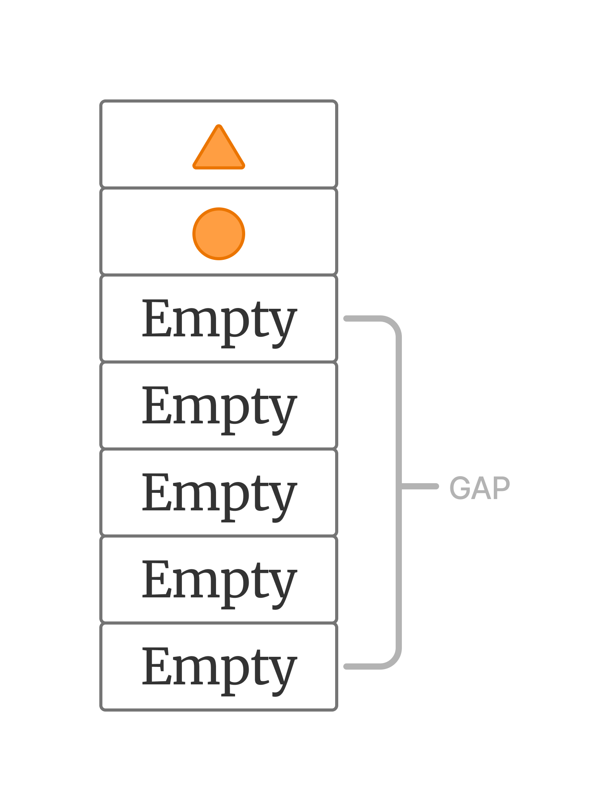
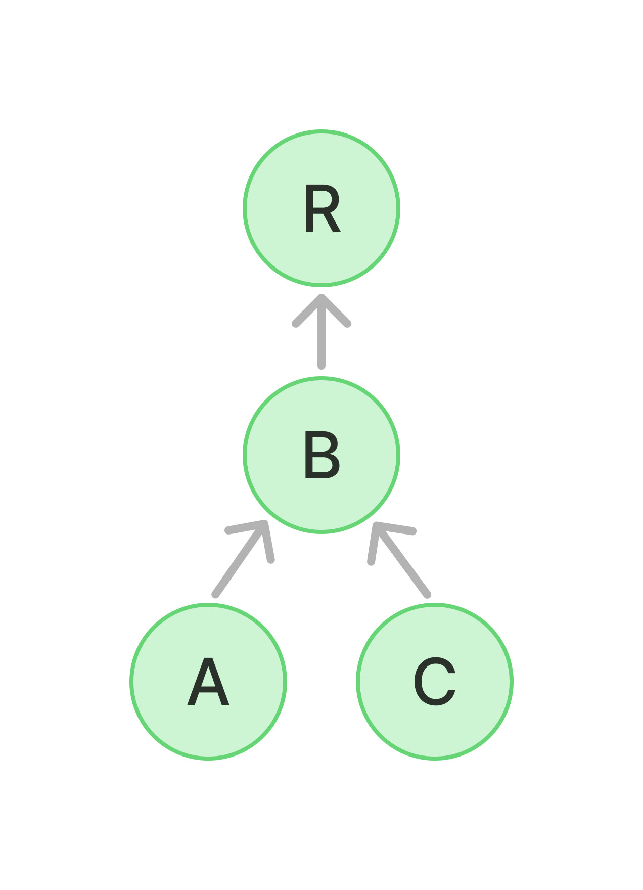
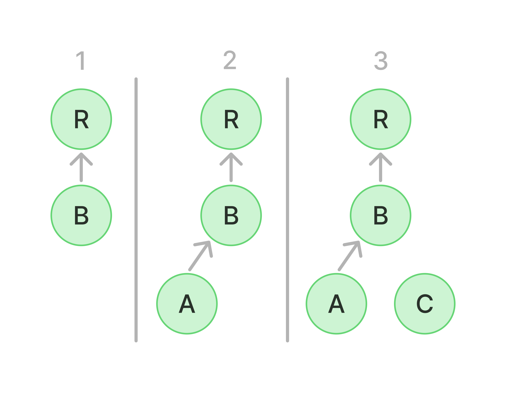
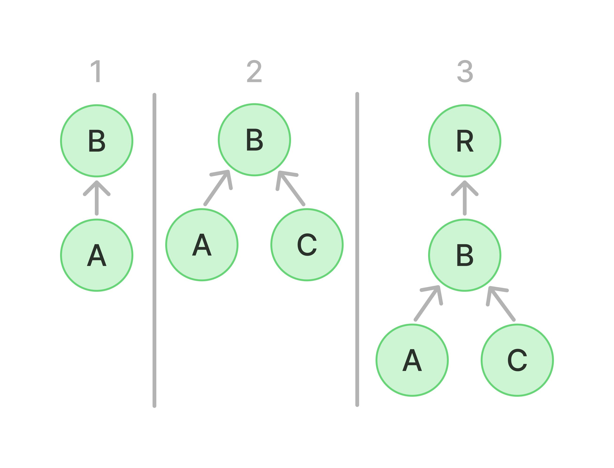
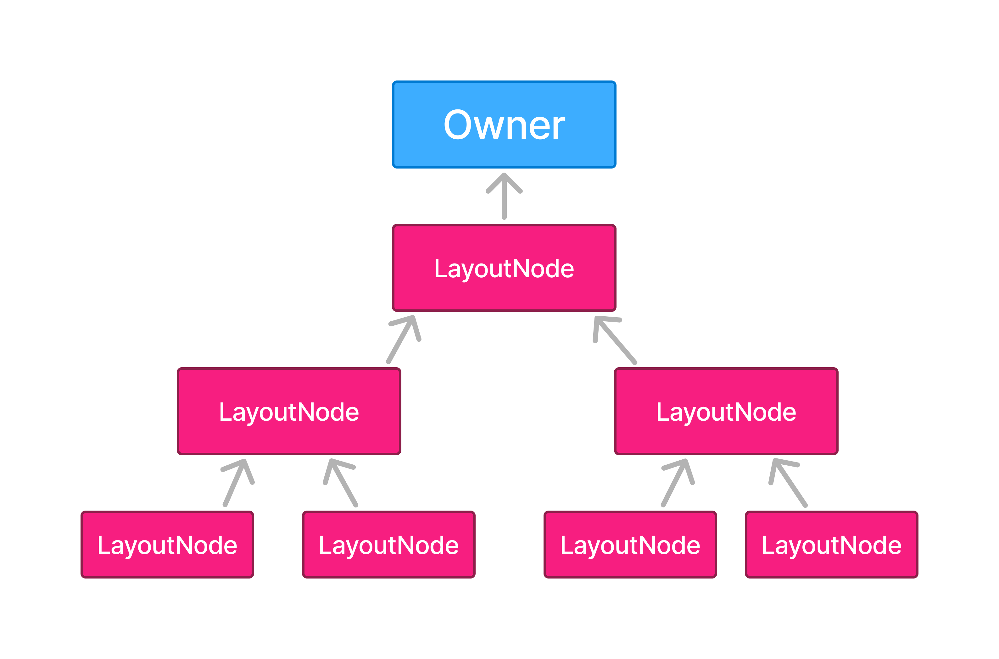

Jetpack Compose Internals 를 읽고 정리하는 글이다. 
어쩌다보니 올해 안에 완독 하겠다는 목표를 세워서 [(관련글)](https://winter-love.dev/insights/compose-internals) 열심히 읽는중이다.
이 글의 수준을 다음과 같이 설정했다. 
대학생이나 현업 개발자 등 컴포즈를 평소보다 좀 더 깊이 있게 파고들고 싶은 자가 받아들일 수 있을 정도로 쉬운 난이도.

---

주당 1챕터씩 작성하려 했으나 1주가 미뤄졌다. 회사 일이 바쁘고 주말에 지침 이슈. ~~(게으름 이슈)~~ 연말 휴가때 좀 몰아서 읽어야겠다.

[이전 2장 컴포즈 컴파일러](https://winter-love.dev/composeinternals/2-the-compose-compiler/)
도 만만치 않았지만, 이번 3장은 분량이 2배다.
예시코드와 그림들이 전보다 많기 때문에 장수가 더 많아진 감도 있다.
이전 장도 이해하고 요약하기 위해 마음의 준비가 필요했지만, 이번 장은 2배 정도의 노력이 더 필요했다.

---

> **슬롯 테이블 (Slot Table):** Composition의 현재 상태를 저장하는 메모리 구조. 모든 Composable 호출의 위치, 파라미터, 기억된 값 등을 추적.

> **변경 목록 (List of Changes):** 노드 트리에 실제로 적용할 변경사항을 담은 목록. 패치 파일처럼 동작.

# 슬롯 테이블과 변경 목록 (The slot table and the list of changes)

슬롯 테이블은 composition의 현재 상태를 저장한다.
Composable 호출의 위치, 파라미터, 기억된 값, CompositionLocal 등 모든 정보가 여기 담긴다.

변경 목록은 실제 노드 트리에 적용할 변경사항이다.
패치 파일처럼 동작한다.

슬롯 테이블 = 상태 기록, 변경 목록 = 변경 적용.

Composer가 슬롯 테이블의 정보를 보고 변경 목록을 생성한다.
Applier가 변경 목록을 트리에 적용한다.
Recomposer가 언제, 어디서 할지 결정한다.

---

> **갭 버퍼 (Gap Buffer):** 텍스트 에디터에서 사용하는 자료구조. 데이터 중간에 빈 공간(갭)을 두고, 갭을 이동시키면서 효율적으로 삽입/삭제.

> **앵커 (Anchor):** 슬롯 테이블에서 특정 위치를 가리키는 포인터. 빠른 접근을 위해 사용.



# 슬롯 테이블 심층 분석 (The slot table in depth)

슬롯 테이블은 갭 버퍼 개념을 바탕으로 한다.
빠른 선형 접근에 최적화된 데이터 구조다.

두 개의 배열로 구성된다.
```kotlin
var groups = IntArray(0)
var slots = Array(0) { null }
```
groups 배열은 그룹 메타데이터를 저장한다. 부모-자식 관계, 그룹 타입 등의 정보다.
slots 배열은 실제 composition 데이터를 저장한다. Any? 타입이므로 모든 종류의 값을 담을 수 있다.

[2장에서 봤듯이 (교체 가능한 그룹)](https://winter-love.dev/composeinternals/2-the-compose-compiler/#%EA%B5%90%EC%B2%B4-%EA%B0%80%EB%8A%A5%ED%95%9C-%EA%B7%B8%EB%A3%B9-replaceable-groups) 
컴파일러는 Composable 함수 본문을 그룹으로 감싼다.
그룹은 Composable 함수에 고유 ID를 부여하고 관련 정보를 감싼다.
그룹 타입은 재시작 가능한 그룹, 이동 가능한 그룹, 교체 가능한 그룹, 재사용 가능한 그룹이 있다.
부모 그룹이 먼저 나오고 자식 그룹이 뒤따른다. 선형 구조로 그룹 트리를 모델링한다.

갭은 테이블에서 이동 가능한 범위 포인터다.
데이터를 읽고 쓸 위치를 결정한다.
조건부 로직에서 조건이 바뀌면 갭이 그룹 시작 위치로 돌아가서 기존 슬롯을 덮어쓴다.

SlotReader는 테이블에서 데이터를 읽는다. 여러 개의 Reader가 동시에 읽을 수 있다.
SlotWriter는 테이블에 데이터를 쓴다. 하나의 Writer만 활성화될 수 있다.
동시 읽기/쓰기를 막아서 경쟁 상태를 방지한다.
Reader는 방문자처럼 작동한다. 현재 그룹, 위치, 부모, 슬롯 등을 추적하면서 배열을 탐색한다.
Writer는 그룹과 슬롯을 추가, 교체, 이동, 제거한다. 갭을 이동시키면서 어디에 쓸지 결정한다.

앵커는 특정 인덱스를 가리키는 포인터다. 빠른 접근을 위해 사용된다.
앵커가 가리키는 위치 앞에서 그룹이 이동/교체/삽입/제거되면 앵커도 업데이트된다.

---

# 변경 목록 (The list of changes)

Composition이 발생할 때마다 Composable 함수들이 실행되고 방출된다.
방출이란 슬롯 테이블을 업데이트하고, 지연된 변경사항을 생성하는 것이다.
이 변경사항들이 목록 형태로 저장된다.

새로운 변경 목록은 슬롯 테이블에 이미 저장된 값을 바탕으로 생성된다.
트리의 어떤 변경사항이라도 composition의 현재 상태에 의존하기 때문이다.

예를 들어 노드를 이동한다고 생각해보자.
테이블에서 해당 노드가 이전에 어디 있었는지 확인하고, 그 위치의 슬롯을 제거한 다음 새 위치에 다시 작성해야 한다.

Composable 함수가 방출될 때마다 슬롯 테이블을 확인하고, 현재 정보에 따라 지연된 변경사항을 생성하고, 변경 목록에 추가한다.
나중에 composition이 끝나면 변경 목록의 내용들이 실제로 실행되면서 구체화된다.
그때가 슬롯 테이블을 최신 정보로 실제 업데이트하는 순간이다.
실행을 기다리는 작업을 미리 생성해두는 것만으로 방출 과정이 매우 빠르다.

변경 목록이 적용된 직후, 구체화된 노드 트리를 업데이트하기 위해 Applier에게 알린다.

Recomposer는 이 과정을 조율한다.
어떤 스레드에서 composition/recomposition 할지, 어떤 스레드에서 변경사항을 적용할지 결정한다.
변경사항을 적용하는 스레드는 LaunchedEffect가 사이드 이펙트를 실행하는 디폴트 컨텍스트가 되기도 한다.

이제 Composer를 살펴볼 차례다.

---

# Composer

주입된 $composer는 우리가 작성하는 Composable 함수를 Compose Runtime에 연결하는 역할을 한다. 
[`$composer`가 어떻게 주입 되는지는 2장에서 자세히 다뤘다.](https://winter-love.dev/composeinternals/2-the-compose-compiler/#composer-%EC%A3%BC%EC%9E%85%ED%95%98%EA%B8%B0-injecting-the-composer)

---

# Composer 키우기 (Feeding the Composer)

트리의 메모리 표현에 노드가 어떻게 추가되는지 살펴보자.
Layout Composable을 예로 들 수 있다.
Layout은 Compose UI의 모든 UI 컴포넌트의 기반이다.

```kotlin
@Composable inline fun Layout(
    content: @Composable () -> Unit,
    modifier: Modifier = Modifier,
    measurePolicy: MeasurePolicy
) {
    val density = LocalDensity.current
    val layoutDirection = LocalLayoutDirection.current
    ReusableComposeNode>(
        factory = ComposeUiNode.Constructor,
        update = {
            set(measurePolicy, ComposeUiNode.SetMeasurePolicy)
            set(density, ComposeUiNode.SetDensity)
            set(layoutDirection, ComposeUiNode.SetLayoutDirection)
        },
        skippableUpdate = materializerOf(modifier),
        content = content
    )
}
```

Layout은 LayoutNode를 composition에 방출하기 위해 ReusableComposeNode를 사용한다.
즉각 노드를 생성하고 추가하는 것처럼 보이지만, 실제로는 "적절한 시기에 노드를 생성, 초기화, 삽입하는 방법"을 런타임에게 가르친다.

```kotlin
@Composable
inline fun > ReusableComposeNode(
    noinline factory: () -> T,
    update: @DisallowComposableCalls Updater.() -> Unit,
    noinline skippableUpdate: @Composable SkippableUpdater.() -> Unit,
    content: @Composable () -> Unit
) {
    currentComposer.startReusableNode()
    currentComposer.createNode(factory)
    Updater(currentComposer).update() // initialization
    currentComposer.startReplaceableGroup(0x7ab4aae9)
    content()
    currentComposer.endReplaceableGroup()
    currentComposer.endNode()
}
```

currentComposer 인스턴스에 모든 것을 위임하는 형태다.
교체 가능한 그룹으로 Composable 함수 본문을 감싼다.
content 람다 내부에서 방출된 모든 자식들은 이 교체 가능한 그룹의 자식으로 저장된다.
다른 모든 Composable 함수도 동일한 방출 작업을 수행한다.
remember를 보자.

```kotlin
@Composable
inline fun  remember(calculation: @DisallowComposableCalls () -> T): T =
    currentComposer.cache(invalid = false, calculation)
```

remember는 제공된 람다가 반환한 값을 composition에 캐싱하기 위해 currentComposer를 사용한다.
invalid 매개변수는 값을 강제로 업데이트한다.

cache 함수는 다음과 같다.

```kotlin
inline fun  Composer.cache(invalid: Boolean, block: () -> T): T {
    return rememberedValue().let {
        if (invalid || it === Composer.Empty) {
            val value = block()
            updateRememberedValue(value)
            value
        } else it
    } as T
}
```

먼저 composition(슬롯 테이블)에서 값을 검색한다.
찾을 수 없으면 변경사항을 방출해서 값 업데이트를 예약한다.
있으면 그대로 반환한다.

---

# 변경 사항 모델링 (Modeling the Changes)

currentComposer에 위임된 모든 방출 작업은 Change로 모델링되어 변경 목록에 추가된다.
Change는 현재 Applier와 SlotWriter에 접근할 수 있는 지연된 함수다.
작성자는 한 번에 하나만 활성화될 수 있다는 걸 기억하자.

```kotlin
internal typealias Change = (
    applier: Applier,
    slots: SlotWriter,
    rememberManager: RememberManager
) -> Unit
```

이런 변경사항들은 변경 목록에 추가된다. 다시 말해 기록된다.
"방출"이라는 행위는 본질적으로 이런 Change들을 생성하는 것이다.
Change는 슬롯 테이블에서 노드를 추가, 제거, 교체, 이동할 수 있는 지연된 람다식이며, 결과적으로 Applier에 변경사항을 알린다.
궁극적으로 Applier를 통해 구체화된다.

따라서 "변경사항 방출", "변경사항 기록", "변경사항 스케줄링"은 모두 같은 의미다.
Composition이 끝나면 일련의 Composable 함수들이 호출되고, 모든 변경사항이 기록된다.
그 후 Applier에 의해 모든 변경사항들이 일괄 적용된다.
Composition 자체는 Composition 클래스로 모델링된다.

---

# 작성 시기 최적화 (Optimizing when to write)

새로운 노드를 삽입하는 것은 Composer에게 위임된다.
Composer가 composition에 새로운 노드를 삽입하는 과정에 참여하고 있을 때, Compose는 항상 그 사실을 알고 있다.
이런 경우 Composer는 변경사항을 변경 목록에 추가하지 않는다.
곧바로 슬롯 테이블에 변경사항을 작성한다.
그 외의 경우에는 변경사항이 변경 목록에 기록되고 지연된다.
아직 적용할 시점이 아니기 때문이다.

---

# 쓰기 및 읽기 그룹 (Writing and reading groups)

Composition이 완료되면 `composition.applyChanges()`가 호출된다.
트리를 구체화하고 변경사항이 슬롯 테이블에 기록된다.

Composer는 데이터, 노드, 그룹 등 다양한 유형의 정보를 작성할 수 있다.
단순화를 위해 궁극적으로 모든 항목은 그룹 형태로 저장된다.
그룹들은 서로 다른 그룹 필드로 차별화된다.

Composer는 모든 그룹을 "시작"하고 "종료"할 수 있다.
쓰기 작업 중이면 슬롯 테이블에서 "그룹 생성"과 "그룹 제거"를 의미한다.
읽기 작업 중이면 SlotReader가 읽기 포인터를 그룹 외부로 이동한다.

Composable 트리의 노드는 삽입뿐만 아니라 제거되거나 이동될 수도 있다.
그룹을 제거한다는 것은 그룹과 모든 슬롯을 테이블에서 제거하는 것이다.
Composer는 SlotReader를 재배치하고 해당 그룹을 건너뛰게 하며, 모든 노드를 Applier에서 제거한다.
모든 수정 작업은 일괄 적용을 위해 예약(기록)되어야 한다.
모든 변경사항이 동시에 반영되어야 의미 있기 때문이다.
Composer는 제거된 그룹에 대한 모든 보류 중인 invalidation을 폐기한다.

모든 그룹이 재시작/교체/이동/재사용 가능한 형태로 분류되는 것은 아니다.
예를 들어 디폴트 값을 둘러싸는 블록도 매우 특정한 그룹으로 분류된다.
`model: Model = remember { DefaultModel() }` 같은 형태다.

Composer가 그룹을 시작하려고 할 때 다음과 같은 일이 발생한다.
값들을 삽입하는 과정이면 곧바로 슬롯 테이블에 작성한다.
보류 중인 작업이 있으면 변경사항 적용 시 모두 기록한다. 대상 그룹이 이미 존재하면 재사용한다.
그룹이 다른 위치에 있으면(이동됨) 모든 슬롯을 이동하는 동작이 기록된다.
새 그룹이면(테이블에 없음) 삽입 모드로 이동해서 중간 insertTable에 작성한 후 최종 테이블에 삽입을 예약한다.
삽입 중도 아니고 보류 중인 작성 작업도 없으면 그룹 읽기를 시작한다.

그룹 재사용은 흔하다.
이미 존재하는 노드는 재사용할 수 있다.
Applier에 의해 노드 이동 작업은 발행(기록)하지만, 생성과 초기화 작업은 생략한다.

노드의 속성에 업데이트가 필요하면 그 업데이트 동작도 Change로 기록된다.

---

# 값 기억하기 (Remembering values)

Composer는 값을 composition에 기억하고(슬롯 테이블에 기록), 나중에 업데이트할 수 있다.
마지막 composition으로부터 값이 변경되었는지 비교는 remember 함수가 호출되는 즉시 수행된다.
하지만 업데이트 작업은 Composer가 값을 이미 삽입하는 중이 아니라면 Change로 기록된다.
업데이트할 값이 RememberObserver인 경우 Composer는 암시적 Change도 기록한다.
composition의 기억 작업을 추적하기 위해서다.
나중에 기억하고 있는 모든 값을 다시 잊어야 할 때 사용한다.

---

> **RecomposeScope:** Composition의 나머지 부분과 독립적으로 재구성될 수 있는 영역.
 
# 재구성 범위 (Recompose scopes)

Composer를 통해 발생하는 또 다른 기능은 스마트 recomposition을 가능하게 하는 범위 재구성이다.
이는 재시작 가능한 그룹과 직접 관련이 있다.
재시작 가능한 그룹이 생성될 때마다 Composer는 RecomposeScope를 생성하고 이를 Composition의 currentRecomposeScope로 설정한다.

RecomposeScope는 Composable의 recomposition을 수동으로 invalidate하고 트리거하는 데 사용할 수 있다.
invalidate는 `composer.currentRecomposeScope().invalidate()`와 같이 Composer를 통해 요청된다.
재구성을 위해 Composer는 슬롯 테이블을 해당 그룹의 시작 위치에 배치한 다음 재구성 블록을 호출한다.
Composable 함수가 다시 호출되어 한 번 더 방출되므로 Composer에게 테이블의 기존 데이터를 재정의하도록 요청한다.

Composer는 invalidate된 모든 재구성 범위의 스택을 유지한다.
다음 recomposition에서 트리거되어야 하는 보류 중인 범위들이다.
currentRecomposeScope는 실제로 이 재구성 범위 스택을 통해 생성된다.

RecomposeScope가 항상 활성화되는 것은 아니다.
Compose가 Composable 함수 내에서 상태 스냅샷 읽기와 관련된 작업을 발견했을 경우에만 발생한다.
이 경우 Composer는 RecomposeScope를 used로 표시한다.
그러면 Composable 함수 끝에 삽입된 "end" 호출이 더 이상 null을 반환하지 않고 뒤따르는 recomposition 람다를 활성화한다.

```kotlin
// After compiler inserts boilerplate
@Composable
fun A(x: Int, $composer: Composer, $changed: Int) {
    $composer.startRestartGroup()
    // ...
    f(x)
    $composer.endRestartGroup()?.updateScope { next ->
        A(x, next, $changed or 0b1)
    }
}
```

endRestartGroup 함수 호출의 ? 문자 뒤를 보자.
Composer는 재구성이 필요할 때 현재 상위 그룹의 invalidate된 하위 그룹을 모두 recomposition할 수 있다.
그렇지 않은 경우 SlotReader가 그룹을 마지막까지 생략할 수 있다.
([2장의 비교 전파 섹션 참고](https://winter-love.dev/composeinternals/2-the-compose-compiler/#%EB%B9%84%EA%B5%90-%EC%A0%84%ED%8C%8C-comparison-propagation))

---

# Composer와 사이드 이펙트 (SideEffects in the Composer)

Composer는 사이드 이펙트도 기록할 수 있다.
사이드 이펙트는 항상 composition 이후에 실행된다.
트리에 대한 변경사항 적용이 완료된 시점에 호출 가능한 함수 형태로 기록된다.
이는 Composable 함수 외부에서 발생하는 이펙트를 나타내므로 Composable의 라이프사이클과 완전히 무관하다.
Composition을 떠날 때 실행 중인 작업을 자동 취소하거나 recomposition에 이펙트를 재시도하는 것 같은 작업은 담당하지 않는다.
이런 유형의 이펙트는 슬롯 테이블에 저장되지 않기 때문에 composition이 실패하면 간단히 폐기된다.

---

# CompositionLocals 저장 (Storing CompositionLocals)

Composer는 CompositionLocals를 등록하고 키를 통해 해당 값을 획득하는 방법을 제공한다.
`CompositionLocal.current` 호출은 이에 의존한다.
CompositionLocals의 Provider(공급자)와 공급되는 값은 모두 슬롯 테이블에 그룹 형태로 저장된다.

---

# 소스 정보 저장 (Storing source information)

Composer는 composition 중에 수집된 내용을 CompositionData 형태로 소스 정보를 저장한다.
각종 Compose 툴에서 활용할 수 있도록 하기 위해서다.

---

> **Subcomposition:** 독립적인 invalidation을 지원하기 위해 별도로 생성된 composition. 상위 composition과 CompositionContext로 연결됨.

# CompositionContext를 이용한 Composition 연결 (Linking Compositions via CompositionContext)

CompositionContext는 단일 composition에는 없지만 composition과 subcomposition 트리에 존재한다.

Subcomposition은 독립적인 invalidation을 지원하기 위해 현재 컨텍스트에서 별도의 composition을 구성하려는 의도로 생성된 인라인 타입의 composition이다.
상위 CompositionContext 참조를 통해 상위 composition과 연결된다.

CompositionContext는 composition과 subcomposition을 하나의 트리로 연결하기 위해 존재한다.
CompositionLocal과 invalidation이 마치 단일 composition에 속한 것처럼 투명하게 트리 아래로 전파되는 것을 보장한다.
CompositionContext 자체도 슬롯 테이블에 그룹의 한 유형으로 기록된다.

Subcomposition은 일반적으로 `rememberCompositionContext`를 통해 생성된다.

```kotlin
@Composable fun rememberCompositionContext(): CompositionContext {
    return currentComposer.buildContext()
}
```

이 함수는 슬롯 테이블의 현재 위치에 새 composition을 기억하거나, 이미 기억된 경우 이를 반환한다.
VectorPainter, Dialog, SubcomposeLayout, Popup 같은 별도의 composition이 필요한 위치에서 subcomposition을 만드는 데 사용된다.
Android View를 Composable 트리에 통합하기 위해 사용하는 wrapper인 AndroidView도 마찬가지다.

---

# 현재 상태 스냅샷에 접근  (Accessing the current State snapshot)

Composer는 현재 스냅샷에 대한 참조를 가지고 있다.
이는 현재 스레드에 대한 가변적인 상태 및 기타 상태 객체들이 반환하는 값의 스냅샷과 유사하다.
모든 상태 객체는 스냅샷에서 명시적으로 변경되지 않는 한 스냅샷이 생성되었을 때와 동일한 값을 갖는다.

---

# 노드 탐색 (Navigating the nodes)

노드 트리 탐색은 Applier에 의해 수행되지만 직접적으로 수행되지는 않는다.
구독자에 의해 탐색되는 노드의 모든 위치를 기록하고 downNodes 배열에 기록함으로써 수행된다.
노드 탐색이 실현되면 downNodes에 있는 모든 하향 노드 정보를 Applier에 전달된다.
하향 노드 탐색이 수행되기 전에 상향 노드 탐색이 수행되는 경우에는 downNodes 스택에서 제거하여 탐색 경로를 단축한다.

---

# 구독자와 작성자의 동기화 유지  (Keeping reader and writer in sync)

구독자와 작성자의 동기화 유지는 low-level에서 이루어지는 작업이다.
특정 그룹을 삽입, 삭제, 이동할 수 있으므로 작성자의 그룹 위치는 변경사항이 적용될 때까지 일시적으로 구독자의 위치와 다를 수 있다.

이 차이를 추적하기 위해 델타를 유지 관리한다.
델타는 삽입, 삭제, 이동에 따라 업데이트되며 "작성자와 구독자의 현재 슬롯 위치를 정확하게 일치시키기 위해 이동해야 하는 실현되지 않은 거리"를 반영한다.

구독자와 작성자 간의 동기화는 Compose Runtime 라이브러리의 ComposerChangeListWriter에서 수행된다.
이 클래스 내에는 writersReaderDelta 변수가 존재하고, 구독자와 작성자 간의 슬롯 위치를 지속적으로 계산하는 함수들이 있다.

```kotlin
private var writersReaderDelta: Int = 0

fun moveReaderRelativeTo(location: Int) {
    writersReaderDelta += location - reader.currentGroup
}

fun moveReaderToAbsolute(location: Int) {
    writersReaderDelta = location
}
```

이 함수들은 구독자와 작성자 간의 격차를 추적하기 위해 Composer에 의해 지속적으로 호출된다.
그룹 생성이 시작되거나 값에 업데이트가 발생할 때마다 realizeOperationLocation 함수를 실행시켜 거리 간격을 정확하게 일치시킨다.

```kotlin
private fun realizeOperationLocation(forParent: Boolean = false) {
    val location = if (forParent) reader.parent else reader.currentGroup
    val distance = location - writersReaderDelta
    runtimeCheck(distance >= 0) {
        "Tried to seek backward"
    }
    if (distance > 0) {
        changeList.pushAdvanceSlotsBy(distance)
        writersReaderDelta = location
    }
}
```

---

# 변경 사항 적용하기 (Applying the changes)

이번 챕터에서 여러 번 언급했듯이 Applier가 변경사항 적용을 담당한다.
Composer는 이 추상화를 Applier에게 위임하여 composition 이후에 기록된 모든 변경사항을 적용한다.
이것을 "구체화(materializing)"라고 한다.

이 프로세스는 변경 목록을 실행하고 결과적으로 슬롯 테이블을 업데이트한다.
슬롯 테이블에 저장된 composition 데이터를 해석하여 효과적으로 결과를 생성한다.

런타임은 Applier의 구현체와 독립적이다.
클라이언트 라이브러리가 구현할 것으로 기대되는 계약에 의존한다.
Applier는 플랫폼과의 통합점과 같으므로 유즈케이스에 따라 인터페이스의 구현체가 전혀 달라질 수 있다.
```kotlin
interface Applier<N> {
    val current: N
    fun onBeginChanges() {}
    fun onEndChanges() {}
    fun down(node: N)
    fun up()
    fun insertTopDown(index: Int, instance: N)
    fun insertBottomUp(index: Int, instance: N)
    fun remove(index: Int, count: Int)
    fun move(from: Int, to: Int, count: Int)
    fun clear()
}
```

가장 먼저 보이는 것은 N 제네릭 타입 매개변수다.
N 매개변수는 우리가 적용하는 노드의 타입을 결정한다.
이것이 Compose가 제네릭 호출 그래프 또는 노드 트리와 함께 동작할 수 있는 이유다.
사용되는 노드 타입에 대해서는 항상 상호운용이 가능하다.

Applier는 트리를 탐색하고 노드를 삽입, 제거, 이동하는 작업을 제공한다.
하지만 해당 노드의 타입이나 최종적으로 어떻게 삽입되는지는 관여하지 않는다.
노드 자체에게 위임된다.

Applier는 현재 노드에서 지정된 범위의 모든 하위 항목을 제거하거나, 하위 항목을 이동시키고 위치를 변경하는 방법도 정의한다.
clear 작업은 루트를 가리키고 트리에서 모든 노드를 제거한다.
Applier와 해당 루트를 향후 새 composition에 사용할 준비를 한다.

Applier는 모든 노드를 방문하고 적용하면서 전체 트리를 순회한다.
트리는 하향 또는 상향 순회할 수 있다.
Applier는 방문하고 변경사항을 적용하는 현재 노드에 대한 참조를 항상 유지한다.

Composer가 변경사항 적용을 시작하고 끝낼 때 `onBeginChanges()`와 `onEndChanges()`를 호출한다.
`insertTopDown()`과 `insertBottomUp()`으로 상단에서 하단으로, 또는 하단에서 상단으로 노드를 삽입한다.
`down()`으로 현재 노드의 자식 노드로 이동하고, `up()`으로 현재 노드의 부모로 이동한다.

---

# 노드 트리 구축 시 성능  (Performance when building the node tree)

트리를 하향식으로 작성하는 것과 상향식으로 작성하는 것에는 중요한 차이가 있다.

**하향식 삽입  (Inserting top‑down)**

아래와 같은 트리가 있다고 가정해보자.



이 트리를 하향식으로 구축하려면 먼저 B를 R에 삽입한 다음 A를 B에 삽입하고 마지막으로 C를 B에 삽입한다.
즉, 아래 그림과 같은 순서(좌측에서 우측)로 동작한다.



**상향식 삽입 (Inserting bottom‑up)**

트리의 상향식 구축은 A와 C를 B에 삽입한 다음, B 트리를 R에 삽입하는 것으로 시작된다.



하향식과 상향식의 트리 작성 성능은 상당히 다를 수 있다.
사용되는 Applier의 구현체에 따라 성능의 결과가 달라지며, 일반적으로 새 하위 항목이 삽입될 때마다 알림을 받아야 하는 노드 수에 따라 달라진다.

Compose로 표현하려는 그래프에 노드가 삽입될 때마다 노드의 모든 상위 항목에 알려야 한다고 상상해보자.
하향식 삽입의 경우는 수많은 노드(부모 노드, 부모의 부모 노드 등 먼 조상까지)에게 알려야 할지도 모른다.
그래프에 새로운 깊이가 추가될 때마다 변경사항을 알려야 할 노드가 기하급수적으로 증가한다.

대신 상향식 삽입의 경우 부모가 아직 트리에 연결되어 있지 않기 때문에 언제나 직속 부모 노드에게만 알린다.
자식 노드에게만 변화를 알리는 형태의 전략을 취한다면 노드의 변화를 알리기 위한 비용을 많이 절감시킬 수 있다.

따라서 전략은 표현하고 있는 트리에 따라서, 혹은 변경사항들이 트리의 위쪽이나 아래쪽에 어떻게 알려져야 하는지에 따라서 달라질 수 있다.
핵심은 노드 삽입 전략을 둘 다 선택해서는 안 되고, 단 하나만을 선택해야 한다는 것이다.

---

# 변경 사항이 적용되는 방식 (How changes are applied)

클라이언트 라이브러리는 Applier 인터페이스에 대한 구현을 제공한다.
그중 하나가 Android UI에서 사용되는 UiApplier다.
UiApplier는 "노드 적용"의 의미를 내포하며, 디바이스 스크린에서 볼 수 있는 구성 요소를 어떻게 생성하는지 보여주는 완벽한 예시다.

구현체를 살펴보면 별로 거창하지 않다.

```kotlin
internal class UiApplier(
    root: LayoutNode
) : AbstractApplier<LayoutNode>(root) {

    override fun insertTopDown(index: Int, instance: LayoutNode) {
        // Ignored.
    }

    override fun insertBottomUp(index: Int, instance: LayoutNode) {
        current.insertAt(index, instance)
    }

    override fun remove(index: Int, count: Int) {
        current.removeAt(index, count)
    }

    override fun move(from: Int, to: Int, count: Int) {
        current.move(from, to, count)
    }

    override fun onClear() {
        root.removeAll()
    }

    override fun onEndChanges() {
        super.onEndChanges()
        (root.owner as? AndroidComposeView)?.clearInvalidObservations()
    }
}
```

가장 먼저 볼 수 있는 것은 Applier 인터페이스의 제네릭 타입 N이 LayoutNode로 바뀌었다는 것이다.
이는 렌더링될 UI 노드를 나타내기 위해 Compose UI가 선택한 노드 타입이다.

다음으로 주목해야 할 점은 AbstractApplier를 상속받는 형태다.
이는 방문한 노드를 스택에 저장하는 기본 구현체다.
트리 하단에서 새 노드를 방문할 때마다 스택에 추가하고, 방문자가 위로 이동할 때마다 마지막으로 방문한 노드를 스택 상단에서 제거한다.
일반적으로 여러 Applier 간에 공통적으로 사용되는 스펙이기 때문에 추상 클래스로 만든 것이다.

Android의 경우 노드 삽입이 상향식으로만 수행되기 때문에 UiApplier에서 insertTopDown이 무시되는 것을 확인할 수 있다.
노드 선택 전략은 둘 중 하나를 선택하는 것이 중요하다.
이 경우 새 하위 항목이 삽입될 때마다 중복되는 노드 알림을 방지하려면 상향식 전략이 더 적합하다.

노드를 삽입, 제거, 이동하는 방법은 모두 노드 자체에 위임된다.
LayoutNode는 Compose UI가 UI 노드를 모델링하는 방법이므로 상위 노드와 하위 노드에 관한 모든 것을 알고 있다.
노드를 삽입한다는 것은 해당 노드를 주어진 위치의 새 부모 노드에 연결하는 것을 의미한다.
노드를 이동한다는 것은 본질적으로 부모 노드의 자식 노드들을 재정렬하는 것을 의미한다.
노드를 제거한다는 것은 단순히 목록에서 해당 노드를 제거하는 것을 의미한다.

변경사항 적용이 끝나면 `onEndChanges()`를 호출할 수 있다.
이는 최종적인 요구사항을 루트 노드 소유자에게 위임한다.
변경사항을 적용하기 전에 항상 `onBeginChanges()`가 먼저 호출된다고 가정되므로 `onEndChanges()`는 마지막에 호출해야 한다.

`onEndChanges()`가 호출된 시점에서 모든 보류 중인 무효화된 관찰들이 해제된다.
이 스냅샷 관찰들은 읽고 의존하는 값이 변경될 때 자동으로 레이아웃이나 화면에 그리는 작업을 다시 호출하기 위한 것이다.
트리에서 노드가 추가되거나 삽입되거나 교체되거나 이동되는 것이 레이아웃 크기의 측정이나 구성 등에 어떻게 영향을 미칠 수 있는지 생각해보자.

---

# 노드 연결 및 그리기 (Attaching and drawing the nodes)

트리에 노드를 삽입하면 어떻게 화면에 나타날까?
노드는 스스로 연결하고 그리는 방법을 알고 있다.

UiApplier가 LayoutNode에게 삽입을 위임하면 다음 순서로 진행된다.
조건 확인 (부모 노드 없는지 등), Z 인덱스 정렬된 자식 목록 invalidate, 부모 노드와 Owner에 연결, invalidate 수행.

Owner는 트리의 루트에 존재한다.
Composable 트리를 안드로이드 뷰 시스템과 연결하는 통합 계층이다.
AndroidComposeView(표준 View)로 구현된다.
모든 레이아웃, 그리기, 입력, 접근성은 Owner를 통해 연결된다.



LayoutNode는 Owner와 연결되어야 화면에 나타난다.
Owner는 setContent 호출 시 설정된다.
Activity, Fragment, ComposeView에서 setContent를 호출하면 AndroidComposeView가 생성되어 View 계층에 연결되고 Owner로 설정된다.

---

# Composition

Composer가 Composition에 대한 참조를 가지고 있어서 Composer가 Composition을 생성하고 소유한다고 생각할 수 있다.
하지만 실제로는 그 반대다.
Composition이 생성되면 Composer는 스스로 구축한다.
Composer는 currentComposer 메커니즘을 통해 접근할 수 있으며, Composition이 관리하는 트리를 생성하고 업데이트하는 데 사용된다.

클라이언트 라이브러리는 두 가지 진입점을 통해 Jetpack Compose Runtime에 접근한다.

Composable 함수 작성: 관련된 모든 정보를 방출하고 런타임과 연결한다.
setContent: 대상 플랫폼과의 통합 계층. Composition이 생성되고 시작된다. Composable 함수는 Composition 프로세스 없이는 실행되지 않기 때문에 필요하다.

---

# Composition 생성하기 (Creating a Composition)

Android에서는 `ViewGroup.setContent` 호출로 새 composition을 생성한다.

```kotlin
private fun doSetContent(
    owner: AndroidComposeView,
    parent: CompositionContext,
    content: @Composable () -> Unit
): Composition {
    val original = Composition(UiApplier(owner.root), parent)
    val wrapped = WrappedComposition(owner, original)
    wrapped.setContent(content)
    return wrapped
}
```

WrappedComposition은 Composition을 AndroidComposeView에 연결하는 데코레이터다.
안드로이드 Context 정보를 CompositionLocal로 제공한다.
UiApplier는 트리의 루트 LayoutNode를 가리킨다.
클라이언트 라이브러리가 Applier 구현을 선택한다.

VectorPainter는 자신만의 Composition을 생성한다.
VectorApplier를 사용하며 벡터 트리의 루트 노드(VNode)를 가리킨다.
SubcomposeLayout도 자체 Composition을 유지한다. 측정 단계에서 내용을 하위 구성할 수 있다.

상위 CompositionContext를 전달하면 새 composition을 기존 composition에 논리적으로 연결한다.
invalidation과 CompositionLocal이 전체에서 동일하게 작동한다.
recomposition 컨텍스트로 변경사항을 적용할 CoroutineContext를 지정할 수 있다.
제공하지 않으면 EmptyCoroutineContext가 사용된다.

Composition은 더 이상 필요하지 않으면 `composition.dispose()`로 폐기해야 한다.

---

# 초기 Composition 과정 (The initial Composition process)

`composition.setContent(content)`가 호출되면 슬롯 테이블이 데이터로 채워진다.

```kotlin
override fun setContent(content: @Composable () -> Unit) {
    this.composable = content
    parent.composeInitial(this, composable)
}
```

상위로 계속 위임하다가 결국 Recomposer가 초기 composition을 수행한다.

모든 State 객체의 현재 값을 스냅샷으로 취합한다.
이 스냅샷은 가변적이지만 동시성에 안전하다.
State 변경사항은 해당 객체에만 발생하고 나중에 전역 상태와 원자적으로 동기화된다.
`snapshot.enter(block)` 안에서만 State 값 수정 가능하다.
Recomposer는 State 읽기/쓰기 관찰자를 전달해서 composition에 알린다.

`composition.composeContent(content)`가 실행되고 Composer가 실제 composition을 수행한다.
완료되면 `snapshot.apply()`로 변경사항을 전역 상태에 전파한다.

진행 중이면 재진입 불가. 보류 중인 invalidation을 복사하고, isComposing을 true로 설정한다.
`startRoot()` → `startGroup` → content 람다 호출 → `endGroup` → `endRoot()` 순으로 진행한다.
완료 후 `isComposing`을 `false`로 변경하고 임시 데이터를 삭제한다.

---

# 초기 Composition 후 변경 사항 적용 (Applying changes after initial Composition)

초기 composition 이후 Applier는 `composition.applyChanges()` 프로세스 중에 기록된 모든 변경사항을 적용하라는 알림을 받는다.

`applier.onBeginChanges()`를 호출하고 모든 변경사항을 실행한다.
필요한 Applier와 SlotWriter 인스턴스를 각 변경사항에 전달한다.
마지막으로 모든 변경사항이 적용된 후 `applier.onEndChanges()`를 호출한다.

등록된 모든 RememberedObserver를 전달하므로 RememberObserver 계약을 구현하는 모든 클래스는 composition에 들어가거나 나갈 때 알림을 받을 수 있다.
`LaunchedEffect`나 `DisposableEffect` 같은 항목이 RememberedObserver를 구현하므로 composition 내의 Composable 수명 주기에 대한 이펙트를 제한할 수 있다.

그 직후 모든 사이드 이펙트들은 기록된 순서대로 실행된다.

---

# Composition에 대한 추가 정보 (Additional information about the Composition)

Composition은 보류 중인 invalidation을 인지하고 있다.
`isComposing` 플래그로 현재 composition 수행 중인지 알고 있어서 invalidation을 즉시 적용하거나 연기할 수 있다.

런타임은 ControlledComposition에 의존한다.
Recomposer가 invalidation과 recomposition을 조율할 수 있게 해준다.

Composition은 관찰 중인 객체들이 변경되면 recomposition을 강제할 수 있다.
상위 composition에서 CompositionLocal이 변경되면 하위 composition도 recomposition된다.

오류 발견 시 composition을 중단하고 Composer를 재설정한다.
currentRecomposeScope가 recomposition을 요구하지 않으면 건너뛴다.

---

# Recomposer (The Recomposer)

Recomposer는 ControlledComposition을 제어한다.
필요할 때 recomposition을 트리거하고 변경사항들을 적용한다.
composition이나 recomposition할 스레드와 변경사항을 적용할 스레드를 결정한다.

---

# Recomposer 생성 (Spawning the Recomposer)

루트 composition의 부모가 Recomposer가 된다.

Android의 `ViewGroup.setContent`를 호출하면 WindowRecomposerFactory가 Recomposer를 생성한다.
생성된 Recomposer는 수명 주기를 인식해서 뷰 트리가 연결되지 않으면 취소된다.

AndroidUiDispatcher는 Choreographer와 메인 Looper의 핸들러와 연결된다.
MonotonicFrameClock과도 연결되어 프레임 렌더링을 조정한다.

PausableMonotonicFrameClock을 생성한다.
Window가 보이지 않을 때 이벤트 전달을 일시 중지할 수 있다.

Recomposer 인스턴스화 시 CoroutineContext를 제공한다.

```kotlin
val contextWithClock = currentThreadContext + (pausableClock ?: EmptyCoroutineContext)
val recomposer = Recomposer(effectCoroutineContext = contextWithClock)
```

이 컨텍스트는 변경사항을 적용하고 `LaunchedEffect`에서 이펙트를 실행하는 데 사용된다.

뷰 트리 수명 주기에 관찰자를 연결한다.
`onCreate` 시 `recomposer.runRecomposeAndApplyChanges()`로 recomposition 작업을 시작한다.
`onStart`/`onStop` 시 이벤트 재개/일시 중지, `onDestroy` 시 Recomposer 종료.

이 함수는 invalidation을 기다리고 recomposition한 후 변경사항을 적용한다.

---

# Recomposition 프로세스 (Recomposition process)

`recomposer.runRecomposeAndApplyChanges()` 호출 시 invalidation을 기다리다가 발생하면 자동으로 recomposition한다.

먼저 변경사항 전파 프로세스에 관찰자를 등록한다.
상태 변경 시 자동으로 recomposition을 트리거한다.

Recomposer는 모든 Composition을 invalidate하고 모든 것이 변경되었다고 가정한다.
이전 변경사항은 추적되지 않았으니 처음부터 기록한다.
보류 중인 invalidation이 유입될 때까지 작업을 지연한다.

`parentFrameClock.withFrameNanos {}`를 호출하고 다음 프레임을 기다린다.
블록 내에서 모노리틱 클럭 프레임을 애니메이션 같은 대기자에게 전달한다.
이로 인해 새로운 invalidation이 발생할 수 있다.

보류 중인 모든 스냅샷에 대해 invalidation을 수행한다.
마지막 recomposition 이후 수정된 모든 상태 값을 가져와 보류 중인 recomposition으로 기록한다.

각 composition에 대해 recomposition을 수행하고 변경사항 적용을 보류 목록에 추가한다.
Recomposition은 Composition 상태(슬롯 테이블)와 구체화된 트리(Applier)에 필요한 모든 변경을 다시 계산하는 것이다.
값 변경으로 다시 composition을 수행해야 하는 잠재적인 recomposition을 찾아내고 작업으로 예약한다.
적용할 변경사항이 있는 모든 Composition을 검토하고 `composition.applyChanges()`를 호출한다.

---

# Recomposition의 동시성 (Concurrent recomposition)

Recomposer는 recomposition을 동시에 수행할 수 있는 기능이 있다.
Compose UI는 이 기능을 사용하지 않지만 다른 클라이언트 라이브러리는 필요에 따라 사용할 수 있다.
`runRecomposeConcurrentlyAndApplyChanges` 함수로 recomposition을 동시에 대응할 수 있다.
상태 스냅샷 invalidation을 기다리고 자동으로 recomposition을 트리거하는 suspend 함수다.

```kotlin
suspend fun runRecomposeConcurrentlyAndApplyChanges(
    recomposeCoroutineContext: CoroutineContext
) { /* ... */ }
```

`runRecomposeAndApplyChanges`와의 차이점은 외부에서 제공되는 CoroutineContext를 사용하여 invalidation된 Composition의 recomposition을 수행한다는 점이다.

전달된 컨텍스트로 자체 CoroutineScope를 생성하고 이를 사용하여 필요한 모든 recomposition을 동시에 수행하기 위한 하위 작업을 생성하고 조정한다.

---

# Recomposer의 상태 (Recomposer states)

Recomposer는 수명 주기를 나타내는 일련의 상태를 갖는다.

```kotlin
enum class State {
    ShutDown,
    ShuttingDown,
    Inactive,
    InactivePendingWork,
    Idle,
    PendingWork
}
```

각 상태의 의미는 다음과 같다.

**ShutDown**: Recomposer가 취소되고 정리 작업이 완료되었다. 더 이상 사용할 수 없다.

**ShuttingDown**: Recomposer가 취소되었지만 여전히 정리 작업 중이다. 더 이상 사용할 수 없다.

**Inactive**: Recomposer는 Composer의 invalidation을 무시하고 recomposition을 트리거하지 않는다. Recomposition 관찰을 시작하려면 `runRecomposeAndApplyChanges`를 호출해야 한다. 생성 후 Recomposer의 초기 상태다.

**InactivePendingWork**: Recomposer가 비활성 상태이지만 이미 프레임을 기다리는 보류 중인 이펙트가 있을 가능성이 있다. 프레임은 Recomposer가 실행을 시작하자마자 생성된다.

**Idle**: Recomposer가 composition 및 스냅샷 invalidation을 추적하고 있지만 현재 수행할 작업이 없다.

**PendingWork**: Recomposer가 보류 중인 작업에 대해 알림을 받았으며 이미 작업을 수행 중이거나 수행할 기회를 기다리고 있다.


