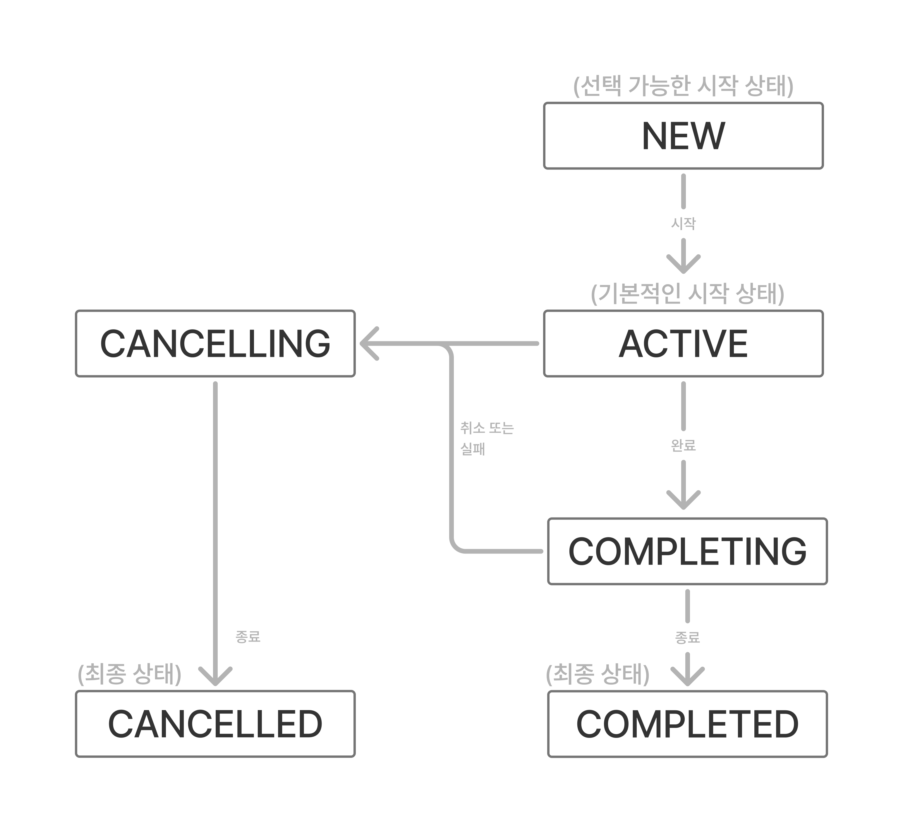

> 러프하게 초안 정리 상태

# 코루틴 빌더
중단 함수는 컨티뉴에이션 객체를 다른 중단 함수로 전달해야 한다.
(4장에서 다뤘는데, 중단 함수들의 콜스택과 연결되는 개념이다)

그래서 일반 함수가 중단 함수를 호출 할수는 없지만
중단 함수는 일반 함수를 실행할 수 있다.

우리는 지금까지
중단 함수는 코루틴을 실행할 수 있으며
코루틴은 함수를 일시중단 할 수 있다고 배웠다.

그렇다면 중단 함수는 처음에 어떻게 실행 되는가?
이것을 시작하는 지점이 코루틴 빌더다.

계층으로 표현해본다면 이런 느낌?
- 코루틴 빌더
  - 중단 함수 or 코루틴

## launch 빌더

새로운 일시중단 가능한 분기를 생성한다.
launch 는 몇 번이든 호출하여 새로운 분기를 만들 수 있다.

## runBlocking 빌더

이 빌더가 실행된 스레드가 중단된다.

## async 빌더

```kotlin
async {
  // 비동기 태스크
}
```

비동기 태스크를 async 블록으로 감싸면 비동기 태스크가 실행되며 Deferred 타입을 반환한다.
deferred 객체의 await() 을 호출하면 결과 값을 반환 받을수 있다.
await() 를 특정 시점에서 병렬로 호출하는 응용이 가능하다.

## coroutineScope 사용하기

# 코루틴 컨텍스트

## CoroutineContext 인터페이스

Job, CoroutineName, CoroutineDispatcher 와 같은 
원소나 원소의 집합을 나타내는 인터페이스다.

## 컨텍스트 더하기

val ctx1 = CoroutineName("one")
val ctx2 = CoroutineName("two")

ctx1 + ctx2

덧셈식으로 더할 수 있으며
새로운 원소 ctx2 가 기존 원소를 대체할 수 있다.

## 비어있는 코루틴 컨텍스트

EmptyCoroutineContext

## 코루틴 컨텍스트와 빌더

# 잡과 자식 코루틴 기다리기

**Job 이란?**
Job 은 수명을 가지고 있으며 취소 가능하다.
Job 의 수명은 상태로 나타낸다.



잡의 상태를 확인하기 위해서는 `isActive`, `isCompleted`, `isCancelled` 프로퍼티를 사용하면 된다.

| State | isActive | isCompleted | isCancelled |
|---|---|---|---|
| New (optional initial state) | `false` | `false` | `false` |
| Active (default initial state) | `true` | `false` | `false` |
| Completing (transient state) | `true` | `false` | `false` |
| Cancelling (transient state) | `false` | `false` | `true` |
| Cancelled (final state) | `false` | `true` | `true` |
| Completed (final state) | `false` | `true` | `false` |


