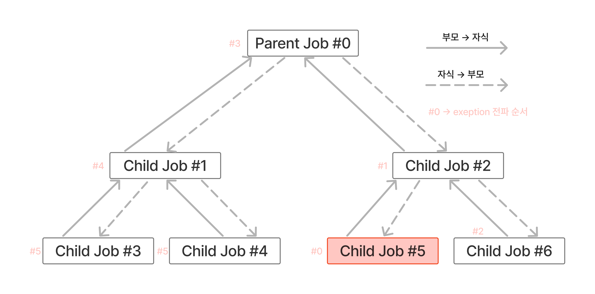
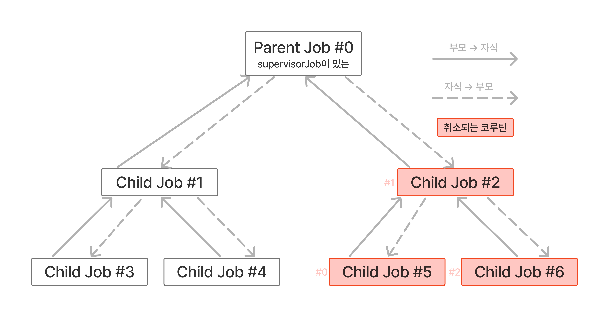

# 취소

## 기본적인 취소

> 코루틴을 취소하기 위해 사용되는 예외(exception)은 `CancellationException` or 이 예외의 서브 타입이어야 한다.

Job 인터페이스는 취소하기 위한 `cancel()` 메소드를 가지고 있다.

이 메소드를 호출할 때
- 호출 시점에 잡을 끝낸다.
- 잡이 자식을 가지고 있다면, 자식들도 취소된다. 부모는 영향받지 않는다.
- 취소된 잡은 더이상 코루틴의 부모로 사용될 수 없다. 
- 취소된 잡은 `Cancelling` 상태가 되었다가 `Cannceled` 상태로 바뀐다.

`join()` 메소드도 알고 넘어가자. 
`cancel()` 이 호출된 뒤, 다음 작업을 진행하기 전에 `join()` 을 호출하면 취소 과정이 완료되는걸 기다리게 된다.

우리는 명시적인 `cancel()` 시점을 핸들링 하기 위해 `join()` 을 사용하는 사례가 많을거다.
그래서 이 둘을 세트로 호출할 수 있는 확장 함수 `cancelAndJoin()`를 잘 활용하자.

```kotlin
public suspend fun Job.cancellAndJoin() {
  cancel()
  return join()
}
```

`Job()` 하위에 생성된 수많은 자식 잡을 한 번에 취소할 수 있다는 점도 알고 가자.

```kotlin
// suspend fun main(): Unit = coroutineScope { ...
val job = Job()
launch(job) {
  repeat(1_000) { i ->
    delay(200)
    println("Printing $i")    
  }
}
delay(1100)
job.cancelAndJoing()
println("Canceeld successfully")

// Printing 0
// Printing 1
// Printing 2
// Printing 3
// Printing 4
// Cancelled successfully
```

## 취소는 어떻게 작동하는가?

`Job` 이 취소되면 
- `Cancelling` 상태로 바뀐다.
- 상태가 바뀐 뒤, 첫 번 째 중단점에서 `CancellationException` 예외를 던진다.

예외는 `try-catch` 로 잡을 수도 있지만 다시 던지는(`throw`)게 좋다.

```kotlin
// coroutineScope { ...
val job = Job()
launch(job) {
  try {
    repeat(1_000) { i ->
      delay(200)
      println("Printing $i")
    } catch (e: CancellationException) {
      println(e)
      throw e
    }
  }
}
delay(1100)
job.cancelAndJoin()
println("Cancelled successfully")
delay(1000)

// Printing 0
// Printing 1
// Printing 2
// Printing 3
// Printing 4
// JobCancellationException...
// Cancelled successfully
```

취소된 코루틴이 단지 멈추는게 아니라 내부적으로 예외를 사용해 취소된다는걸 알아야 한다.
따라서 `finally` 블록 안에서 모든것을 정리할 수 있다. (파일 IO나 DB 연결 닫기 등의 정리)

## 취소 중 코루틴을 한 번 더 호출하기

모든 코루틴은 모든 자원을 정리할 필요가 있는 한 계속해서 실행될 수 있다. (위에서 언급한 파일 IO나 DB 연결 닫기 등의 자원 정리를 말하는 듯)

하지만 자원 정리 과정 중에 중단을 허용하지는 않는다. `Job` 은 이미 `Cancelling` 상태가 되었기 때문에.

정리 과정 중에 
- 새로운 코루틴을 시작하려고 하면 무시된다.
- 중단하려고 하면 `CancellationException` 을 던진다.

코루틴이 이미 취소 되었을 때 중단 함수를 반드시 호출해야 하는 경우도 있다. 
예를 들어, DB의 변경 사항을 롤백하는 경우이다.
이런 경우 함수 콜을 `withContext(NonCancellable) { ... }` 로 포장하는 방법이 많이 사용되고 있다.
블록 내부에서 잡은 액티브 상태를 유지하며, 중단 함수를 원하는 만큼 호출할 수 있다.

```kotlin
// suspend fun main(): Unit = coroutineScope {
val job = Job()
launch(job) {
  try {
    delay(200)
    println("Coroutine finished")
  } finally {
    println("Finally")
    withContext(NonCancellable) {
      delay(1000L)
      println("Cleanup done")
    }
  }
  delay(100)
  job.cnacelAndJoin()
  println("Done")
}

// Finally
// Cleanup done
// Done
```

## invokeOnCompletion

`invokeOnCompletion`: Job 이 `Completed` 나 `Cancelled` 와 같은 마지막 상태에 도달했을 때 호출되는 핸들러다.

```
// suspend fun main(): Unit = coroutineScope 
val job = launch {
  delay(1000)
}
job.invokeOnCompletion { exeption: Trowable? ->
  println("Finished")
}
delay(400)
job.cancelAndJoin()

// Finished
```

`invokeOnCompletion` 핸들러의 파라미터로 넘어오는 예외 종류:
- Job 이 예외 없이 끝나면 null 
- 코루틴이 취소되면 `CancellationException`
- 코루틴을 종료시킨 예외일수 있음 (이에 대해선 추후 배울거라고 함)

잡이 `invokeOnCompletion` 호출되기 전에 완료되면 핸들러는 즉시 호출된다는 특징도 있다. 

## 중단될 수 없는걸 중단하기

> `yield()`
> or
> `Job` 의 상태 추적하기

취소는 중단점에서 일어난다. 
때문에 중단점이 없으면 취소를 할 수 없다.

원하는 시점에 취소할 수 없는 중단 함수가 있다고 가정해보자.
1초 뒤에 실행이 취소 되어야 하는데, 실제론 3분이 넘게 걸리는 경우엔 어떻게 해야할까?

`yield()` 를 호출하는 방법이 있다.
yield 는 코루틴을 중단하고 즉시 재실행한다.
중단점이 생겼기 때문에 취소를 포함해 중단중에 필요한 모든 작업을 할 수 있는 기회가 주어진다.
(첫 장에서 배웠던 시퀀스를 떠올려보자)

중단 불가능하면서 CPU 집약적이거나 시간 집약적인 연산들의 경우, 각 연산들 사이에 yield 를 사용하는게 좋다

```kotlin
suspend fun cpuIntensiveOperations() = 
  withContext(Dispatchers.Default) {
    cpuIntensiveOperation1()
    yield()
    cpuIntensiveOperation2()
    yield()
    cpuIntensiveOperation3()
}
```

다른 방법은 잡의 상태를 추적하는 것이다.
코루틴 빌더 내부에서 this(리시버)는 빌더의 스코프를 참조하고 있다.
따라서 `coroutineContext.job` 에 접근해 현재 상태를 확인할 수 있다.

Job 은 코루틴이 액티브한지 확인하는데 사용되는데,
액티브 상태를 간단하게 확인할 수 있는 `isActive` 라는 확장 함수를 사용할 수 있다.

코루틴 내부 반복문 안에서 `isActive` 상태일때만 특정 메시지를 출력하게 만드는데 활용할 수 있다.
아니면 `Job` 이 액티브 상태가 아니면 `CancellationException` 을 던지는 `ensureActive()` 함수를 사용하는 방법도 있다.


`isActive`: 잡의 액티브 상태를 조회하고 Boolean 결과를 반환한다.

`ensureActive()`: 잡이 더이상 액티브 상태가 아니면 예외를 던진다.

## suspendCancellableCoroutine

> `invokeOnCancellation`: 코루틴이 취소 되었을때 행동을 정의할 수 있다. (특정 라이브러리 실행 취서 or 자원 해제를 할 때 등) `invokeOnCompletion` 과는 다르다.

```kotlin
suspend fun someTask() = suspendCancellableCoroutine { cont ->
  cont.invokeOnCancellation {
    // 정리 작업을 실행한다.
  }
  // 나머지 구현 부분.
}
```

대표적으로 Retrofit 이 내부적으로 `suspendCancellableCoroutine` 를 사용하는 사례를 볼 수 있으며, 
코루틴이 취소되면 `invokeOnCancellation` 핸들러로 api 호출을 취소 처리하는 모습을 볼 수 있다.

# 예외처리

보통의 프로그램은 예외를 try-catch 하지 않으면 종료된다. 
코루틴도 비슷하다.
알아둬야 할 것은 코루틴 빌더는 부모도 종료 시키고, 취소된 부모는 모든 자식들을 취소시킨다.

(아래) 자식이 부모로, 부모가 자식들에게 취소를 전파되며 취소되는 모습



## 코루틴 종료 멈추기. SupervisorJob

SupervisorJob 은 위 그림처럼 한 자식에서 발생한 모든 예외를 무시할 수 있다.
즉, 전파되지 않는다.

(아래) SupervisorJob 을 사용한 부모는 exception 을 전파를 무시하는 모습 



## supervisorScope

예외 전파를 막는 다른 방법은 코루틴 빌더를 `supervisorScope { ... }` 로 래핑하는 것이다.
다른 코루틴에서 발생한 예외를 무시하고 부모와 연결을 유지할 수 있다.

```
fun main(): Unit = runBlocking {
  supervisorScope {
    launch {
      delay(1000)
      throw Error("Some error")
    }
    launch {
      delay(2000)
      println("Will be printed")
    }
  }
  delay(1000)
  println("Done")
}

// Exception ...
// Will be printed
// (1초 후)
// Done
```

supervisorScope 는 단지 중단 함수일 뿐이며, 중단 함수 본체를 래핑하는데 사용된다.

예외 전파를 막는 또다른 방법은 `coroutineScope { ... }` 를 사용하는 것이다.
이 함수는 부모에 영향을 미치는 대신 try-catch 를 이용해 잡을 수 있는 예외를 던진다.

## await

`async` 코루틴 빌더는 launch 처럼 부모 코루틴을 종료하고, 예외를 전파한다.
`SupervisorJob` or `supervisorScope` 로 전파를 막을수 있는것 또한 동일하다.

## Cancellation 은 부모까지 전파되지 않는다

예외가 CancellationException 의 서브클래스라면 부모로 전파되지 않는다. 
현재 코루틴을 취소하고 예외를 출력할 뿐이다.

## 코루틴 예외 핸들러

예외를 처리하는 기본 행동을 정의하는 것이 유용할 때가 있다.
이런 경우 `CoroutineExceptionHandler` 컨텍스트를 사용할 수 있다.
예외 전파를 중단 시키지는 않지만, 예외가 발생했을 때 해야 할 것들을 정의하는데 사용할 수 있다.

```kotlin
fun main(): Unit = runBlocking {
  val handler = 
    CoroutineExceptionHandler { ctx, exception ->
      println("Caught $exception)
    }
  val scope CoroutineScope(SupervisorJob() + handler)
  scope.launch {
    delay(1000)
    throw Error("Some error")
  }
  scope.launch {
    delay(2000)
    println("Will be printed")
  }
  delay(3000)
}

// Caught java.lang.Error: Some error
// Will be printed
```

안드로이드에서는 사용자에게 대화창이나 에러 메시지를 보여주는 식으로
어떤 문제가 발생했는지 알리는 역할을 할 수 있다.

# 코루틴 스코프 함수

코루틴 스코프 함수들의 사용법을 알아보는 장이다.

## 코루틴 스코프 함수가 소개되기 전에 사용한 방법들

중단 함수에서 중단 함수를 호출하는 것이 첫 번 째 방법이다. 
하지만 이 방법은 순차적으로만 실행된다.
요청당 1초가 걸리는 중단 함수를 두 번 실행할 경우, 총 2초가 소요된다.

두 개의 중단 함수를 동시에 실행하려면 `async` 로 각각 래핑해야 한다.
하지만 `async` 는 스코프가 필요하다.

> 참고: 이 때 `GlobalScope` 를 사용하는건 좋은 방법이 아니다. 

`GlobalScope` 는 `EmptyCoroutineContext` 를 가진 스코프일 뿐이다.
`GlobalScope` 에서 `async` 를 호출하면 부모 코루틴과 아무런 관계가 없다.
이 때 `async` 코루틴은 
- 취소할 수 없다. (자원 낭비)
- 부모로부터 스코프를 상속받지 않는다. 항상 기본 디스패처에서 실행되며, 부모의 컨텍스트를 전혀 신경쓰지 않는다.
- 메모리 누수가 발생할 수 있으며 쓸데 없이 CPU 를 낭비한다.
- 코루틴을 유닛 테스트하는 도구가 작동하지 않아 함수를 테스트하기 어렵다.

## coroutineScope

스코프를 시작하는 중단 함수이다. 인자로 들어온 함수가 생성한 값을 반환한다.

```kotlin
suspend fun <R> coroutineScope(
  block: suspend CoroutineScope.() -> R
): R
```

`coroutineScope` 본체는 리시버 없이 곧바로 호출된다.
`async` 나 `launch`와 다르게 새로운 코루틴을 생성하지만 순차적으로만 실행할 수 있다.


```kotlin
// fun main() = runBlocking { ...
val a = coroutineScope {
  delay(1000)
  10
}
println("a is calculated")
val b = coroutineScope {
  delay(1000)
  20
}
println(a) // 10
println(b) // 20

// (1초 후)
// a is calculated
// (1초 후)
// 10
// 20
```

## 코루틴 스코프 함수

스코프를 만드는 다양한 함수가 있다. `coroutineScope` 와 비슷하게 작동한다.

`supervisorScope`: `coroutineScope`와 비슷하지만, `Job` 대신 `SupervisorJob` 을 사용한다

`withContext`: 코루틴 컨텍스트를 바꿀 수 있는 `coroutineScope`

`withTimeout`: 타임아웃이 있는 `coroutineScope`

코루틴 빌더와 코루틴 스코프의 차이를 인지하자.

|  | 코루틴 빌더 (runBlocking 제외) | 코루틴 스코프 함수 |
|---|---|---|
| 예시 | launch, async, produce | coroutineScope, supervisorScope, withContext, withTimeout |
| 종류 | CoroutineScope의 확장 함수 | 중단 함수 |
| 컨텍스트 | CoroutineScope 리시버의 코루틴 컨텍스트를 사용 | 중단 함수와 같은 방식으로 예외를 던짐 |
| 실행 방식 | 비동기인 코루틴을 시작함 | 코루틴 빌더가 호출된 곳에서 코루틴을 시작함 |

`runBlocking` 은 블로킹 함수지만 코루틴 스코프 함수는 중단 함수라는 것이다.
즉 `runBlocking` 은 코루틴 계층에서 가장 상위에 있으며, 코루틴 스코프 함수는 계층 중간에 있는것이다.

계층으로 표현해보면
- runBlocking <- 얘만 최상위 계층 고정
  - 코루틴 스코프 함수 or 코루틴 빌더


```
class SomeUseCase(
    
) {
  // 이 코드가 가능한 이유: supervisorScope 라서
  suspend fun run() = supervisorScope {
    // supervisorScope 일 경우
    // 예외는 발생했지만 다른 코드 실행에 영향을 주지 않는다
    val a = async {
      getApi() 
    }
    val b = async { getApi() }
    val c = async { getApi() }
    
    // 잡을 사용하는 경우에도 예외를 핸들링 하고싶을 경우
    // SupervisorScope
    try {
      a.await()
    }
  }
}
suspend fun await(): T {
    val state = getState()

    if (state is CompletedExceptionally) {
        throw recoverStackTrace(state.cause) 
    }
    
    if (state is Completed) {
        return state.result as T
    }
    return awaitSuspend() 
}
```

## withContext

스코프의 컨텍스트를 변경할 수 있다.
`withContext(EmptyContext)` 와 `coroutineScope` 는 같은 방식으로 동작한다.

기존 스코프와 컨텍스트가 다른 스코프를 설정하기 위해 주로 사용된다.

```kotlin
launch(Dispatchers.Main) {
  view.showProgressBar()
  withContext(Dispatchers.IO) {
    fileRepository.saveData(data)
  }
  view.hideProgressBar()
}
```

## supervisorScope

`coroutineScope` 와의 차이점은 `Job` 을 `SupervisorJob` 으로 오버라이딩 하는것이다.
서로 독립적이며, 취소 전파가 되서는 안되는 작업을 할 때 사용한다.

## withTimeout

```kotlin
withTimeout(1500) {
  delay(1000)
  println("Still thinking")
  delay(1000) 
  println("Done") 
  42
}
// Done 은 출력될 수 없다.
// 1500ms 타임아웃 상태이기 때문이며
// TimeoutCancellationException 을 반환한다.
```

## 코루틴 스코프 함수 연결하기

아래 예시처럼 `withContext` 와 `withTimeoutOrNull` 두 개의 코루틴 스코프 함수를 중첩해서 두 가지의 스코프 함수의 기능을 사용할수도 있다. 

```kotlin
suspend fun calculateAnswerOrNull(): User? = 
  withContext(Dispatchers.Default) {
    withTimeoutOrNull(1000) {
      calculateAnswer()
    }
  }
```

## 추가적인 연산

추가적인 연산을 위한 스코프를 만들어서 UseCase 같은 비즈니스 로직 생성자로 주입하는 방법도 있다.
생성자를 통해 주입하면 유닛테스트를 추가할 수도 있고, 스코프를 사용하는데도 장점이 있다.

스코프를 전달하면 전달된 클래스를 통해 독립적인 작업을 실행할 수 있다.
때문에 이 독립적인 작업은 기다릴 필요 없이 종료하면 된다.

(근데 굳이 이럴 필요가 있을까 싶다. 그냥 "이렇게도 할 수 있다" 는걸 보여주고 싶었던 것 같다.)


