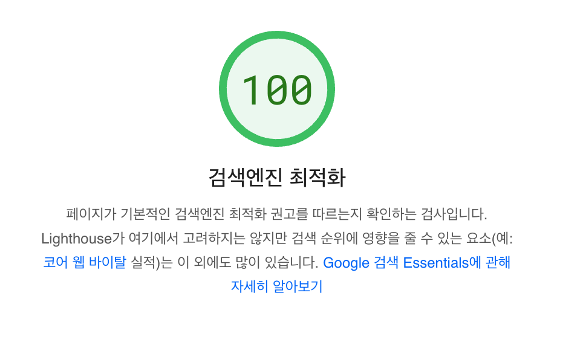
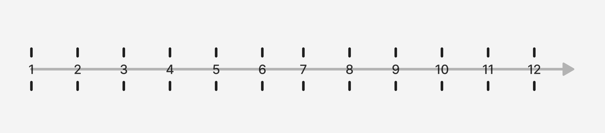
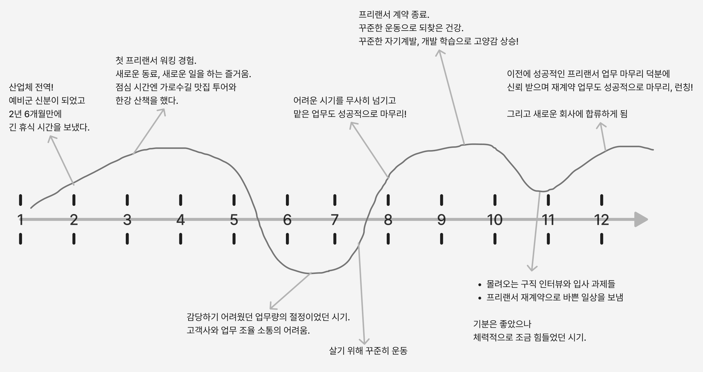
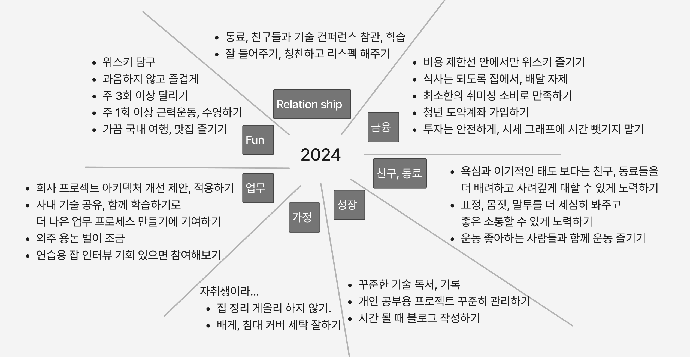
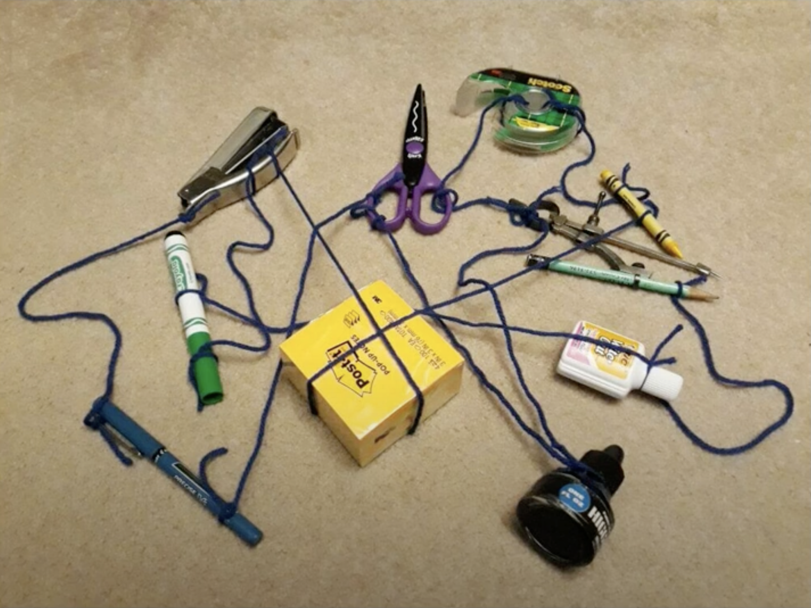
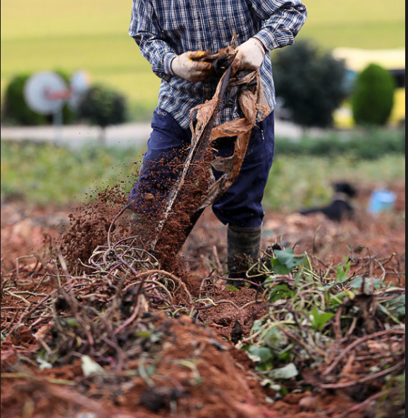
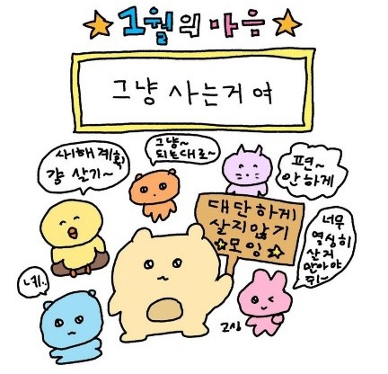

# 자기소개
안녕하세요. 4년차 안드로이드 개발자 김성훈 입니다. 

추운 겨울 날씨를 좋아해서 Winter 로 예명을 지었습니다.

저는 영하 9도 까지는 반 팔로 산책을 할 수 있습니다. (대신 여름에 힘들어요)

<figure>
  
  <figcaption>에스파 윈터 아닙니다</figcaption>
</figure>


지금 다니는 회사에서도 Winter로 불리고 있습니다.

Winter의 입사 소식을 듣고 팀원들이 많이 설레였다고 하는데요.

실제 제 모습은 수염난 털보 아저씨 입니다. 🤭 (히히)


<figure>
  
  <figcaption>대충 이런 모습</figcaption>
</figure>


# 개발자 인생 4년 만에 블로그를 개설하다

공부하고 일하면서 습득한 지식들을 개인적으로 노션에 기록하는 편이었는데요.

기록의 장소를 공개적인 곳으로 옮기면서 스스로에게 긴장감을 주기로 했습니다.

- 틀린 정보가 공유되지 않게 신중히 공부하는 습관
- 운영의 주체성, 주도성과 재미를 느끼기 위해
- 게을러진 기록 습관에 새로운 활력을 주기 위해

이런 이유들로 블로그를 개설하게 되었습니다.

제 동년배, 선배, 후배님들 모두 블로그를 운영하고 계시는 모습을 봐왔던 영향도 있습니다.

운영의 주체성과 재미를 자극하기 위해 Gatsby 를 사용해서 블로그도 직접 만들었습니다.

Gatsby (개츠비) 는 React 기반의 정적 사이트 생성기입니다.

정적 사이트 특성상 SEO (Search engine optimize)에 유리해서 검색에 잘 노출될 수 있고, 커스텀이 쉬운 React 기반이라는 점이 좋아서 선택했습니다.

<figure>
  
  <figcaption>SEO 100 점 달성 완료~!</figcaption>
</figure>

이미 사람들이 만든 다양한 테마들이 있어서 빠른 블로그 구축이 가능하기도 합니다.

줌코딩님, 단민님 이 블로그 제작의 큰 도움이 되어주셨습니다. 🤗

저에게 꾸준함의 기준이란, 일주일에 한 번을 작성하든. 한 달에 한 번을 작성하든.

결국 돌아와서 기록을 남기는것이 제가 생각하는 꾸준함입니다.

아무튼.

<figure>
  
  <figcaption>블로그 오픈 시자아아악 했습니다아아악</figcaption>
</figure>

# 지난 해를 되돌아보고, 새 해를 계획하는 방법

2025년이 벌써 10일이나 지났습니다. 하루는 긴데 일 주일, 10일은 참 짧네요.

저는 연초부터 블로그 제작을 시작해서 이제서야 첫 컨텐츠를 발행하고 있습니다.


<br />

2023년 12월까지 거슬러 올라,

저는 안드로이드 개발자 연말 세미나에 참여했습니다.

다양한 발표중에 저는 `한 해를 회고하는 방법과 새 해를 계획하는 방법` 세션에 참여했습니다.

- 지난 해를 회고하는 방법
- 새 해를 계획하는 방법

여기서 공유받은 두 가지의 내용이 저는 처음이라 재미 있었는데요.

이 방법을 알고나면 유용하게 써먹을수도 있을 누군가를 위해 살짝 공유드리겠습니다.

## 지난 해를 회고하는 방법


*1월 ~ 12월 까지의 시간선*

참여자 모두 종이와 펜을 받았고, 이렇게 수평으로 월 단위의 타임 라인을 그렸습니다.

그리고 1월부터 12월 까지. 삶의 좋음과 나쁨을 수직 그래프로 표현했는데요.

저의 2023년 경험으로 그린 그래프는 이렇게 채워졌습니다.



정말 많은 일이 있었던 해였는데, 삶의 좋았던 순간들과 힘들었던 순간들을 이렇게 짧고 단순하게 요약하고 표현할 수 있는점이 맘에 들었습니다.

## 새 해를 계획하는 법

일곱 가지의 카테고라이징 섹션을 나누어, 각 항목에 대해 목표 삼고싶은 내용을 채웠습니다. 



처음엔 너무 과한지 않았나 생각했지만, 지금 보니 실제로 이룬 부분들 몇 가지가 눈에 띕니다.

예를 들어 

`Fun` 섹션의 
- 과음하지 않기
- 주 3회 이상 달리기, 운동하기 (한 3분기 부터는 놓아버림 ㅠ)
- 맛집 즐기기

`업무` 섹션의 
- 회사 프로젝트 아키텍처 개선 제안, 적용하기.
- 기술 공유

등등이 눈에 띕니다. 더 있는데 대략 이정도로 요약하겠습니다.

정리하면, 이게 제가 알고있는 지난해 회고와 신년을 계획하는 방법입니다.

# 2024 회고

타임라인 그래프를 또 그리긴 귀찮기 때문에

생각나는 것을 몇 가지 추려보기만 했습니다.

 - 새로운 회사 적응, 업무 프로세스를 받아들이느라 정신없는 시간을 보냈습니다. 
 - 가끔은 팀원들과 업무의 문제를 함께 해결하기도 하고, 업무 외적으로 즐거운 시간을 보내기도 했습니다.
    - 9년간 관리 되어온 거대한 모놀리틱 프로젝트 환경에 적응하고 개발 업무를 해야되는게 특히 부담 되었습니다.


 - 오랫동안 생각해왔던 아키텍처 개선 작업을 맡아서 진행하게 되었습니다.
    - 모놀리틱(싱글)모듈을 멀티 모듈화 아키텍처로 개선하는 작업입니다. 
    - 9년 간 거대하게 엮인 코드들을 분리했습니다. 
    - 코드의 특성과 역할을 기반으로 각각 데이터, 도메인, 피처 레이어로 분산 해주었습니다.
    - 거대하고 복잡하게 얽힌 고구마 줄기를 뽑아내는 기분이었습니다. 고구마가 아니라 건물을 뽑아 올리는 듯한 큰 일이었습니다.
    - 결국 해냈고, 프로젝트의 의존성 그래프를 명시적으로 그릴 수 있게 되었습니다. 
    - 아직 개선할 사항들이 많지만 변경과 테스트에 더 유연한 프로젝트가 되었습니다.

<div style="display: flex; flex-wrap: wrap; gap: 20px; justify-content: center;">
  <div style="flex: 1 1 300px; text-align: center; min-width: 300px;">
    
    <p>이렇게 꼬여있는 프로젝트를</p>
  </div>
  <div style="flex: 1 1 300px; text-align: center; min-width: 300px;">
    
    <p>관리하기 편한 형태로 바꾸는 과제였습니다.</p>
  </div>
</div>

<div style="display: flex; flex-wrap: wrap; gap: 20px; justify-content: center;">
  <div style="flex: 1 1 300px; text-align: center; min-width: 300px;">
    
    <p>많은 코드가 강력하게 얽혀 마치 건물을 뽑아 올리는 듯한 도전이었습니다. </p>
  </div>
  <div style="flex: 1 1 300px; text-align: center; min-width: 300px;">
    
    <p>하지만 결국 다 해결했고, 저 자신이 대견했습니다.</p>
  </div>
</div>

안드로이드 모듈화에 관한 내용은 추후에 블로그 컨텐츠로 다루겠습니다.

- 아키텍처 개선이라는 큰 일을 겪고난 후 회사에 꽤 많이 적응했습니다. 때로는 편안하게, 때로는 바쁘게. 회사에서 즐거운 한 해를 보냈습니다.
- 개발자로서 확실한 한 단계 성장을 이룬 점이 특히 뿌듯했고, 소중한 경험이었습니다.


# 2025 계획

계획: 행복하자~! 여러분~ 모두 행복하세요~ 🥰



끝.

<figure>
  
  <figcaption>그냥 살죠~</figcaption>
</figure>

저는 지금의 이 평온한 일상을 쭉 지키고 싶은 마음입니다.

퇴근하고 누워서 쉬거나, 공부를 하거나, 외주로 약간의 용돈 벌이를 하고.

평온한 일상이지만, 되돌아보면 꽤 성장한 점이 있는. 지금의 삶을 유지하고 싶어요.

아, 설 지나고 다이어트. 그건... 할거임... 계획 진짜 끝.

이상입니다. 

부족한 저의 필력의 글을 여기까지 읽어주신 독자분들. 감사합니다. 

2025년 한 해, 여러분도 행복한 일 가득하길 바래요 🥰

다음 컨텐츠 부터는 되도록 개발 관련 컨텐츠 위주로만 발행 됩니다.

```toc

```