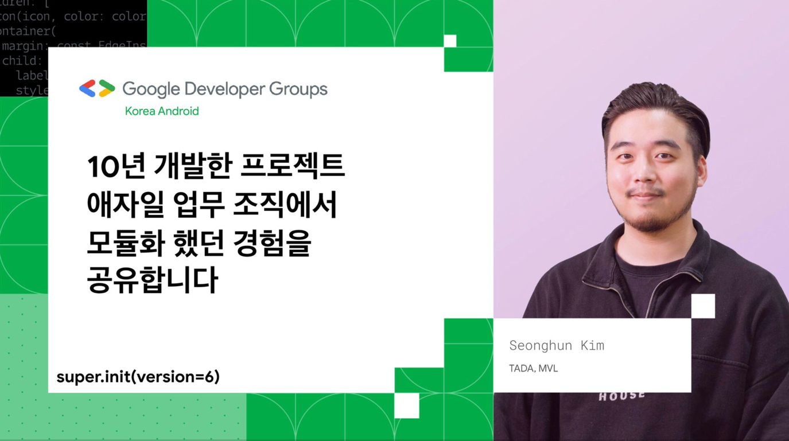
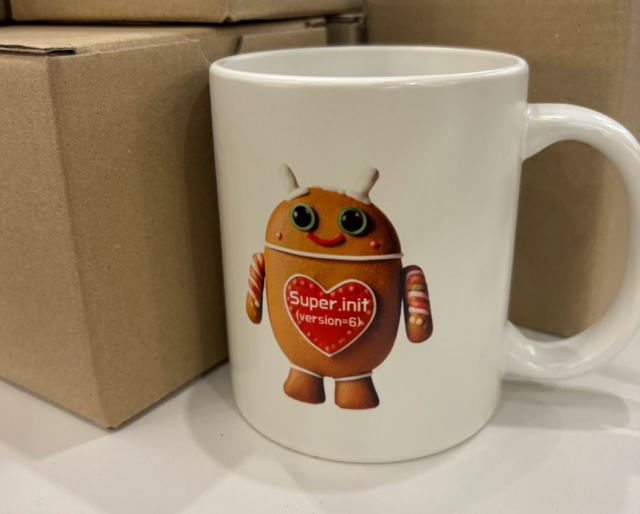
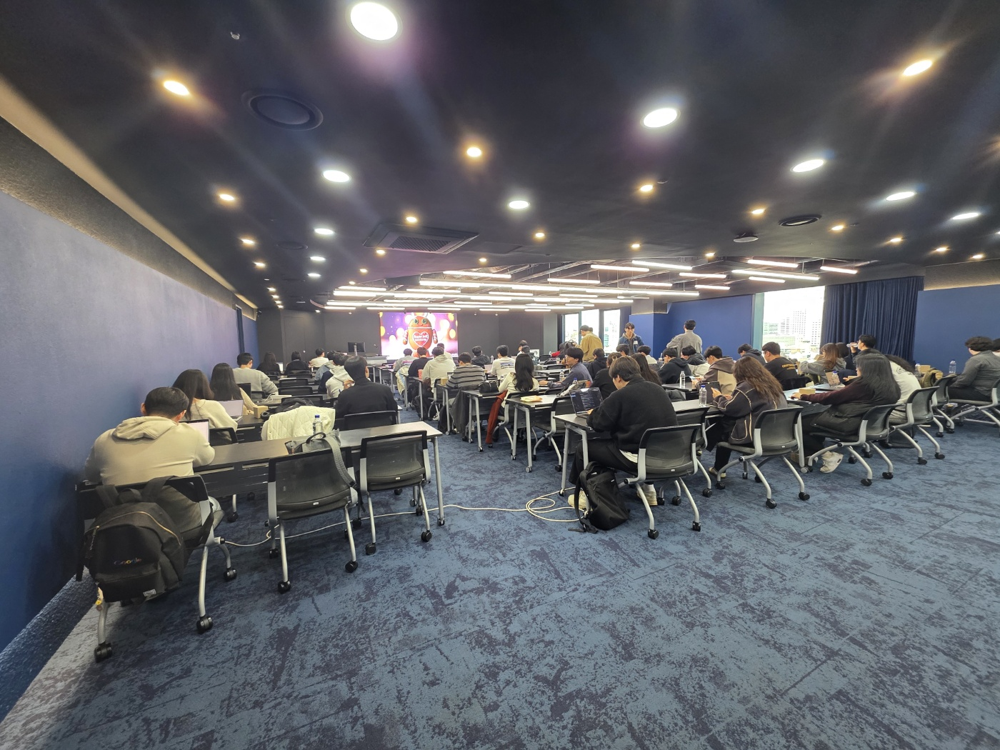
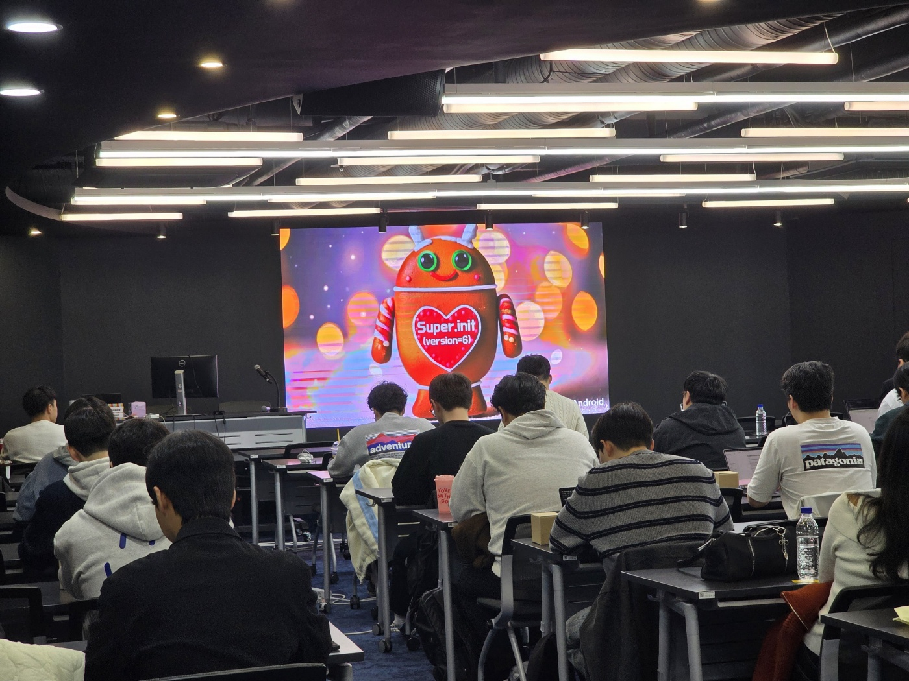
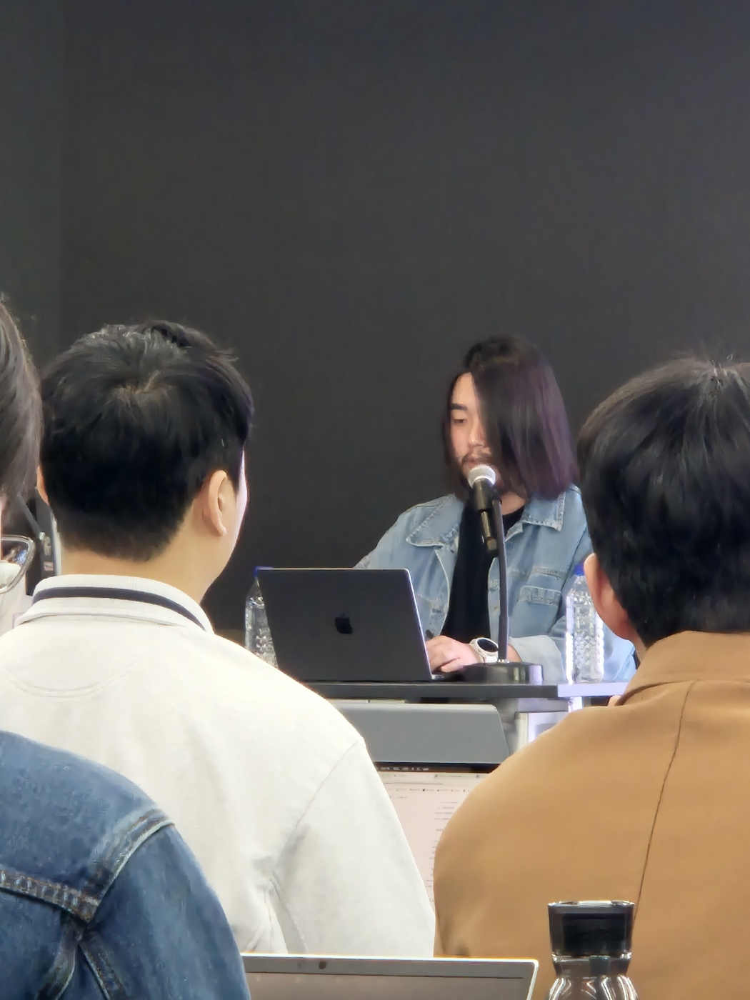

*발표자료: [speakerdeck.com/android-modularization-experience](https://speakerdeck.com/winterlovedev/android-modularization-experience)*

*행사 정보: https://event-us.kr/gdgandroid/event/99825*

> 자식 클래스가 생성되기 위해서는 부모 클래스의 생성자를 먼저 호출합니다.
>
> 이 행사는 시니어가 되기 위해 주니어들이 super.init 하는 행사입니다.
>
> 어떠한 기준으로 주니어/시니어를 나눌 수 없지만 오늘의 나보다 더 발전하기를 원하고 내일의 내가 더 나은 개발자가 될 수 있도록 그러한 배움을 더 바라는 분들을 위해 행사를 준비했습니다.

# 개요 - 발표자 지원하기

2025년 3월 15일. GDG Korea Android 팀이 주관하는 행사 super.init(version=6)의 발표 연사자가 되었습니다.

안드로이드 주니어 개발자들에게 발표 기회를 주고, 주니어 청중들을 대상으로 기술이나 경험을 주제로 발표를 하는 행사입니다.

저는 4년차 안드로이드 개발자고, 이런 공개적인 행사의 청중으로만 참여했을 뿐 발표한 경험은 없었습니다. 이번 행사에선 저도 발표자로 첫 발을 내딛고, 주니어와 중니어의 경계에 있는 연차로서 마지막 super.init 발표 참여 기회라고 생각했습니다.

발표자 모집 기간에 떨리는 마음으로 지원했고, 큰 기대는 안 했었는데 운이 좋게도 발표자로 선정되어 이렇게 후기를 작성하고 있네요. 좋은 기회를 주신 GDG Korea Android 팀에 감사의 인사를 전합니다. 🥰

# 발표 주제 선정하기

- 팀원들을 설득하는 방법
- 모듈화 경험

저의 관심사를 몇 가지 리스트업 했고, 현실적으로 많은 이야기를 할 수 있는 발표 주제로서는 모듈화 경험만한게 없었습니다.

발표 제목은 청중들의 흥미를 자극할 수 있는게 뭐가 있을까 고민했고, 정말 마음에 드는 제목이 딱 떠올랐습니다. 🤭

**"10년 개발한 프로젝트. 애자일 업무 조직에서 모듈화 했던 경험을 공유합니다"** 

# 발표 준비하기

1. 발표 대본 글쓰기
2. PPT 만들기

발표 자료를 만드는 프로세스는 이렇게 두 단계였는데, 글을 쓰는데 정말 많은 시간을 투자했습니다 (2주 정도). 아무래도 회사 일정과 병행 하다보니 준비가 쉽지는 않았습니다.

여차 저차 아쉬움이 남지 않게 발표 자료를 열심히 만들었습니다.

발표자료: [speakerdeck.com/android-modularization-experience](https://speakerdeck.com/winterlovedev/android-modularization-experience)

2주 동안 열심히 작성한 대본과 PPT 자료를 조합해서 며칠 동안은 방이 쩌렁 쩌렁 울리게 대본을 읽고, 발표 제한시간 20분이 넘지 않게 첨삭하는 시간을 보냈습니다. 방에서 대본을 읽는것도 처음엔 많이 떨려서 익숙해지는데도 시간이 며칠 필요했습니다. 🤢

# 행사장 모습

행사 장소는 선릉역에 있는 "배민테크살롱" 입니다. 평소엔 학생들이 개발 공부를 하는 캠퍼스로 사용되는 공간이라고 합니다.

*행사장 입구에서 귀여운 머그컵을 나눠주고 있었습니다*

*행사장 모습*

*행사장 모습2*

100명이 넘는 안드로이드 개발자 청중들이 모였습니다. 

*제가 발표하는 모습입니다 ✌️*

# 간단한 발표 내용 공유

저는 모빌리티 서비스 TADA 팀에서 개발중입니다. 우리가 익숙하게 알고있는 한국의 TADA 가 아니라, 해외에도 똑같은 이름의 TADA 서비스를 운영하는 회사가 있는데요. 저는 이 해외 서비스 개발팀 입니다. 전혀 다른 회사고 우리가 먼저 출시 했다고 합니다. (매우 중요 😤)

이 프로젝트는 10년 간 개발 되었습니다. 10년 전의 개발 방식부터 현대 방식과 아키텍처 적용에 이르기까지 **"다양한 개발 방법론"** 과 **"아키텍처"** 와 **"각 출시 국가별 구현이 쌓여온"** 프로젝트였습니다.

열정있는 우리 팀원 분들이 아키텍처를 현대화 하고 코드 퀄리티를 개선하기 위해 꾸준히 노력해왔지만 이미 과거부터 너무나 강력하게 결합되고, 거대해진 코드베이스의 확장성, 가독성, 코드 품질을 개선하는 것은 쉽지 않은 일이었습니다.

우리팀은 효율적인 개발 환경으로 개선하기 위해 오랜 시간 고민해왔는데요. 그 해결책으로 모듈화 도입을 오랫동안 검토하고 있었습니다. 

마침 우리는 모듈화를 진행하게 되는 [어떠한 계기를 맞이하게 되었고](https://speakerdeck.com/winterlovedev/android-modularization-experience?slide=6) 이후로 우당탕탕 모듈화를 했던 과정와 경험담을 공유하는 발표입니다. 🤗

모듈화에 관한 경험담과 방법을 언젠가 블로그 아티클로 다루려 합니다.

# 후기

자료 준비부터 현장 발표까지 한 순간도 아쉬움이 남지 않게 열심히 준비해서 다 쏟아내고(?) 왔습니다.

발표 당시엔 너무 떨렸습니다. 🤢 끝나고 나서는 후련하고 뿌듯했습니다. 🤟 좋은 기회를 주신 GDG Korea Android 팀에 다시 한 번 감사의 인사를 전합니다. 🥰

제 발표를 보러 먼 길 와주신 친구들, 회사 동료에게도 감사의 인사를 전합니다. 🥰

링크드인으로만 뵈었던 분들이 저에게 먼저 다가와서 인사도 해주셨는데, 정말 반가웠습니다. 🤝

저의 [Lint 적용 블로그 아티클](https://winter-love.dev/android/research-lint-library/) 을 보고 Lint 작업을 하셨다는 분도 있었습니다. 😱 충격과 뿌듯함, 감사함이 몰려왔습니다...! Lint 후속 글 쓰기로 했는데... 빨리 써야겠습니다.

행사장의 사람들과 이야기 하면서 여러가지 인사이트를 얻었고, 그 과정에서 저에게 당장 필요한, 부족한 부분들을 찾을수 있었습니다. 좋은 고민 주제를 몇 가지 얻을수 있었습니다.

감사합니다.

