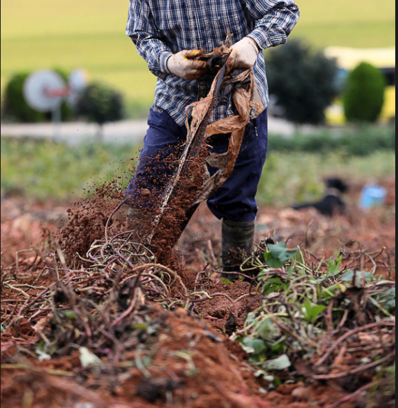

[//]: # (
private: 
    true -> 글 비공개
    false -> 글 공개
배포 환경에서만 적용됨.
)


## 👋 소개

<h1>
  Hello, Im Android Developer 
  
</h1>

```kotlin
SeongHunKim(
  name      = "김성훈",
  challenge = "저는 모바일 세상을 더 멋지게 만드는 일을 하고 있어요",
  android   = listOf("AAC", "MVVM", "Coroutine"),
  code      = "Kotlin",
  platform  = "Android",
  like      = "Whiskey",
)
```

안녕하세요.

4년차 개발자 김성훈, Winter 입니다.

에스파 윈터 따라한거 아닙니다. 제가 먼저 했습니다. 이런말 의미 없는거 나도 잘 압니다 🥹

추운 겨울 날씨를 좋아해서 예명도 Winter 를 선호합니다.


테스트용으로 작성해보는 포스트라 아무 말이나 막 할 겁니다.
그리고 안 그랬던 사람처럼 이 글을 지울거고.

사뭇 진지해진 컨셉으로 정규 첫 포스팅을 올려보겠씁니다. 

이미 좀 진지해진 것 같은데 암튼 걍 쓰겠습니다. 원래 좀 진지한 인간입니다.

정규 포스팅을 시작하기 전에
이 포스팅의 내용을 복붙해서 
총 세 개의 테스트 포스팅을 올려볼 생각입니다.

저에 대해 좀 더 오픈을 하자면, 
저는 게으름과 망나니의 끝판왕인 사람입니다.

때문에 블로그 관리와는 먼 성격이구요.
지금 이 블로그를 작성하는 것 자체가 기적이자 혁명인 셈입니다.

## 블로그를 미뤄왔던 지난 날을 회상하기

공부한게 아까워서.
현업에서 배우고, 문제를 해결한 경험이 휘발 되는게 아까워서.
블로그로 남겨야겠다고 생각했습니다,

 > 하지만 저의 게으름이 이겼습니다. 🤪


개발자로서 성장하기 위한 배움과 경험을 글로 남기면
게시자가 원하는 순간까지 쭉 존재할 수 있고, 회상하고, 
다시 그 순간으로 돌아가서 학습할 수 있습니다.
또한 나의 배움과 경험을 주변 사람들에게 더 자세히 공유 해줄수 있습니다.

하지만 게으름의 끝판왕인 나는
이런 좋은 점들을 알고서도
추친력의 부재로 끝내 블로그 운영을 해내지 못했습니다.

네이버, 티스토리, 벨로그, 미디엄과 같은 블로그 플랫폼에선 
버튼만 한 번 딸깍 누르면 나의 블로그가 뿅 생성되구요.
곧바로 글을 작성할 수 있는 에디터가 내 앞에 대령 됩니다.

극도의 귀차니즘 상태였던 저는
"나는 아직 준비가 안 되었다" 라며 결국 블로그 운영을 미룹니다.

> 게으름은 이미 n 백번 째 승리만 하는 중 😭

주로 이렇게 누워있는 시간을 좋아합니다.


## 🤔 블로그를 시작하게 된 계기

그렇게 커리어 내내 미뤄온 블로그였는데!!

올해 회사 업무로 참 바빴던 여름을 한 차례 버텨냈고, 이후엔 번아웃이 찾아왔었습니다.  


다행히 그 뒤로는 널널한 일상이 돌아왔고, 다시 저만의 게으른 일상을 즐기며 안정을 되찾았습니다.

잠깐이지만 잘 안하던 게임에 몰입하기도 했습니다.

번아웃으로 힘들 당시엔 몰랐는데, 그 시기를 보낸 덕분에 지금 이 자리에 앉아있게 된 겁니다.

다시 여름 이야기로 돌아와서...

참 바빴던 여름의 그 순간들을 떠올려보면, 

잊기 아까울 정도로 값진 경험과 배움들이 급격히 몰아쳤던 시기였습니다.

그 순간들 만큼은 놓치고 싶지 않았고,

지금이라도 내 커리어의 발자취를 열심히 남겨야겠다는 생각에

미약한 의지를 발휘해서 이 자리에 앉았습니다.


## 🚀 내가 그래도 개발 할 때는 몰입을 잘 하거든요

1. 개발 업무하고 체력 방전
2. 게으름 즐기러 가기

이 패턴이 반복 되는게 문제지만.

날 몰입 시키고 지속 시키는 힘은 `주체성`입니다.

개발 업무를 할 때, 내 생각대로 만들고 개선하고 이끄는 느낌을 좋아합니다.

블로그도 저에게 개발 업무와 같은 `주체성`을 자극 시켜준다면

날 꽉 붙잡고 있는 게으름과 침대로부터 빠져나올 수 있을겁니다. 분명.

그래서 내 블로그를 직접 만들기부터 하기로 했는데요.

템플릿플 다운받고, 커스텀 하는 과정 자체가 일종의 개발 업무와 같아서 즐거운 시간을 보냈습니다.

README.MD 파일에 이렇게 글을 작성하는 지금도 개발 업무를 하는것 같아서 몰입이 잘 끊기지 않아서 좋습니다.

## ⚙️ 블로그 컨텐츠 작성 방향성 고민

지난 여름, 

저에게 번아웃을 줄 만큼 힘들었던 일에 대한 포스팅을 먼저 하려고 합니다.

힘든만큼 배운게 많았고, 그 경험과 기억이 휘발되기 전에 조금씩 글로 남겨보려고 합니다.

9년간 관리 되어온 모노레포 (회사) 프로젝트를 모듈화 하는 업무였습니다.

회사에서 절 채용한 이유중 하나는 모듈화 경험이 있었기 때문입니다.

복잡하게 얽히고, 강하게 의존중인 코드들을 보다 관리하기 쉽게 구조를 개선하는 것을 

우리팀 리드 성생님께서 생각 하셨고, 저도 매우 기대했던 일이었습니다.

이 모듈화 작업이 너무 재밌어서 몇 달 정도는 몸을 돌보지 않고 일에만 몰입했습니다.

우여곡절 끝에 모듈화를 끝낸 뒤엔 몸과 마음의 건강이 많이 상해 있었지만, 

개발자로서 그 어느 때보다 많은 성장을 이뤘다고 생각해서 기뻤습니다.


<div style="display: flex; flex-wrap: wrap; gap: 20px; justify-content: center;">
  <div style="flex: 1 1 300px; text-align: center; min-width: 300px;">
    
    <p>이러케 꼬여있는 프로젝트를</p>
  </div>
  <div style="flex: 1 1 300px; text-align: center; min-width: 300px;">
    
    <p>이러케 관리하기 편한 형태로 바꾸는 과제였습니다.</p>
  </div>
</div>

<div style="display: flex; flex-wrap: wrap; gap: 20px; justify-content: center;">
  <div style="flex: 1 1 300px; text-align: center; min-width: 300px;">
    
    <p>현실은 마니 잔혹했습니다. 코드 하나를 분리하기 위해 수십, 수백 코드의 의존 관계 컨플릭을 해결해야 했습니다.</p>
  </div>
  <div style="flex: 1 1 300px; text-align: center; min-width: 300px;">
    
    <p>하나를 개선하기 위해 이만큼이나 많은 의존성들을 떼어내고 개선해야 했지만... 이젠 다 해결했고, 지난 일입니다. 🤪</p>
  </div>
</div>


```toc

```
