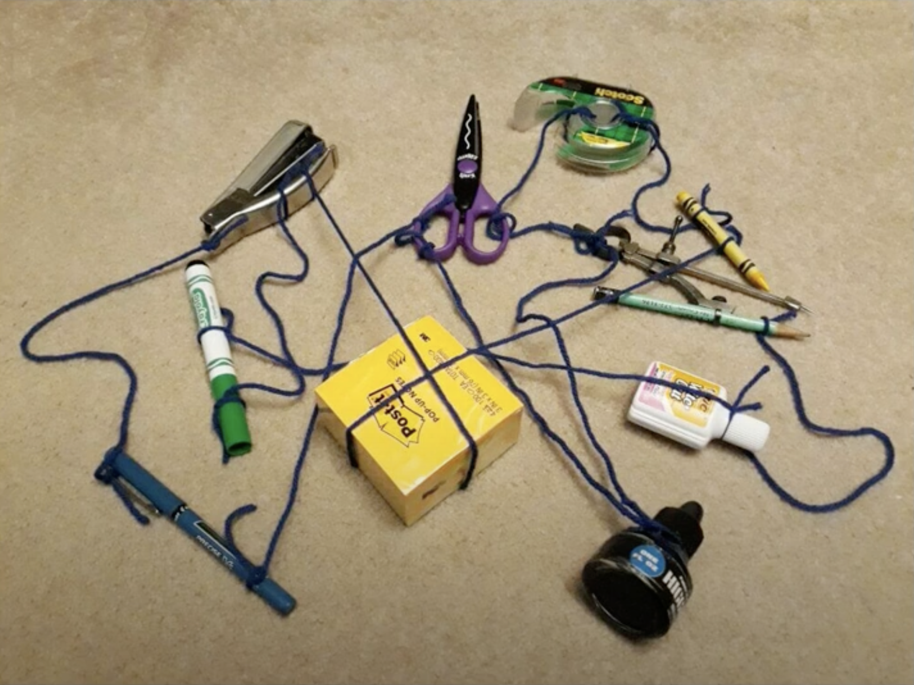

[//]: # (
private: 
    true -> 글 비공개
    false -> 글 공개
배포 환경에서만 적용됨.
)

optional: 헤더 이미지


[//]: # (optional: 헤더 이미지)
# 👋 제목1
## 👋 제목2
### 👋 제목3

텍스트

**굵은 텍스트**

~~취소선~~

링크가 포함된 텍스트 [ㅁㄴㅇ]()


<h1>
  제목과 이미지 나란히 쓰기 (우측 선글라스 이모지) 
  
</h1>

### 싱글라인 코드블록
`코드코드`

### 멀티라인 코드 블록
```kotlin
SeongHunKim(
  name      = "김성훈",
  challenge = "저는 모바일 세상을 더 멋지게 만드는 일을 하고 있어요",
  android   = listOf("AAC", "MVVM", "Coroutine"),
  code      = "Kotlin",
  platform  = "Android",
  like      = "Whiskey",
)
```

> 인용구

> 인용구
> > 중첩 인용구
> > > 중첩 중첩 인용구

### 본문 이미지


### 본문 이미지 + 이미지와 캡션글 작성
<figure>
  
  <figcaption>여기에 캡션 텍스트를 작성합니다</figcaption>
</figure>


*여기에 캡션 텍스트를 작성합니다*

<details open> 
<summary>토글 접었다 펴기</summary>

여기에 내용을 적습니다.
기본적으로 "접힘" 상태이며 `<details open>` 을 입력하면 "펼쳐짐" 상태가 기본이 됩니다. 

</details>

### 두 이미지 나란히 선언하기 & 이미지에 캡션글 작성하기
<div style="display: flex; flex-wrap: wrap; gap: 20px; justify-content: center;">
  <div style="flex: 1 1 300px; text-align: center; min-width: 300px;">
    <figure>
      
      <figcaption>이미지 캡션 텍스트 1</figcaption>
    </figure>
  </div>
  <div style="flex: 1 1 300px; text-align: center; min-width: 300px;">
    <figure>
      
      <figcaption>이미지 캡션 텍스트 2</figcaption>
    </figure>
  </div>
</div>


