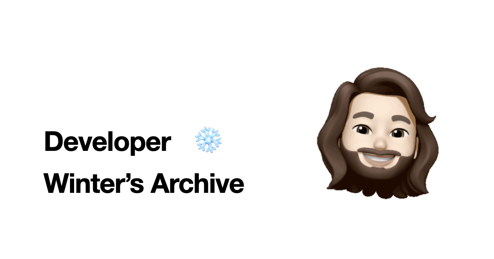

나는 5년차 안드로이드 개발자. 이 블로그에서 온갖 잡담부터 간단하게나마 개발 인사이트를 적을 용도로 Insight 페이지를 만들었다.

아티클은 너무 정성 들여서 구성해야 할 것 같고, 잘못된 정보를 전달하지 않기 위해 여러 공식문서를 돌아다니면서 사실 파악을 할 필요가 있었다. 아티클은 뭔가 글 하나에 들어가는 정성이 적지 않아서 마음의 장벽이 생긴듯 함.

성실히는 아니라도 한, 두 달에 아티클 하나정돈 발행하기. 나름 올해의 포부로 시작했으나 (관련 글: [2024 회고. 내 동년배 개발자들 다 블로그 운영한다.](https://winter-love.dev/life/2024-review/)) 스스로 쌓은 마음의 장벽이 너무 높아졌던 탓일까. 벌써 6개월 넘게 방치 해버렸다.

뭐 아티클은 내 마음속에서 정한 현재의 정성 스러운 컨셉? 을 그대로 두고, 블로그 컨텐츠 작성의 접근성을 아예 낮추기 위해 만든 페이지가 이 인사이트인 것.

이곳은 단 1줄 간단히 적어도 되는 공간이다. 그렇게 정했다. 글이 좀 길어질 땐 아티클에서 적으면 되는거고. 

인사이트에선 아티클보다는 좀 더 자주, 짧은 잡담이나 개발 인사이트 글을 남겨보겠다.

