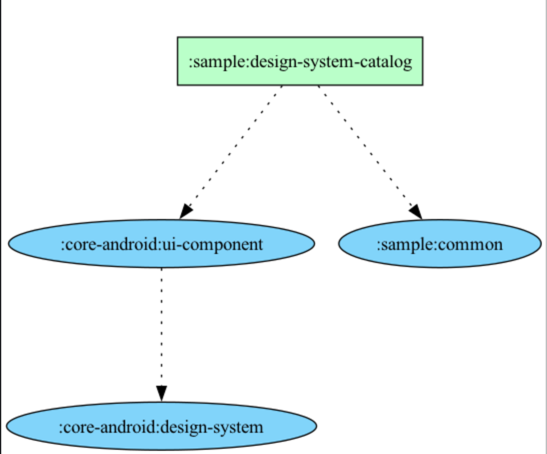

어떤 외국인이 설계 해놓은 디자인 시스템을 구매했다. 원화로 5만 4천 원 정도 되었다. 

`:sample:design-system-catalog` 앱모듈을 별도로 구성해서 디자인 시스템 구현 작업을 하고있고 
이것은 android 종속성의 공통 구현체란 의미로 `:core-android:design-system` 이라는 모듈로 분류했다.

외국인의 설계를 참고해서 내 앱에 파운데이션 토큰들부터 하나 하나 정의했고, 이를 기반한 앱의 기초적인 Theme 을 구성했다.
(참고로 Theme 을 읽을땐 "테마" 라고 하지 않고 "띄~임"으로 읽어야 한다는 사실)
이어서 파운데이션을 기반한 간단한 컴포넌트를 하나씩 구현해보고 있다.
간단한 컴포넌트 하나도 내 기준으로 약간 부담될 정도로 많은 경우의 수에 대응되게 설계 되어있다.

당장 필요하지 않은데 여러 경우의 수를 다 고려하면서 만든다는는 행위가 어찌보면 이상할 수 있는데,
현업에선 상황별로 필요한 만큼 스펙이 아주 조금씩 업데이트 되고있고 그것을 필요한 사람이 돌아가면서
조금씩 업데이트, 커스텀 하다보니 누구도 제로부터 완결까지 경험할 수 있는 기회는 흔치 않았다.
개인적으로 이런 경험 부족의 갈증을 해소하기 위한 과정이기도 하고
앞으로 나의 여러가지 개인 프로젝트를 일관성 있게 잘 만들고 싶다는 목표의 초석이기도 하다.

디자인 시스템 TF (Task Force) 팀이 구성되고 이것만 집중적으로 전담하는 팀이 있다면 좋았겠지만
어쩌겠는가 회사마다 각자의 사정, 상황에 맞춰서 운영할 수밖에.

다시 "약간 부담될 정도로 많은 경우의 수에 대응되게 설계 되어있다" 의 이야기 시점으로 돌아와서.
제일 간단한 편인 버튼 컴포넌트의 일부 구성을 확인해보면
Default(정지상태), Active(누름상태), Disabled(비활성 상태) 와 같은 상태별 인터렉션이 정의되어 있고. 
버튼 내부 곳곳에 텍스트와 Icon resource 가 위치할 수 있는 Slot 공간과 Size 가 정의되어 있다. 
몇 가지 스펙은 언급하지 않았지만 지금까지 정의된 버튼의 스펙을 동일하게 공유하고
상황별로 다르게 쓰이는 다양 타입 색상의 버튼들이 정의되어 있다. (Primary, Secondary ~ + N 개).

당연한 얘기지만 디자인이 아무리 구체적으로 잘 설계 되었다 한들 소스코드와 1대1로 매칭되는 것은 쉽지 않은 일인데
처음엔 나름 1대1로 맞춰추는 상상을 했다. (토큰) → (버튼 스펙) + (구현체) 이렇게 세 번 정도의 계층 공정으로 충분히 완성이요 ~
라고 상상했으나 역시나 디자인 시스템의 경험 부족 초보다운 생각이었다.

현실을 인지하고 하나의 컴포넌트를 완성하기 위해 소스코드 레벨에서 
일련의 제작 공정들과 필요한 요소들을 설계했고, 과정중에 부수적인 결과물도 나왔다. 
예를 들어 버튼 외에 다른 컴포넌트에서도 공통으로 쓸 수 있는 구현체가 `/interaction` 이라는 공통 분류로 빠지기도 했다.
개인적으로 코드간 얽힘을 싫어해서 공통화는 최대한 신중히 결정하려는 편이라 추후에 이 결정을 수정하게 될지도 모르겠다.

어쨋든 버튼 컴포넌트를 완성하기 위한 최종 공정은
(`토큰`) → (`interaction` - Press / Scale 공통 구현체) → (`Button spec` - Icon / Shape / State 전용 구현체) → (`버튼` 구현체) 와 같이
계층적으로 설계가 완성 되었는데 적고보니 지극히 당연하고 기초적인 구성 요소들 아니겠는가. 
초보는 오늘도 [바퀴를 재발명 하면서 (출처)](https://news.hada.io/topic?id=21111) 배움을 얻고 깨닫습니다. 

제일 간단한 버튼 하나를 구현한 것 뿐이지만 혼자 제로부터 완결까지 낸 경험이 만족스러웠다.
디자인과 인터렉션을 100% 핸들링 하기 위해 Material Button 컴포넌트도 사용하지 않고 거의 Modifier 로 완성했다.

이 기초적인 디자인 시스템 설계 감각을 계속 키워서 
훨씬 복잡한 컴포넌트들도 잘 만들자고 생각하던 찰나에 새로운 고민이 시작 되었으니 ...

파운데이션 토큰을 기반으로 구성된 Theme 과 버튼 구현만 해도 구현량이 17개의 파일과 2000 라인을 넘으며 양이 상당했다. 
아직 기초 작업밖에 안했는데 이정도면 순식간에 혼자서 N 만 라인이 넘는 소스코드를 관리하게 될 미래가 보였다.
소스량 자체가 두려운것도 있고, 무엇보다 이 많은 것들을 어떻게 잘 정돈하고 통제할 수 있을지? 이런 관점에서의 걱정이었다.

디자인 시스템에 명시되지 않았지만 구현상 필요하게 된 `/interaction` 이라는 소스코드 레벨의 공통 설계 분류가 추가 되었고, 
앞으로 `/shape` 이나 `/state` 등 소스코드 레벨에서 어떤 새로운 공통 분류가 생겨날지 알 수 없는 상황이다. 
내 성향상 웬만하면 이렇게까지 공통화 하지 않겠지만 미래엔 효율이라는 명목으로 
나조차도 내가 어떤 선택 할지도 확신할 수 없다는거지.

디자인 시스템엔 명시되지 않은 소스코드 레벨의 설계들과 컴포넌트들이 추가됨에 따라 디자인 시스템 모듈이 비대해지고, 
디자인 스펙과 설계를 담고있는 그런 의미의 **디자인 시스템** 의 정체성이 흐릿해질것 같았다.
좀 더 자세히는 뚜렷한 맥락을 잃고 UI 라는 명목으로 온갖 것이 똘똘 뭉친 구현 집합체가 될 것 같았다.

`:design-system` 모듈은 디자인 시스템에 문서에 명시된 `파운데이션 토큰`을 그대로 담고있는
디자인 시스템의 가장 코어하고 순수한 맥락이라는 정체성을 명확히 하고싶었다.
그래서 모듈을 `ui-component` 하나 더 만들어서 `:design-system` 모듈의 순수한 맥락을 지켜보려는 시도를 하는중이다.

`:design-system` 은 오직 `ui-component` 만 의존할 수 있게 설정했고, 때문에 `:design-system` 은 internal 한 성격의 모듈이 되었다.
`ui-component` 모듈은 `:design-system` 이라는 맥락에 의해 여러 컴포넌트와
소스코드 레벨의 구현체가 채워져도 되어도 정체성의 흐림을 걱정할 필요 없을것 같았다. 

그래도 여전히 지금의 선택에 100% 만족한건 아니다. 괜히 분리하는건 아닐지? 약간의 의문이 계속 맴돈다.
지금의 선택이 정답인지는 모르겠지만, 구현 과정에서 더 나은 설계로 조금씩 진화할게 될거라고 믿고 
처음부터 욕심 부리지 말자.

어쨋든 지금의 설계 선택을 기반으로 당장은 디자인 시스템 해피 코딩을 즐길 생각이다.
한 달 뒤에 이 설계를 보고 "이게 뭐야" 할 수도 있지만.
그것조차도 성장의 과정 아니겠는가.

이번 경험을 통해서도 느끼고 종종 느끼는 거지만 
처음부터 완벽한 설계란 불가능함에도 늘 그것을 달성하고 싶다는 욕심을 부리게 된다. 
개발자는 여러가지 환상을 꿈꾸며 사는것 같다.
예를 들어 잘 설계된 코드로 우리의 작업을 "딸깍" 하여 종결하고 싶다는 환상. 
혹은 이번 사례처럼 처음부터 완벽한 설계를 완성하고 싶다는 환상.

지금 이 순간의 고민과 선택들이 쌓여서 언젠가는 
"그때 그렇게 고민했던게 도움이 됐구나" 기분좋게 되돌아볼 수 있는 날이 오길.

