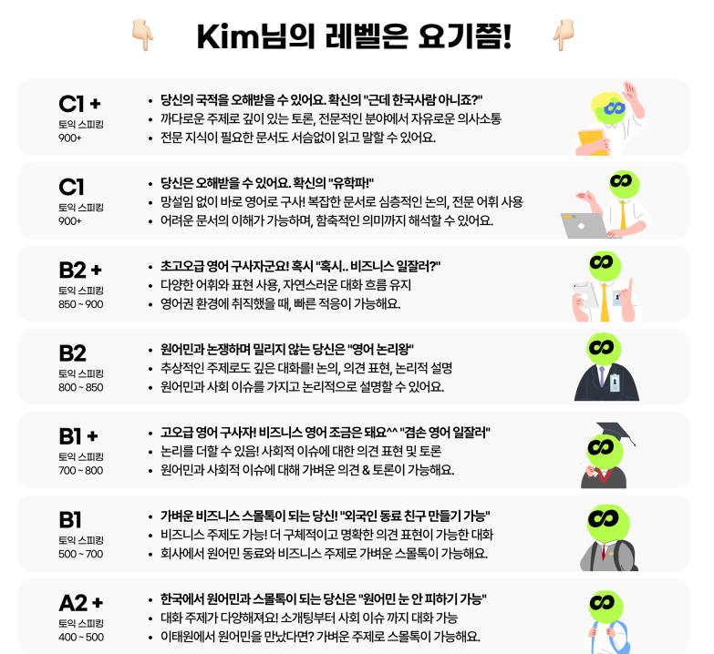
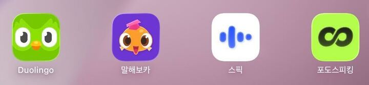

난 외국 IT 서비스 팀에서 일하고 있다.
외국인 팀원들을 포함한 PO, Designer, Developer 등 다양한 사람들과 소통해야 한다.
날이 갈수록 사내 영어 사용의 중요성이 높아지고 있는 상황이라
영어 공부를 피할수 없는 운명이란 말이다.

난 영어를 못한다.
일상 영어 대화도 잘 하지 못하는데 비즈니스 영어를 해야되는 상황이라니.
최근에 부랴부랴 영어공부 앱을 사용하기 시작했고 오프라인 영어 클래스도 참여했다.
그렇게 시간이 지난지도 약 2달.
영어공부 벼락치기 하는중인 사람의 영어공부 후기 글이다.

**듀오링고**. 두 달 정도 꾸준히 사용, MAX family 요금제.

퀴즈 풀이 + 약간의 스피킹을 반복 해야되는 학습 구성이다. 단순히 정답 맞추기 급급할 때가 있다.
릴리와 프리토킹 세션이 있는데 (GPT Based) 4마디밖에 못한다. 너무 짧음. 

너무 단순한 학습 구성들이라 앱 학습 효과에 대해 신뢰하진 못하고 있다.
듀오링고에 준비된 학습 코스를 모두 완료하면 대학 입학 시험을 볼 수 있을 정도의 레벨은 된다고 하니까 일단은 꾸준히 해보려고 한다.

아무리 단순하더라도 이런 과정에서 익히고 배우는게 있긴 하니까.
당장 내 일상에 적용하기가 어려울 뿐. 
그리고 릴리와 프리토킹 세션후 피드백을 받긴 하는데
개선하는건 스스로의 몫이고, 의지가 없다면 당연하게도 교정되지 않는다.
개선을 직접 도와주는 학습 코스도 경험 했다보니 릴리에 대해선 이점도 아쉬었다.

후기가 거의 별로라는 뉘앙스로 전개되긴 했지만,
그래도 듀오링고는 내 일상에서 영어와 단절되지 않게 해주는 유일한 끈? 같은 존재이다.

**말해보카**. 7일 무료체험

캐릭터들이 너무 귀엽다. 다양한 아바타 꾸미기 요소들이 많아서 이 아저씨는 항마력이 버티질 못했다. 🤢
정답 맞추기 위주의 학습 구조는 듀오링고와 비슷한 느낌.

듀오링고보다 다양한 영어 어휘를 다루기 때문에 학습 인사이트를 약간 더 넓힐수 있다.
다른 주제를 학습해서 그런지 듀오링고와는 다른 재미가 있었다.

**스픽**. 7일 무료체험

일단 체험부터 해보고 계속할지 판단할 생각이었다. (결론: 굳이 선택하지 않음)

영상속 강사님의 티칭후 나의 학습 타이밍이 주어진다. 학습 인터렉션이 자연스럽게 이어지는 UX 구성이 좋았다.
잘 설계된 UX 의 힘으로 머리에 영어 지식을 쏙쏙 넣어주는 느낌.
단순히 시킨 문장을 읽고 스피킹 하는데 그치지 않고 틀린 발음을 인식해서 피드백을 해주는 부분이 좋았다.

하지만 앞서 듀오링고랑 말해보카를 하고와서 그런지 앱 학습은 굳이 더 늘릴 필요 없다고 판단했음.
스픽으로만 앱 학습을 할거라면 나쁘지 않은 선택일듯?
가격도 직장인이라면 크게 부담되지 않을 정도이다.

**포도 스피킹**. 유료 가입

외국인 선생님과 1대1 원격 수업을 하는 앱. (15 ~ 25분, Voice only)
학습 교재를 실시간 Screen share 한다. 공유중인 교재를 화이트보드 삼아 손글씨를 슥슥 적으면서 수업을 진행한다.
비즈니스 영어학습 클래스를 선택할수도 있지만 일단 나한테 필요한 초보적인 학습 위주로 하는중.

선생님이 실시간으로 내 스피킹을 듣고 발음이나 문법 & 문장 구성에 대해 교정을 해주신다.
선생님들이 다 친절하고 텐션도 좋아서 즐겁다. 1대1 실시간 학습인만큼 스피킹, 리스닝, 리딩 학습 비중이 모두 높다.
학습 임팩트가 앱 학습 대비 훨씬 높다. 배운 내용이 머리에 좀 더 오래 머문다.
릴리한테 스피킹하는 어휘가 좀 더 나아짐을 느낀다.

약속한 시간에 사람과 바짝 하는대신 듀오링고같은 앱처럼 학습 반복성은 떨어짐.
혼자 교재랑 녹화된 인강을 보면서 학습 할수도 있지만,
선생님과 약속한 시간 외 혼자 학습할땐 그냥 듀오링고를 하는게 더 낫다고 생각함.

첫 수업은 500원으로 참여할 수 있다.
첫 수업이 끝나면 내 레벨 측정 결과를 PDF 로 보내준다. (부끄부끄)

**미치의 미친 영어 코칭**. [mitchinenglishcoach.com](https://www.mitchinenglishcoach.com/)

친구의 외국인 지인인 Mitch 선생님이 운영하는 오프라인 영어 클래스.
직접 자기 얘기를 하고 리스닝도 해야되는 곳이다.
클래스 한 세션당 직장인과 대학생 8 ~ 10 명 정도 모인다. (양재역)

미치 선생님이 대화 토픽을 제시하고, 해당 토픽에 대해 사람들과 계속 대화를 나눠야 한다.
대부분 자기 일상이나 경험에 대해 이야기를 주고 받다보니 재미있다. 시간이 금방 흐른다.
주변 동료들한테 추천하고 싶을정도.

클래스 레벨 자체는 초보 수준에 맞춰진듯 하다. 
내가 참여하기엔 딱 좋고,
함께 참여한 영어 잘하는 친구는 자기 레벨엔 맞지 않다고.

나의 지난 2달간의 학습 흐름을 대략 정리해보면  
듀오링고로 입을 떼기 시작하고  
포도 스피킹으로 사람과 말수를 늘리고  
미친 영어 클래스에서 사람들과 직접 대화까지 했다.

처음엔 어떤 학습 수단이 제일 나은지 비교하고 싶었던건데 이제는 하나만 할 수 없게 되었다.
앱 학습부터 오프라인까지 초보인 나에겐 거의 거를 타선이 없었다.
듀오링고 하나만으론 역시 부족하고 다양한 노력이 필요한 나의 현실을 알 수 있었다. 🥲
영어는 할 수 있을때 미리 열심히 해두자... 나중에 와서 일과 병행 하려니 역시 쉽지 않다.

