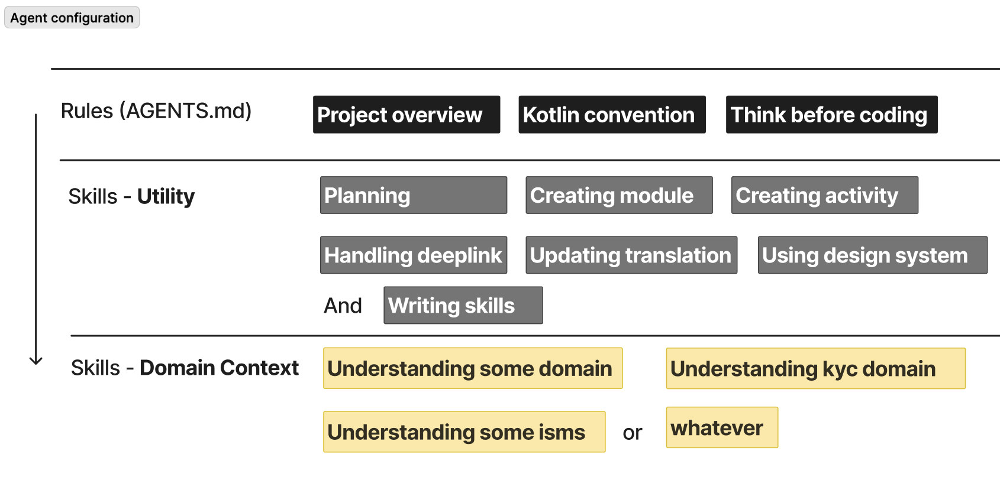
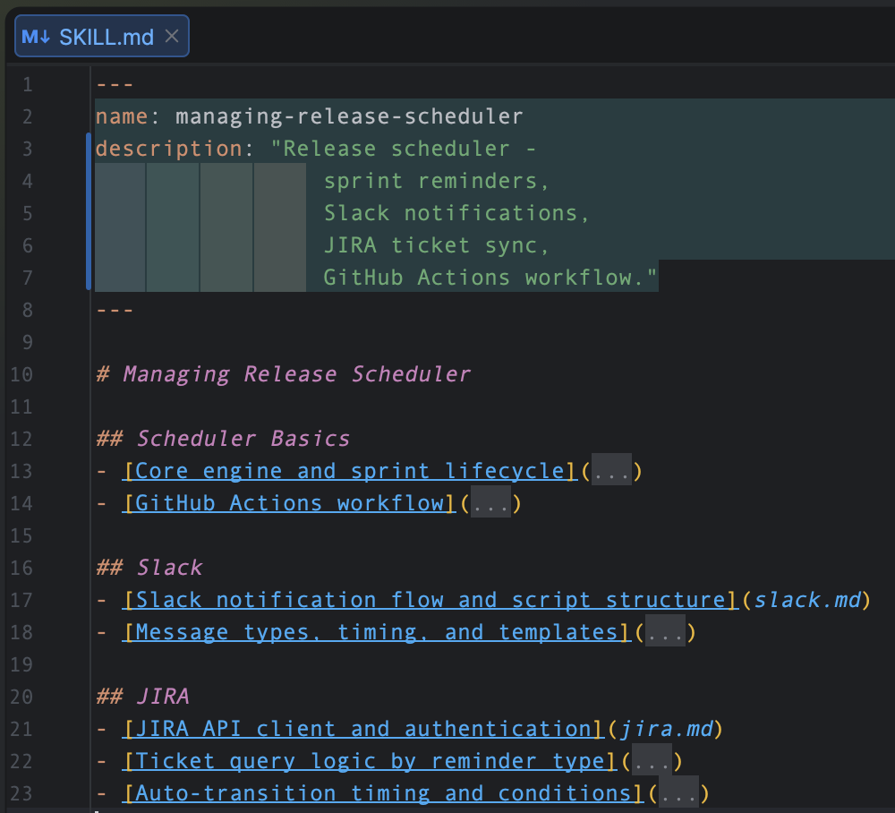
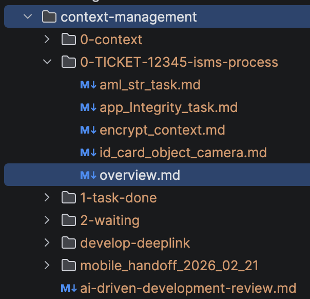
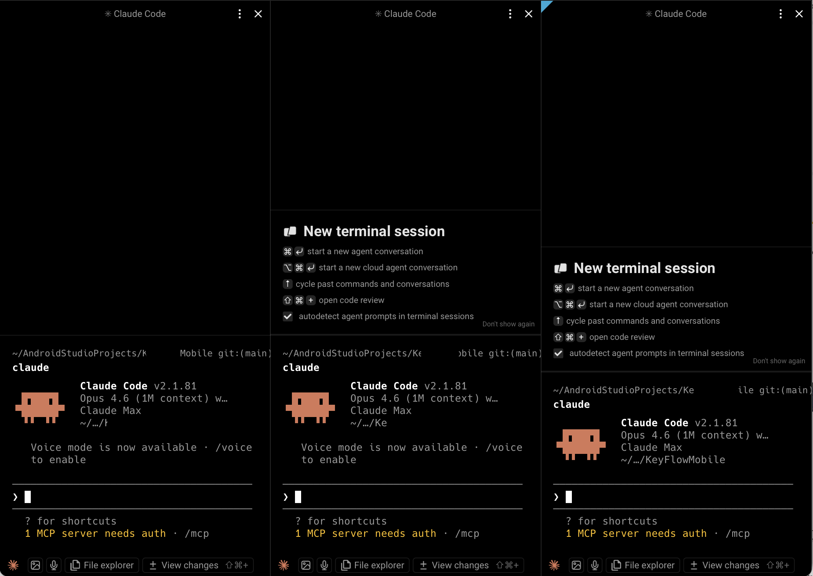

요약: 
컨텍스트 엔지니어링, AI 개인화, 작업 병렬성 활용, 작업 아키텍처 설계 후 실질적인 작업을 지휘하는 사례를 설명하는 글이다.

대부분 공식문서와 개인적인 통찰을 거쳐서 만들어진 내용들이라 요즘 공유되는 AI 활용 사례 이야기들과 결이 다르게 느껴질 수 있다. 

**사용중인 AI:** Claude, Gemini

**많이 활용하는 AI 설정:** AGENTS.md, Skills

---

AI 설정에 내 나름으로 구조화를 적용 해봤다.

AGENTS.md -> **Utility** Skills -> **Domain** Skills

스킬 구성에 대해 고민을 많이 하다보니 내 눈엔 두 가지 분류로 보이게 되었다.

**Utility Skills**는 특정 작업 아웃풋의 일관성을 갖기 위해 설정한다.
보통 AI Skill 하면 누구나 떠올리는 용도가 이 분류에 해당한다고 생각한다.

**Domain Skills**는 특정 도메인이나 규모있는 작업을 진행하기 위해 알아야 할 사전 지식들을 정리하는 문서로 활용한다.
필요한 시점에 필요한 정보만 점진적으로 로드하기 위한 구성을 신경쓰고 있다.
이 의도대로 잘 동작하게 하기 위해 SKILL.md 본문엔 어떤 지식들을 알 수 있는지 인덱싱만 해두고,
자세한 내용은 분리된 문서에 정리해두고 있다.

Domain Skills 구성은
[Skills 작성 모범 사례](https://platform.claude.com/docs/ko/agents-and-tools/agent-skills/best-practices)
공식 문서를 많이 참고했다.

---

그리고 AI 개인화를 실현하기 위해 테스트중인 나만의 방법이 있는데, 난 이 방식이 꽤 마음에 든다.

별거 아니다. `context-management` 라는 디렉토리 공간을 gitignore 해두고, 
이 안에서 온갖 작업 맥락을 문서화 해두고 있다. 
일종의 컨텍스트 로컬 캐싱 방법인데 MCP 호출로 인한 토큰 낭비와 프롬프트 실행 대기 시간을 줄여준다.

가장 좋은 점은 200k 정도로 매우 한정된 (요즘은 1M 으로 상향 되었지만) 컨텍스트 윈도우에 미련을 갖지 않게 된다.
언제든 새로운 세션을 열고, 로컬 캐싱한 배경 지식을 읽게 하면 언제든 작업을 이어갈 수 있다.
context compact 로 인한 대기 시간도 1분 이상, 길 땐 수 분으로 꽤 긴 편인데 이 시간을 아껴줄 수 있다.

이 안에서 나름의 구조화를 시도 해보고 있는데 특정 작업 티켓 넘버를 디렉토리명으로, 
`overview.md` 에서 작업 배경과 진행 상황을 업데이트 한다.
배경 지식이 너무 많고, 세부적인 TODO Task 관리가 필요한 내용은 별도 문서로 분리해서 관리한다.

---

AI 를 실행하기 위한 터미널은 **Warp** 라는 앱을 사용하고 있다. 
IDE 에서 에디터를 Split 해서 사용하듯 터미널을 Split 해서 한 눈에 볼 수 있게 된다.
주로 체이닝이 없는 별도의 작업들을 동시에 오케스트레이션 할 수 있다는 점에서 유용하게 사용중이다.

혹은 하나의 큰 일을 할 때, 세션 1을 메인 AI 로 두고 나머지 세션을 세션1 에게 오케스트레이션을 맡기는 방식으로도 활용하고 있다.
최근엔 teams 라는 오케스트레이션이 아예 피처로 출시 되기도 했는데, 아직 사용하진 않았다.
최근엔 그냥 체이닝이 없는 여러 일을 대응할 때 세션을 하나씩 분할해서 사용하는 패턴이 더 많았다.

---

나는 요즘 위의 구성을 바탕으로 일을 하고있다. 
요즘 내가 개발 작업에서 가장 많은 비중을 차지하는 일을 한 키워드로 압축하면 "매니징"이다. 

- 작업 배경 관리
- 아키텍처 설계
- 설계를 바탕으로 AI 지휘 및 코드 검증, 일부 손코딩

안드로이드 개발을 주로 했던 사람으로서 하기 어려웠던 일을 해내기도 했다. (특정 랭귀지 및 스크립트 핸들링)
설계와 아이디어는 있었지만 핵심 스크립트 작성에 많은 시간과 노력이 필요했던 일을 확 쉽게 만들어줬다.

예를 들어 최근엔 안드로이드 팀원 매니징 자동화 시스템을 도입했다.
원래 2주에 한 번씩 & 한 사람씩 돌아가면서 했던 일이고 사람 손을 많이 타는 일이었는데 이 일을 거의 다 자동화 했다.
사람 손을 약 6단계 거치던 프로세스를 1단계로 줄였다. (슬랙, 지라, git 등을 통합한 워크플로우를 제작함)

이번 일은 사내에서도 꽤 호평을 받았고, 다른 팀에서도 도입을 준비중이다.
