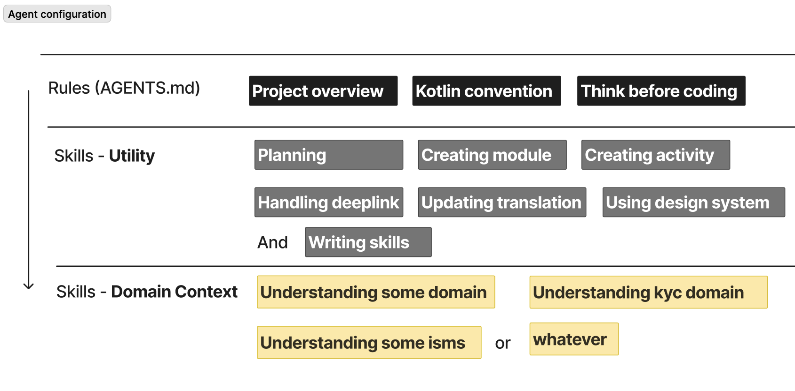
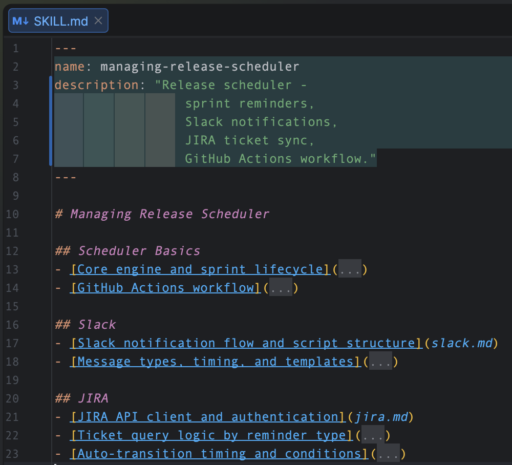
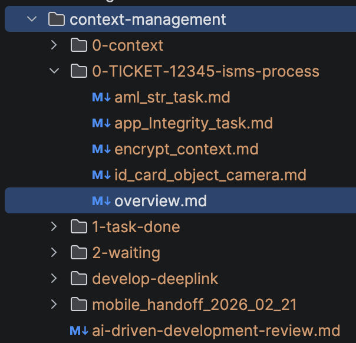
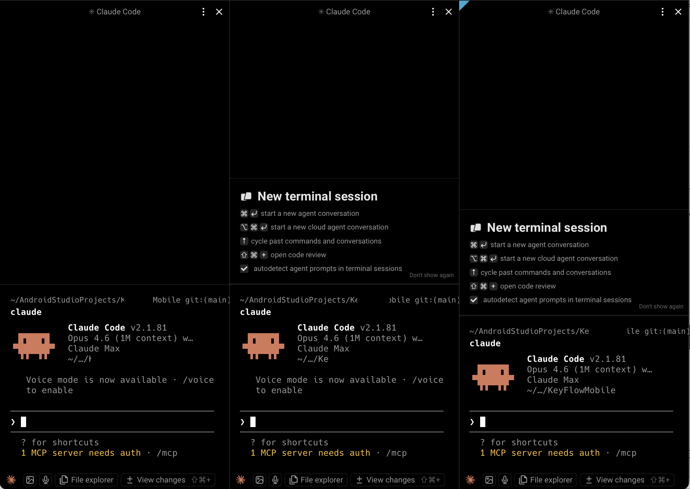

요즘 내가 개발 작업에서 가장 많은 비중을 차지하는 일을 한 키워드로 압축하면 "매니징"이다.

AI가 코드를 잘 작성해주는 시대가 되면서, 직접 코드를 작성하는 것보다 AI를 잘 활용하는 쪽이 좀 더 효율적이라고 생각했다.
자연스럽게 작업 배경을 관리하고 아키텍처를 설계하고 AI를 지휘하고 결과를 검증하는 시간이 훨씬 많아졌다.
이 워크플로우를 가능하게 하는 구성들과 실전 사례를 소개한다.

**사용중인 AI:** Claude, Gemini

**많이 활용하는 AI 설정:** AGENTS.md, Skills

---

**1. AI 설정 구조화**

AI에게 매번 같은 맥락을 설명하거나, 결과물을 낼 때마다 결과물의 품질이 달라지는 게 불편했다.
AI를 지휘하려면 AI가 맥락을 알아야 한다. 그래서 스킬 구성에 나름대로 구조화를 적용해봤다.

AGENTS.md -> **Utility** Skills -> **Domain** Skills

스킬 구성에 대해 고민을 많이 하다보니 내 눈엔 두 가지 분류로 보이게 되었다.

**Utility Skills**는 특정 작업 아웃풋의 일관성을 갖기 위해 설정한다.
보통 AI Skill 하면 누구나 떠올리는 용도가 이 분류에 해당한다고 생각한다.

**Domain Skills**는 특정 도메인이나 규모있는 작업을 진행하기 위해 알아야 할 사전 지식들을 정리하는 문서로 활용한다.
필요한 시점에 필요한 정보만 점진적으로 로드하기 위한 구성을 신경쓰고 있다.
이 의도대로 잘 동작하게 하기 위해 SKILL.md 본문엔 어떤 지식이 있는지 인덱싱만 해두고,
자세한 내용은 분리된 문서에 정리해두고 있다.

Domain Skills 구성은
[Skills 작성 모범 사례](https://platform.claude.com/docs/ko/agents-and-tools/agent-skills/best-practices)
공식 문서를 많이 참고했다.

---

**2. 컨텍스트 로컬 캐싱**

위 섹션에서 AI의 역량을 내 프로젝트에 맞게 구성하는 방법을 소개했다면, 
이건 실시간으로 쌓이는 작업 기억을 관리하는 방법이다.

규모가 있는 작업을 할 때, 세션이 바뀔 때마다 배경 지식을 다시 전달해야 하는 게 큰 비효율이었다.
MCP로 외부 정보를 불러오는 것도 매번 토큰을 소모하고 대기 시간이 생긴다.

`context-management` 라는 디렉토리를 gitignore 해두고,
이 안에서 온갖 작업 맥락을 문서화해두고 있다.
일종의 컨텍스트 로컬 캐싱 방법으로, 위의 문제를 해결해준다.

가장 좋은 점은 200k 정도로 매우 한정된 (요즘은 1M 으로 상향 되었지만) 컨텍스트 윈도우에 구애받지 않게 된다.
새로운 세션을 열고, 로컬 캐싱한 배경 지식을 읽게 하면 언제든 작업을 이어갈 수 있다.
context compact 로 인한 대기 시간도 1분 이상, 길 땐 수 분으로 꽤 긴 편인데 이 시간을 아껴줄 수 있다.

이 안에서 나름의 구조화를 시도해보고 있는데 특정 작업 티켓 넘버를 디렉토리명으로 사용하고,
`overview.md` 에서 작업 배경과 진행 상황을 업데이트 한다.
배경 지식이 너무 많고, 세부적인 TODO Task 관리가 필요한 내용은 별도 문서로 분리해서 관리한다.

---

**3. 작업 병렬성 — 터미널 분할 활용**

AI에게 일을 시키고 결과를 기다리는 동안 아무것도 안 하고 있는 게 아까웠다.
설정과 맥락이 갖춰져 있으면, 여러 일을 동시에 오케스트레이션 할 수 있다.

AI 를 실행하기 위한 터미널 앱으로는 **Warp** 를 사용하고 있다.
IDE 에서 에디터를 Split 해서 사용하듯 터미널을 Split 해서 한눈에 볼 수 있게 된다.
체이닝이 없는 별도의 작업들을 각 세션에서 동시에 처리할 수 있다는 점에서 유용하다.

혹은 하나의 큰 일을 할 때, 세션 1을 메인 AI 로 두고 나머지 세션을 세션 1에게 오케스트레이션을 맡기는 방식으로도 활용하고 있다.
최근엔 teams 라는 오케스트레이션이 아예 피처로 출시 되기도 했는데, 아직 사용하진 않았다.
요즘은 그냥 체이닝이 없는 여러 일에 대응할 때 세션을 하나씩 분할해서 사용하는 패턴이 더 많았다.

---

**4. 실전 사례 — 팀 매니징 자동화**

최근 안드로이드 팀원 매니징 자동화 시스템을 도입했다.
원래 2주에 한 번씩, 한 사람씩 돌아가면서 했던 일이고 사람 손을 많이 타는 일이었다.
반복적이고 실수하기 쉬운 프로세스라 항상 자동화하고 싶었지만, 숙련도가 없다보니 항상 많은 시간 투자를 각오해야 했다.
사람이 약 6단계를 거치던 프로세스를 1단계로 줄였다. (슬랙, 지라, git 등을 통합한 워크플로우를 제작함)

안드로이드 개발자로서 설계와 아이디어는 있었지만, AI가 워크플로우 제작을 확 쉽게 만들어줬다.

이번 일은 사내에서도 꽤 호평을 받았고, 다른 팀에서도 도입을 준비 중이다.

---

AI를 구성하고, 할 일을 설계하고, 지휘한다. 요즘 내가 AI와 일하는 방식이다.
